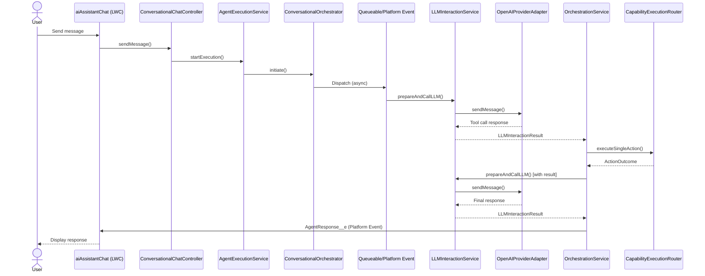
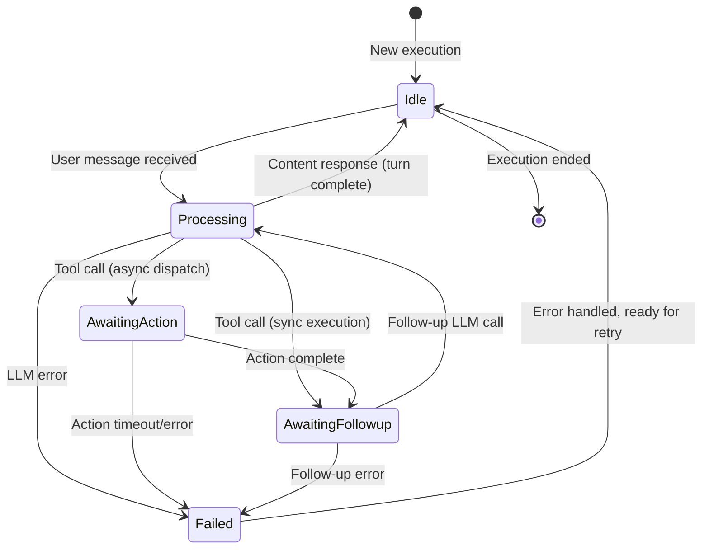

# Salesforce AI Agent Framework

> **Enterprise-Grade Agentic AI Platform for Salesforce**

A production-ready, extensible framework for building sophisticated AI agents powered by Large Language Models (LLMs) that seamlessly integrate with your Salesforce environment. Built with architectural excellence, security-first principles, and enterprise scalability.

[](https://opensource.org/licenses/MPL-2.0)
[](https://developer.salesforce.com/)

---

## ⚠️ Repository Notice

**This repository contains the core AI Agent Framework only.** The `aiAgentStudioAddons` folder visible in the codebase contains proprietary extensions and enhanced UI components that are **NOT part of the open-source repository**. These addons include:

- Function and Workflow orchestrators
- AgentCapability__c object and visual configurators
- Additional LLM provider adapters (Claude, Gemini)
- Advanced UI components (Agent Storyboard, Setup Assistants, Speech-to-Text)
- Extended action handlers

If you're cloning this repository, you will have access to the core framework in the `force-app` directory, which provides all fundamental capabilities for building AI agents.

---

## 🎯 Overview

The Salesforce AI Agent Framework is a **best-in-class, production-grade platform** that enables you to build intelligent AI agents that:

- 🤖 **Understand natural language** and execute complex multi-step workflows
- 🔒 **Respect Salesforce security** with automatic CRUD/FLS enforcement
- ⚡ **Scale efficiently** with dual-mode async processing (Platform Events + Queueables)
- 🎨 **Work declaratively** through configuration, not just code
- 📊 **Provide deep observability** with comprehensive decision logging
- 🔧 **Extend infinitely** through well-designed interfaces and patterns
- 🎯 **Support multiple agent types** - Conversational, Function, and Workflow orchestration
- 🌐 **Multi-LLM provider support** - OpenAI, Claude, Gemini (extensible architecture)

**Key Differentiators:**
- ✅ Unified execution model with `AgentExecution__c` and `ExecutionStep__c` objects
- ✅ Three agent types: Conversational (multi-turn), Function (one-shot), Workflow (multi-agent orchestration)
- ✅ Advanced memory management with multiple strategies (buffer window, summary buffer)
- ✅ Sophisticated error handling with LLM-friendly message sanitization
- ✅ Enterprise-ready async patterns with automatic failover
- ✅ Multi-LLM provider support (OpenAI, Claude, Gemini) through adapter pattern
- ✅ Human-in-the-loop approval workflows with native Salesforce integration
- ✅ Visual configuration tools and setup assistants
- ✅ Context ledger system for intelligent context resolution across conversations
- ✅ Bulk execution capabilities for processing large datasets

---

## 📋 Table of Contents

- [Target Audience](#-target-audience)
- [Core Features](#-core-features)
- [Architecture Overview](#-architecture-overview)
- [Execution Patterns](#-execution-patterns)
- [Quick Start](#-quick-start)
- [Security Model](#-security-model)
- [Performance & Scalability](#-performance--scalability)
- [Troubleshooting & FAQ](#-troubleshooting--faq)
- [Contributing](#-contributing)
- [Support & Community](#-support--community)
- [License](#-license)

---

## 👥 Target Audience

### **Salesforce Administrators**
Configure AI agents declaratively using Custom Objects and metadata. No Apex required for standard workflows.

### **Salesforce Developers**
Extend the framework with custom actions (`IAgentAction`), LLM providers (`ILLMProviderAdapter`), memory strategies (`IMemoryManager`), and context providers (`IAgentContextProvider`).

---

## ✨ Core Features

### 🧠 **Intelligent Agent Orchestration**

#### **Multi-Agent Architecture**
The framework supports multiple agent types, each optimized for specific use cases:

- **Conversational Agents**: Interactive chat experiences with context-aware responses and multi-turn conversations
- **Function Agents**: Synchronous, stateless, single-shot operations (summarization, classification, translation, tool-terminating actions)
- **Workflow Agents**: Multi-agent orchestration with sequential execution of specialized child agents for complex business processes
- **Batch Processing**: Bulk execution capabilities for processing large datasets with AI-driven analysis

#### **Unified Execution Model**
- Single `AgentExecution__c` object tracks all execution types
- Consistent state management across synchronous and asynchronous operations
- Turn-based conversation tracking with `ExecutionStep__c`
- Comprehensive decision logging via `AgentDecisionStep__c`

### 🔄 **Advanced Async Processing**

#### **Dual-Mode Dispatch Strategy**
```
High Concurrency Mode (Platform Events)
→ Maximum throughput for conversational agents
→ Event-driven architecture for scale

Low Concurrency Mode (Queueables)
→ Sequential processing for state-sensitive operations
→ Better error handling and debugging
```

#### **Intelligent Job Management**
- Automatic concurrency mode selection per agent
- Turn identifier validation to prevent stale job execution
- State machine design with clear transitions
- Engine pattern separating business logic from invocation context

### 💾 **Sophisticated Memory Management**

#### **Multiple Memory Strategies**
- **Buffer Window**: Maintains precise N most recent turns
- **Summary Buffer**: Automatically summarizes old conversations to preserve context
- **Custom Strategies**: Implement `IMemoryManager` for domain-specific needs

#### **Context Ledger System**
- Tracks Salesforce records mentioned across conversations
- Relevance scoring with temporal decay
- Intelligent context resolution via `ContextManagerService`
- Supports multiple context providers per agent
- **Context Formatters**: JSON and XML formatters for structured data presentation to LLMs

### 🛡️ **Enterprise-Grade Security**

#### **Salesforce Native Security**
- Automatic CRUD permission validation via `SecurityUtils`
- Field-Level Security (FLS) enforcement on all data operations
- Sharing rules respected through `inherited sharing` classes
- User context tracking (`originalUserId` vs `executionUserId`)

#### **Record-Level Access Control**
- Validates user access to related records before operations
- Prevents privilege escalation through context manipulation
- Comprehensive audit trail in `AgentDecisionStep__c`

### 🎯 **Powerful Action Framework**

#### **Standard Actions**
- `ActionCreateRecord`: Create any SObject with validation
- `ActionUpdateRecord`: Update records with security checks
- `ActionGetRecords`: Retrieve records with intelligent querying
- `ActionFindEntities`: Semantic search across objects
- `ActionSearchKnowledge`: Knowledge article search with relevance scoring
- `ActionPostChatter`: Chatter feed interactions
- `ActionSendEmail`: Email composition and delivery
- `ActionFlowHandler`: Execute Salesforce Flows with parameters
- `ActionManageTasks`: Create and manage Salesforce tasks
- `ActionRunReport`: Execute Salesforce reports and retrieve results
- `ActionSendNotification`: Send custom notifications to users

#### **Custom Action Development**
- Extend `BaseAgentAction` abstract class
- Automatic parameter validation and type coercion
- Schema-driven parameter processing (JSON Schema support)
- Built-in error handling and outcome formatting
- Security validation integrated

### 🔌 **Multi-LLM Provider Support**

#### **Provider Adapter Pattern**
- Interface: `ILLMProviderAdapter`
- **OpenAI Provider**: `OpenAIProviderAdapter` (GPT-3.5, GPT-4, GPT-4o, GPT-4o-mini)
- **Claude Provider**: `ClaudeProviderAdapter` (Claude 3 Sonnet, Claude 3.5 Sonnet)
- **Gemini Provider**: `GeminiProviderAdapter` (Gemini 1.5 Pro, Gemini 1.5 Flash)
- Extensible: Add any LLM provider through the adapter pattern
- Configuration via `LLMConfiguration__c` custom object

#### **Advanced LLM Features**
- Retry logic with exponential backoff (CPU-optimized)
- Token usage tracking and reporting
- Parallel tool calling support
- Action transparency with transient messages
- Error recovery with "Halt and Report" pattern

### 📊 **Deep Observability**

#### **Decision Step Logging**
Every agent interaction captured:
- User input with timestamps
- System prompt composition
- Available tools list
- LLM request payload
- LLM response details
- Tool execution results
- Final response generation
- Error tracking with stack traces

#### **Performance Metrics**
- Processing duration per step
- Token consumption per turn
- Action execution time
- Turn count and cycle tracking

### ✅ **Human-in-the-Loop Approvals**

#### **Native Approval Process Integration**
- `HumanApprovalRequest__c` object
- Automatic submission to Salesforce Approval Process
- Pause agent execution pending approval
- Resume with approval result
- Rejection handling with user notification

### 💬 **Rich User Experience**

#### **Real-Time UI Updates**
- `AgentResponse__e`: Final response delivery via Platform Events
- `TransientMessage__e`: Intermediate "thinking" display for better UX
- Status updates during async operations
- Error messages with user-friendly formatting
- Conversation history with pagination and branching

#### **Advanced UI Components**
- **AI Assistant Chat**: Full-featured chat interface with speech-to-text support
- **Agent Capability Configurator**: Visual tool builder with drag-and-drop interface
- **Agent Storyboard**: Workflow visualization and testing interface
- **Setup Assistant**: Guided configuration for agents and capabilities
- **Monaco Editor Integration**: Advanced code editing for JSON/Apex configurations
- **Markdown Editor/Viewer**: Rich text editing for prompts and descriptions
- **Case Summarizer Quick Action**: One-click case summarization

#### **LLM-Friendly Error Messages**
- Automatic sanitization of technical stack traces
- Emoji-enriched error presentation (🔒 🔍 💾 ⚡)
- Context-aware suggestions for recovery
- User-appropriate language transformation

---

## 🏗️ Architecture Overview

### **Design Patterns & Principles**

#### **Strategy Pattern**
- `ILLMResponseHandler` → `ContentResponseHandler` | `ToolCallResponseHandler`
- Dynamic response handling based on LLM output

#### **Factory Pattern**
- `LLMProviderFactory` → Creates provider adapters (OpenAI, Claude, Gemini)
- `MemoryManagerFactory` → Creates memory strategies (BufferWindow, SummaryBuffer)
- `ActionRegistry` → Creates action handlers from capability definitions
- `OrchestratorFactory` → Creates execution orchestrators based on agent type (Conversational, Function, Workflow)

#### **Template Method Pattern**
- `BaseAgentAction` → Defines action execution template
- Subclasses implement `executeAction()` only
- Framework handles validation, security, error handling

#### **Adapter Pattern**
- `ILLMProviderAdapter` → Abstracts LLM provider differences
- Consistent interface across OpenAI, Anthropic, etc.

#### **Dependency Injection**
- Constructor-based DI throughout
- Testable service layer
- Clear dependency graphs

### **Async Processing Architecture**

```
User Request → ConversationalChatController
                    ↓
           AgentExecutionService (routes by agent type)
                    ↓
           ConversationalOrchestrator
                    ↓
        Create/Update AgentExecution__c
                    ↓
          ┌─────────┴──────────┐
          │                    │
  [High Concurrency]    [Low Concurrency]
   Platform Event          Queueable
          │                    │
          ↓                    ↓
AsyncFrameworkRequest__e  ConversationalQueueable
          │                    │
          └─────────┬──────────┘
                    ↓
          LLMInteractionService
                    ↓
           [LLM Provider Call]
                    ↓
          OrchestrationService
                    ↓
            ┌───────┴────────┐
            │                │
      [Content]         [Tool Call]
            │                │
            ↓                ↓
    AgentResponse__e   CapabilityExecutionRouter
         (Done)              ↓
                    ┌────────┴─────────┐
                    │                  │
              [Sync Action]      [Async Action]
                    │                  │
                    │           AgentJobEnqueuer
                    │                  ↓
                    │         AsyncActionEngine
                    │                  │
                    └────────┬─────────┘
                             ↓
                   Action Execution Result
                             ↓
                   FollowUpLLMQueueable
                             ↓
                   LLMInteractionService (repeat)
```

---

## 🔄 Execution Patterns

> **Note**: The diagrams below show the Conversational agent flow. Function and Workflow agents have different execution patterns optimized for their use cases.

### **Conversational Agent Flow**



### **Processing Status State Machine**

This diagram shows the `ProcessingStatus__c` field transitions (internal turn-level coordination):



> **Note**: `ProcessingStatus__c` is for turn-level coordination. The high-level `ExecutionStatus__c` field tracks overall lifecycle (Pending, Processing, Completed, Failed, Paused, Cancelled).

### **Turn Lifecycle**

Each "turn" represents one complete user→LLM→action→LLM→response cycle:

1. **User Input** → Create ExecutionStep (UserInput)
2. **System Prompt** → Build from agent config + context + history
3. **LLM Request** → Call provider with prompt + tools + history
4. **LLM Response** → Parse content/tool calls
5. **Tool Execution** (if requested) → Execute action(s)
6. **Follow-up LLM** (if tool executed) → Call LLM with results
7. **Final Response** → Create ExecutionStep (AgentResponse)
8. **Complete Turn** → Update execution status to Idle

---

## 🎭 Agent Types & Use Cases

The framework supports three distinct agent types, each optimized for specific scenarios:

### **1. Conversational Agents**

**Purpose**: Multi-turn, stateful conversations with memory

**Characteristics:**
- Maintains conversation history across turns
- Memory strategies (BufferWindow, SummaryBuffer)
- Context-aware responses
- Real-time interaction via chat UI

**Use Cases:**
- Customer support chatbots
- Sales copilots
- Interactive assistants
- Help desk automation

**Example:**
```apex
AIAgentDefinition__c conversationalAgent = new AIAgentDefinition__c(
    Name = 'Support Copilot',
    AgentType__c = 'Conversational',
    MemoryStrategy__c = 'BufferWindow',
    HistoryTurnLimit__c = 10
);
```

### **2. Function Agents**

**Purpose**: Synchronous, single-shot operations

**Characteristics:**
- Stateless execution
- No conversation history
- Immediate response
- Single transaction
- Tool-terminating or pure LLM generation

**Use Cases:**
- Case summarization
- Document classification
- Text translation
- Entity extraction
- Quick data operations

**Example:**
```apex
AIAgentDefinition__c functionAgent = new AIAgentDefinition__c(
    Name = 'Case Summarizer',
    AgentType__c = 'Function',
    AuditLevel__c = 'Standard'
);
```

### **3. Workflow Agents**

**Purpose**: Multi-agent orchestration with sequential execution

**Characteristics:**
- Coordinates multiple child agents
- State machine execution
- Async processing
- Parent-child execution hierarchy
- Fail-fast error handling

**Use Cases:**
- Complex case processing workflows
- Multi-step lead qualification
- Approval chains
- Data enrichment pipelines

**Example:**
```apex
AIAgentDefinition__c workflowAgent = new AIAgentDefinition__c(
    Name = 'Case Processing Workflow',
    AgentType__c = 'Workflow'
);
// Define workflow steps via AgentWorkflowStep__c junction object
```

---

## 🚀 Quick Start

### **Prerequisites**

- Salesforce org (Sandbox recommended for testing)
- System Administrator profile
- Named Credential or External Credential setup capability
- API access to an LLM provider (e.g., OpenAI API key)

### **Installation**

1. **Clone the Repository**
   ```bash
   git clone https://github.com/your-repo/aiAgentStudio.git
   cd aiAgentStudio
   ```

2. **Deploy the Framework**

   Using Salesforce CLI (v2):
   ```bash
   sf project deploy start -d force-app/main/default -o <your-org-alias>
   ```

3. **Configure LLM Provider Authentication**

   **Option A: External Credential (Recommended for new orgs)**
   - Navigate to: Setup → Named Credentials
   - Click "New" → "New Named Credential"
   - **Label**: OpenAI API
   - **Name**: OpenAI_API
   - **URL**: `https://api.openai.com`
   - Create an External Credential with API Key authentication
   - Add your OpenAI API key as a custom header: `Authorization: Bearer YOUR_API_KEY`

   **Option B: Named Credential (Legacy)**
   - Navigate to: Setup → Named Credentials
   - Click "New Legacy"
   - **Label**: OpenAI API
   - **Name**: OpenAI_API
   - **URL**: `https://api.openai.com`
   - **Authentication**: Named Principal
   - **Protocol**: Password Authentication
   - **Username**: (leave blank)
   - **Password**: Your OpenAI API key
   - Save

4. **Configure Framework Settings** (Optional)
   - Navigate to: Setup → Custom Settings → AIAgentFrameworkSettings
   - Click "Manage"
   - Click "New" (for Organization-level default)
   - Set values:
     - `DefaultMaxConversationTurns__c`: 5
   - Save

5. **Create LLM Configuration**
   - App Launcher → LLM Configurations → New
   - **Developer Name**: OpenAI_GPT4o
   - **Named Credential**: OpenAI_API
   - **Provider Adapter Class**: OpenAIProviderAdapter
   - **Default Model Identifier**: `gpt-4o` (or `gpt-4o-mini` for lower cost)
   - **Default Temperature**: 0.7
   - **Max Retry Attempts**: 1
   - **Is Active**: Checked
   - Save

   > **Tip**: You can create multiple LLM configurations for different models (GPT-4o, GPT-4o-mini, GPT-4-turbo) and choose which one each agent uses.

6. **Create Your First Agent**
   - App Launcher → AI Agent Definitions → New
   - **Name**: Sales Assistant
   - **Developer Name**: Sales_Assistant
   - **Agent Type**: Conversational
   - **LLM Configuration**: OpenAI_GPT4o
   - **Memory Strategy**: BufferWindow
   - **History Turn Limit**: 10
   - **Is Active**: Checked
   - **Identity Prompt**:
     ```
     You are a helpful Salesforce assistant named SalesBot.
     You help users find information about their Salesforce records and perform common tasks.
     You are friendly, professional, and concise.
     ```
   - **Instructions Prompt**:
     ```
     - Always confirm before making changes to records
     - Provide clear explanations of what you find
     - Ask clarifying questions when needed
     - Use appropriate tools to access Salesforce data
     ```
   - **Enable Action Transparency**: Checked (shows tool execution to users)
   - **Concurrency Mode**: Low (recommended for getting started)
   - **Audit Level**: Standard
   - Save

7. **Create Capabilities (Tools) for Your Agent**

   Capabilities define the tools/actions your agent can use. Navigate to: App Launcher → Agent Capabilities → New

   **Capability 1: Get Contact Information**
   - **Capability Name**: `get_contact_info`
   - **Description**: Retrieves detailed information about a contact by name or email. Use this when the user asks about a specific person or contact.
   - **Implementation Type**: Standard
   - **Standard Action Type**: GetRecords
   - **AI Agent Definition**: Sales Assistant
   - **Exposure Level**: External
   - **Backend Configuration**:
     ```json
     {
       "objectApiName": "Contact"
     }
     ```
   - **Parameters** (JSON Schema):
     ```json
     {
       "type": "object",
       "properties": {
         "firstName": {
           "type": "string",
           "description": "First name of the contact"
         },
         "lastName": {
           "type": "string",
           "description": "Last name of the contact"
         },
         "email": {
           "type": "string",
           "format": "email",
           "description": "Email address of the contact"
         }
       },
       "required": []
     }
     ```
   - Save

   **Capability 2: Create Contact**
   - **Capability Name**: `create_contact`
   - **Description**: Creates a new contact record. Use this when the user wants to add a new person to the system.
   - **Implementation Type**: Standard
   - **Standard Action Type**: CreateRecord
   - **AI Agent Definition**: Sales Assistant
   - **Exposure Level**: External
   - **Requires Approval**: Checked (optional - enables approval workflow)
   - **Backend Configuration**:
     ```json
     {
       "objectApiName": "Contact"
     }
     ```
   - **Parameters** (JSON Schema):
     ```json
     {
       "type": "object",
       "properties": {
         "firstName": {
           "type": "string",
           "description": "First name of the contact"
         },
         "lastName": {
           "type": "string",
           "description": "Last name of the contact"
         },
         "email": {
           "type": "string",
           "format": "email",
           "description": "Email address"
         },
         "phone": {
           "type": "string",
           "description": "Phone number"
         },
         "title": {
           "type": "string",
           "description": "Job title"
         }
       },
       "required": ["firstName", "lastName"]
     }
     ```
   - Save

   > **Tip**: You can also use the visual Agent Capability Configurator for an enhanced setup experience.

8. **Add Chat Component to Lightning Page**

   **For Lightning Experience:**
   - Navigate to any record page (Account, Contact, Case, etc.)
   - Click Setup (gear icon) → Edit Page
   - From the Components panel, drag **aiAssistantChat** to your page layout
   - Configure component properties:
     - **Card Title**: AI Assistant (or customize)
     - **Agent Developer Name**: Sales_Assistant
     - **Enable Start Over Feature**: false (for production)
     - **Use Community Mode**: false
   - Click Save → Activate
   - Assign the page layout to your desired app and profiles

   **Alternative: Add to Utility Bar**
   - Setup → App Manager → Edit your Lightning App
   - Go to "Utility Items" → Add Utility Item
   - Select **aiAssistantChat**
   - Configure properties and save

9. **Test Your Agent**
   - Navigate to a page where you added the chat component
   - Start a conversation:
     - Type: "Find me the contact named John Smith"
     - The agent should use the `get_contact_info` tool to search
   - Test record creation:
     - Type: "Create a new contact named Jane Doe with email jane@example.com"
     - The agent should use the `create_contact` tool
     - If approval is enabled, you'll see an approval request
   - Try follow-up questions to test memory:
     - "What was Jane's email again?"
     - The agent should remember from conversation history

---

## 🔒 Security Model

### **Security Best Practices**

1. **Principle of Least Privilege**: Grant agents only necessary capabilities
2. **Approval for High-Risk Actions**: Use `RequiresApproval__c` for data modifications
3. **Input Validation**: Always define proper JSON Schema for parameters
4. **Audit Regularly**: Review `AgentDecisionStep__c` for anomalies
5. **Test in Sandbox**: Never test in production with real user data
6. **Monitor API Costs**: LLM API calls can accumulate quickly

---

## ⚡ Performance & Scalability

### **Async Processing Architecture**

The framework provides two async dispatch strategies optimized for different scenarios:

#### **High Concurrency Mode (Platform Events)**
- **Best For**: Conversational agents with many concurrent users
- **Mechanism**: `AsyncFrameworkRequest__e` Platform Event
- **Advantages**:
  - Maximum throughput
  - Event-driven architecture
  - Scales to thousands of concurrent conversations
  - Fire-and-forget pattern
- **Trade-offs**:
  - More complex debugging
  - Event delivery guarantees (at-least-once)

#### **Low Concurrency Mode (Queueables)**
- **Best For**: State-sensitive operations, testing, debugging
- **Mechanism**: `AsyncActionQueueable` with chaining
- **Advantages**:
  - Sequential processing
  - Better error handling
  - Easier debugging with debug logs
  - Predictable execution order
- **Trade-offs**:
  - Lower throughput
  - Chaining limit (50 per transaction chain)

### **Governor Limit Considerations**

#### **CPU Time**
- LLM response parsing and JSON serialization are CPU-intensive
- Retry logic uses CPU-optimized delays
- Consider Function agents for single-shot operations to reduce CPU usage

#### **Callout Limits**
- Each LLM interaction = 1 HTTP callout
- Multi-turn conversations can accumulate callouts quickly
- Use `HistoryTurnLimit__c` to control memory size
- Async processing helps distribute callout consumption

#### **DML Operations**
- Each turn creates at least 2 DML operations (ExecutionStep records)
- Decision logging adds additional DML
- Consider bulkifying workflows with Workflow agents

### **Optimization Strategies**

1. **Memory Management**
   - Use `BufferWindow` for most cases (efficient)
   - Use `SummaryBuffer` for long conversations (reduces token usage)
   - Set appropriate `HistoryTurnLimit__c` (10-15 recommended)

2. **Tool Design**
   - Group related operations into single capabilities
   - Enable `EnableParallelToolCalling__c` for independent operations
   - Use `RunAsynchronously__c` for long-running operations

3. **Context Resolution**
   - Limit context providers per agent
   - Use relevance scoring to reduce context size
   - Implement custom `IAgentContextProvider` for optimized queries

4. **LLM Configuration**
   - Use `gpt-4o-mini` for simpler tasks (faster, cheaper)
   - Use `gpt-4o` for complex reasoning
   - Adjust `DefaultTemperature__c` based on use case (lower = more consistent)

5. **Caching**
   - Agent definitions and capabilities are queried per execution
   - Consider implementing custom caching for high-volume scenarios
   - LLM configurations are cached by default

### **Monitoring & Observability**

#### **Key Metrics to Track**
- Average turns per conversation
- Token consumption per agent
- LLM response time
- Action execution time
- Error rate by agent/capability

#### **Decision Step Analysis**
Query `AgentDecisionStep__c` for insights:
```sql
SELECT AgentExecution__c, StepType__c, Duration__c,
       TokensUsed__c, CreatedDate
FROM AgentDecisionStep__c
WHERE CreatedDate = LAST_N_DAYS:7
ORDER BY CreatedDate DESC
```

#### **Performance Baselines**
- **Typical Turn Duration**: 2-5 seconds (depends on LLM provider)
- **Token Usage**: 500-2000 tokens per turn (varies by complexity)
- **Concurrent Users**: Supports 100+ concurrent conversations (High Concurrency Mode)

---

## 🔧 Troubleshooting & FAQ

### **Common Issues**

#### **Agent Not Responding**
- ✅ Check Named Credential is configured correctly
- ✅ Verify API key has credits/is valid
- ✅ Check debug logs for error messages
- ✅ Ensure agent `IsActive__c` is checked
- ✅ Verify LLM Configuration `IsActive__c` is checked

#### **"Permission Denied" Errors**
- ✅ Run as user with proper object/field permissions
- ✅ Check CRUD permissions on custom objects
- ✅ Verify FLS on fields being accessed
- ✅ Review profile/permission set assignments

#### **High CPU Time / Timeout Errors**
- ✅ Reduce `HistoryTurnLimit__c` to lower number
- ✅ Use Function agents for one-shot operations
- ✅ Enable async dispatch (`RunAsynchronously__c`)
- ✅ Simplify tool descriptions and parameters

#### **Unexpected Tool Calls**
- ✅ Improve capability descriptions - be specific about when to use
- ✅ Add more examples in `ExamplesPrompt__c`
- ✅ Adjust LLM temperature (lower = more predictable)
- ✅ Review parameters JSON Schema for clarity

#### **Conversation Context Lost**
- ✅ Check `MemoryStrategy__c` is set correctly
- ✅ Increase `HistoryTurnLimit__c` if needed
- ✅ Verify `ExecutionStep__c` records are being created
- ✅ Consider using `SummaryBuffer` for long conversations

### **Frequently Asked Questions**

**Q: Can I use this in production?**
A: Yes, but thoroughly test in sandbox first. This is provided "as-is" without warranties.

**Q: What LLM providers are supported?**
A: OpenAI, Claude (Anthropic), and Gemini (Google). You can add additional providers by implementing the `ILLMProviderAdapter` interface.

**Q: How much does it cost to run?**
A: Cost depends on LLM provider pricing (per token). GPT-4o-mini is most cost-effective. Monitor usage via `ExecutionStep__c`.

**Q: Can agents make changes to my data?**
A: Only if you grant them capabilities to do so (e.g., CreateRecord, UpdateRecord) and those capabilities aren't blocked by CRUD/FLS.

**Q: How do I debug what the agent is thinking?**
A: Check `AgentDecisionStep__c` records - they log every LLM interaction, tool call, and decision.

**Q: Can I use this with Salesforce Communities?**
A: Yes! Set `useCommunityMode={true}` on the chat component when deploying to Experience Cloud.

**Q: How do I add a custom action/tool?**
A: Extend `BaseAgentAction`, implement `executeAction()`, then create an `AgentCapability__c` record with `ImplementationType__c = 'Apex'`.

**Q: Can agents access all my Salesforce data?**
A: No - agents are subject to the running user's CRUD, FLS, and sharing rules. Security is enforced at multiple layers.

---

## ⚠️ Important Disclaimers

### **Use at Your Own Risk**

This framework is provided **"as is"** without warranties of any kind, either express or implied. In no event shall the authors be liable for any claim, damages, or other liability arising from the use of this software.

### **AI-Generated Content Warning**

⚠️ **All AI-generated responses should be independently verified before being relied upon.**

- LLMs can produce inaccurate, biased, or inappropriate content
- Hallucinations (false information) can occur
- The agent may misinterpret user intent
- Always review automated actions before they execute

### **Data & Privacy Considerations**

- User inputs are sent to external LLM providers (e.g., OpenAI)
- Conversation history is stored in Salesforce records
- Ensure compliance with your organization's data policies
- Review LLM provider data handling policies
- Consider data residency requirements (EU, APAC, etc.)

### **Testing Requirements**

⚠️ **Always test thoroughly in a Sandbox environment before deploying to production.**

- Test with realistic user scenarios
- Verify permissions are correctly configured
- Monitor governor limit consumption
- Review debug logs for unexpected behavior
- Test failure scenarios (LLM unavailable, permission denied, etc.)

**Test Data Factory Available:**
The framework includes `AgentTestDataFactory` (in `seed-data` directory) that creates:
- Conversational agents with multiple capabilities
- Function agents (tool-terminating and iterative)
- Workflow agents with multi-step orchestration
- Sample capabilities and LLM configurations
- Realistic business scenarios

```apex
// Execute in Anonymous Apex
Map<String, Id> testData = AgentTestDataFactory.createComprehensiveShowcase();
System.debug('Created test agents: ' + testData);
```

### **Cost Considerations**

- LLM API calls have per-token pricing
- Long conversations = higher costs
- Monitor token consumption via `ExecutionStep__c`
- Set appropriate `HistoryTurnLimit__c` to control costs
- Consider implementing cost caps or quotas

---

## 🤝 Contributing

We welcome contributions from the community! Here's how you can help:

### **Ways to Contribute**

1. **Report Bugs**: Open an issue with detailed reproduction steps
2. **Suggest Features**: Share your ideas for new capabilities or improvements
3. **Submit Pull Requests**: Contribute code, documentation, or examples
4. **Improve Documentation**: Help make the docs clearer and more comprehensive
5. **Share Use Cases**: Tell us how you're using the framework

### **Development Guidelines**

- Follow existing code style and patterns
- Add comprehensive test coverage for new features
- Update documentation for any changes
- Use meaningful commit messages
- Test thoroughly in a scratch org before submitting

### **Pull Request Process**

1. Fork the repository
2. Create a feature branch (`git checkout -b feature/amazing-feature`)
3. Make your changes with tests
4. Commit your changes (`git commit -m 'Add amazing feature'`)
5. Push to your branch (`git push origin feature/amazing-feature`)
6. Open a Pull Request with a clear description

### **Code of Conduct**

- Be respectful and inclusive
- Provide constructive feedback
- Focus on what is best for the community
- Show empathy towards other community members

---

## 📞 Support & Community

### **Getting Help**

- 📖 **Documentation**: This README and inline code documentation
- 🐛 **Bug Reports**: Open an issue on GitHub
- 💡 **Feature Requests**: Open an issue with `[Feature Request]` prefix
- 💬 **Questions**: Use GitHub Discussions

### **Resources**

- [Salesforce Developer Documentation](https://developer.salesforce.com/docs)
- [OpenAI API Documentation](https://platform.openai.com/docs) - GPT models
- [Anthropic Claude Documentation](https://docs.anthropic.com) - Claude models
- [Google Gemini Documentation](https://ai.google.dev/docs) - Gemini models
- [Salesforce AI Research](https://www.salesforceairesearch.com/)

---

## 📄 License

Copyright © 2025 Sonal

This project is licensed under the **Mozilla Public License 2.0** (MPL-2.0).

**Key points of MPL 2.0:**
- ✅ Commercial use allowed
- ✅ Modification allowed
- ✅ Distribution allowed
- ✅ Private use allowed
- ⚠️ Must disclose source if distributing modifications
- ⚠️ Modified files must carry notices stating changes

See the [LICENSE](LICENSE) file for full details.

---

## 🙏 Acknowledgments

Built with ❤️ using:
- **Salesforce Platform** - Enterprise CRM and application platform
- **OpenAI GPT Models** - GPT-4o, GPT-4o-mini, GPT-4-turbo
- **Anthropic Claude** - Claude 3 Sonnet, Claude 3.5 Sonnet
- **Google Gemini** - Gemini 1.5 Pro, Gemini 1.5 Flash
- **Modern Software Architecture Patterns** - Strategy, Factory, Adapter, Template Method
- **Lightning Web Components** - Modern UI framework
- **Monaco Editor** - VS Code's editor for web
- **Community Feedback and Contributions**

Special thanks to:
- The Salesforce Developer Community for inspiration and support
- The AI/ML research community for advancing LLM capabilities
- Open-source contributors and early adopters

---

<div align="center">

**[⬆ Back to Top](#salesforce-ai-agent-framework)**

---

Made with 🤖 and 💡 in 2025

*Empowering Salesforce developers to build intelligent, AI-powered experiences*

</div>
