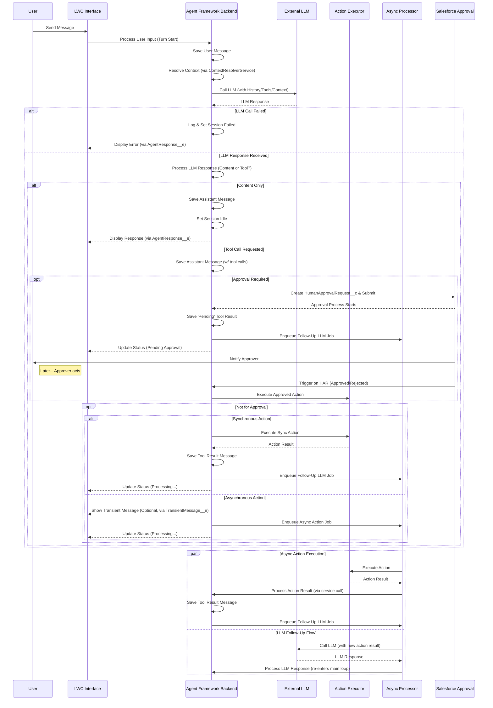

# Salesforce AI Agent Studio

## Overview

This Salesforce AI Agent Studio provides a robust, enterprise-grade, and extensible platform for integrating advanced AI Agents, powered by Large Language Models (LLMs), directly within your Salesforce environment. It enables the creation of sophisticated conversational assistants that can understand user intent, access relevant Salesforce data securely, perform complex multi-step actions, and provide intelligent, context-aware responses through a chat interface.

The framework has been re-architected to prioritize **declarative configuration**, **robust security**, **scalable asynchronous processing**, **comprehensive error handling**, and **deep observability**, allowing technical teams to build, manage, and debug powerful AI-driven workflows entirely within the Salesforce ecosystem.

---

## Core Features & Capabilities

This framework is designed to empower teams to build, manage, and scale powerful AI assistants on the Salesforce platform. Its key features are focused on providing a balance of flexibility, control, and enterprise-grade reliability.

#### **Configuration & Control (Clicks, Not Code)**

*   **Admin-Friendly Agent Builder:** Define and manage every aspect of your AI agents declaratively. Admins can configure an agent's personality, link it to an AI model, and assign its tools through core configuration objects like **`AIAgentDefinition__c`** and **`AgentCapability__c`**, minimizing the need for custom Apex code for setup and maintenance.

*   **Guided Workflows & Smart Task Sequencing:** Enforce business processes by defining the exact order in which an agent must perform tasks. You can configure a capability using the **`ExecutionPrerequisites__c`** field, ensuring the agent follows a logical, predictable path (e.g., `find_record` must succeed before `update_record`).

*   **Intelligent Error Recovery:** Decide how an agent should behave when a tool fails. By configuring the **`HaltAndReportError__c`** flag on a specific `AgentCapability__c`, you can choose to either stop and clearly explain the problem to the user or allow the agent to attempt autonomous recovery with a different tool.

#### **Intelligence & Actions**

*   **Persistent Conversational Memory:** The framework gives agents a "Context Ledger," stored in **`ChatSession__c.EntityHistoryJson__c`**, allowing them to remember key records and information mentioned across multiple interactions in a single conversation. This means users don't have to repeat themselves, and the agent gets smarter as the conversation progresses.

*   **Built-in Managerial Approvals:** For high-stakes actions, require a formal sign-off. The framework can automatically create a **`HumanApprovalRequest__c`** record and submit it into a standard **Salesforce Approval Process**, pausing the action until a manager approves or rejects it.

*   **Real-time "Thinking" Display:** Enhance the user experience with an optional streaming-like interface, powered by a Platform Event (**`TransientMessage__e`**). Users can see the agent's intermediate thoughts and text responses in near real-time while it works on a longer task in the background, making the interaction feel more dynamic and transparent.

#### **Integration & Extensibility**

*   **Connect to Any AI Model:** The framework is not locked into one AI provider. Using the **Adapter Pattern** (**`ILLMProviderAdapter`** interface) and a simple **`LLMConfiguration__c`** record, you can connect to different Large Language Models (e.g., OpenAI, Anthropic, Google), allowing you to choose the best model for your needs.

*   **Create Any Custom Action:** Go beyond the powerful standard actions. Developers can easily build custom tools that interact with any part of Salesforce—or even external systems—by implementing the **`IAgentAction`** interface.

*   **Teach the Agent Your Business:** Equip your agent with deep knowledge of your specific business environment. You can create custom context providers by implementing **`IAgentContextProvider`** and link them to an agent via the **`AgentContextConfig__c`** object, allowing the agent to make more informed decisions.

#### **Trust & Safety**

*   **Built on Salesforce Security:** The agent fundamentally respects your existing security model. It acts *as the user*, meaning it can only access data the user is permitted to see. The framework automatically enforces **Sharing Rules, Profiles, and Field-Level Security (FLS)** during every step of its process.

*   **Scalable & Performant Processing:** The framework's architecture is designed for performance. It can be configured to use either default **Apex Queueables** or a highly scalable, event-driven model powered by **Platform Events** (`AsyncFrameworkRequest__e`), ensuring the agent remains responsive even in high-volume organizations.

---

## Architecture & Key Concepts

This AI Agent framework has evolved to use several modern design patterns:

1.  **Configuration First:** Core behavior is defined in Custom Objects (`AIAgentDefinition__c`, `LLMConfiguration__c`, `AgentCapability__c`) and Custom Metadata (`StandardActionHandler__mdt`, `SObjectConfig__mdt`). This makes the framework highly adaptable.
2.  **Decoupled Asynchronous Processing:** Logic classes (`AsyncActionProcessor`, `FollowUpLLMProcessor`) are separated from their invocation mechanism (Queueable vs. Platform Event), enabling scalability. `AgentJobEnqueuer` handles the dispatching.
3.  **Strategy Pattern for Response Handling:** The `OrchestrationService` uses a `ResponseHandlerFactory` to select the correct strategy (`ToolCallResponseHandler` or `ContentResponseHandler`) based on the LLM's output.
4.  **Centralized Prompt & Context Composition:** `SystemPromptBuilder` assembles the final system prompt, while `ContextResolverService` uses the `ContextManagerService` (the "Ledger") to orchestrate the gathering of all relevant data from multiple `IAgentContextProvider` implementations in a bulk-safe way.
5.  **Template Method for Actions:** `BaseAgentAction` provides a standardized execution template (`execute`), ensuring consistent error handling, validation, and hook execution for all actions.
6.  **Event-Driven UI:** Platform Events (`AgentResponse__e`, `TransientMessage__e`) notify the LWC about final results and intermediate messages, decoupling the backend processing from the UI.

---

## Core Component Types

*   **Configuration:**
    *   **Custom Objects:** `AIAgentDefinition__c`, `LLMConfiguration__c`, `AgentCapability__c`, `AgentContextConfig__c`, `HumanApprovalRequest__c`.
    *   **Custom Metadata:** `StandardActionHandler__mdt`, `SObjectConfig__mdt`.
    *   **Custom Settings:** `AIAgentFrameworkSettings__c`.
*   **Services:** Apex classes handling specific tasks (Orchestration, LLM Interaction, Action Execution, Context Resolution & Management, State, Persistence).
*   **Interfaces:** Define contracts for extensibility (`ILLMProviderAdapter`, `IAgentAction`, `IPreActionHook`, `IPostActionHook`, `IAgentContextProvider`).
*   **Action Framework:** `BaseAgentAction`, `ActionRegistry`, and standard action implementations (e.g., `ActionGetRecords`, `ActionRunReport`).
*   **Data Model:** `ChatSession__c`, `ChatMessage__c`, `OrchestrationLog__c`.
*   **Platform Events:** `AgentResponse__e`, `TransientMessage__e`, `AsyncFrameworkRequest__e`.
*   **Utilities:** Helpers for security, schema, parameters, retries, etc.
*   **LWC UI:** Includes `aiAssistantChat` and the `chatSessionVisualizer`.

---

## Administrator / Configurator Responsibilities

*   **Clear Instructions (Prompts & Descriptions):** The quality of `AIAgentDefinition__c` prompts and `AgentCapability__c.Description__c` is paramount. These must clearly define the agent's role, limitations, and how/when to use specific tools.
*   **Accurate Tool Schemas:** The `Parameters__c` JSON Schema on `AgentCapability__c` must accurately reflect the arguments the LLM needs to provide for an action.
*   **Prerequisite Chains:** Thoughtfully configure `ExecutionPrerequisites__c` on `AgentCapability__c` to guide the agent through logical workflows.
*   **Contextual Relevance:** Configure `AgentContextConfig__c` records effectively to provide necessary, but not excessive, information to the LLM to manage token usage.
*   **Security & Permissions:** Admins are responsible for assigning appropriate permissions to users for the framework objects, Apex classes, and the underlying data the agent might access.
*   **Named Credential Setup:** Correctly configure Named Credentials for LLM provider authentication. **API keys must not be hardcoded.**

---

## Execution Flow (Conceptual)

---

## Setup

1.  **Deploy All Components:** Deploy all Custom Objects, Fields, Apex Classes, Triggers, LWCs, Custom Metadata Types, and Custom Settings from the project.
2.  **Configure Named Credential:**
    *   Create an **External Credential** for your LLM Provider.
    *   Create a **Named Credential** matching the `NamedCredential__c` value you will use in `LLMConfiguration__c`. Set its URL (e.g., `https://api.openai.com`) and link it to the External Credential.
3.  **Configure `LLMConfiguration__c`:**
    *   Create at least one record specifying a `DeveloperName__c`, the `NamedCredential__c` from step 2, the `ProviderAdapterClass__c` (e.g., `OpenAIProviderAdapter`), and the `DefaultModelIdentifier__c`.
4.  **Configure `AIAgentDefinition__c`:**
    *   Create an agent record. Assign a `DeveloperName__c`, link it to an `LLMConfiguration__c`, and write the `IdentityPrompt__c` and `InstructionsPrompt__c`.
5.  **(Optional) Configure `StandardActionHandler__mdt`:**
    *   Verify records exist for standard actions like `GetRecords`, `CreateRecord`, etc., mapping them to their respective handler classes (e.g., `ActionGetRecords`). These should be deployed with the framework.
6.  **Configure `AgentCapability__c` records:**
    *   For each `AIAgentDefinition__c`, create `AgentCapability__c` records for the tools it should use.
    *   Critically, define `CapabilityName__c` (the function name for the LLM), `Description__c`, `ImplementationType__c`, and `Parameters__c` (JSON schema).
    *   Configure advanced options like `RequiresApproval__c`, `RunAsynchronously__c`, and `ExecutionPrerequisites__c` as needed.
7.  **Configure `AgentContextConfig__c` records (Optional):**
    *   If dynamic context is needed, define context providers linking an `AIAgentDefinition__c` to `IAgentContextProvider` Apex classes.
8.  **Configure `AIAgentFrameworkSettings__c` (Custom Setting):**
    *   Go to Setup -> Custom Settings -> AI Agent Framework Settings -> Manage.
    *   Review defaults. For high-volume orgs, consider enabling `EnableScalableProcessingMode__c`. To show intermediate agent thoughts, enable `EnableTransientMessages__c`.
9.  **Assign Permissions:**
    *   Grant users access to essential Custom Objects (CRUD as appropriate: `ChatSession__c`, `ChatMessage__c` for users; more for admins).
    *   Grant users access to the controller Apex class (`AIAssistantController`).
    *   Grant admins access to configuration objects and setup/debug LWCs.
10. **(Optional) Configure Approval Process:**
    *   If using the `RequiresApproval__c` feature, create a standard Salesforce Approval Process on the `HumanApprovalRequest__c` object.
11. **Add LWC to Page (Optional):** Add `aiAssistantChat` to a Lightning Page.

---

## Known Limitations & Potential Future Enhancements

*   **State Reconciliation:** A background reconciliation job (Scheduled Apex) could be implemented to identify and fail "stuck" sessions left in a transient state by a rare, unhandled error.
*   **Advanced Context Management:** Future enhancements could include native RAG (Retrieval Augmented Generation) via vector DBs or agent-driven context selection.
*   **Dynamic LLM Routing:** Allow an agent to dynamically choose an LLM model/provider based on task complexity, cost, or specific capabilities.
*   **Observability Deep Dive:** More advanced analytics on token usage per turn/agent, action success/failure rates, and LLM tool selection accuracy could be valuable.

---

## License

Copyright (c) 2025 Sonal

This source code is licensed under the **Mozilla Public License 2.0**. See the LICENSE file for details.
