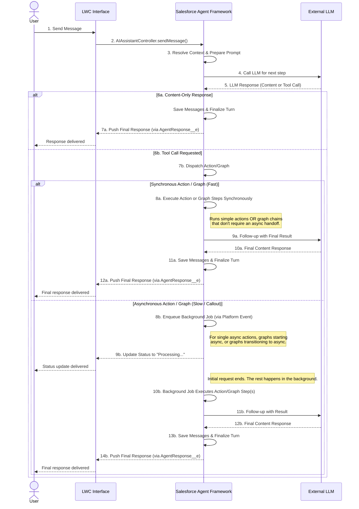

# Salesforce AI Agent Framework

## Overview

The Salesforce AI Agent Framework is a robust, enterprise-grade, and extensible platform for integrating advanced AI Agents, powered by Large Language Models (LLMs), directly within your Salesforce environment. It has evolved into a comprehensive suite for building sophisticated conversational assistants that can understand user intent, access relevant Salesforce data securely, perform complex multi-step processes, and provide intelligent, context-aware responses through a chat interface.

The framework is designed around a "clicks, not code" philosophy for orchestration, featuring a visual **Graph Builder** for defining complex, multi-step agent behaviors with conditional logic. It prioritizes robust security, using a scalable asynchronous processing model via Platform Events, and provides deep observability through a "flight recorder" style logging system. This allows technical teams to build, manage, and debug powerful AI-driven workflows entirely within the Salesforce ecosystem.

---

## Target Audience

This framework is designed for:

*   **Salesforce Administrators:** To declaratively build, configure, and manage powerful AI agents and their capabilities—including complex business processes using the visual Graph Builder—without writing Apex code.
*   **Salesforce Developers:** To extend the framework with custom actions (`IAgentAction`), context providers (`IAgentContextProvider`), and LLM integrations (`ILLMProviderAdapter`) to meet unique business requirements.
*   **Salesforce Architects:** To design and implement secure, scalable, and observable AI solutions that integrate seamlessly with the Salesforce platform's security and data models.

---

## Core Features & Capabilities

This framework is designed to empower teams to build, manage, and scale powerful AI assistants on the Salesforce platform. Its key features are focused on providing a balance of flexibility, control, and enterprise-grade reliability.

#### **Declarative Orchestration Engine (Graph Builder)**

*   **Visual Process Builder:** Define complex, multi-step agent workflows visually using the **Graph Builder**. Admins can create sophisticated flowcharts (`GraphNode__c`) with conditional branches (`ConditionalEdges__c`) to guide the agent's decision-making process, all without writing Apex code.
*   **Synchronous & Asynchronous Steps:** Seamlessly mix fast, synchronous actions with long-running, asynchronous tasks within a single graph. The framework's transaction control automatically manages state, pausing the graph to dispatch an async job and resuming it upon completion.
*   **Intelligent Error Recovery:** Configure how an agent behaves when a tool fails. The `HaltAndReportError__c` flag on a capability determines whether the agent stops and explains the problem to the user or receives the error as context to attempt an autonomous recovery.

#### **Intelligence & Actions**

*   **Intelligent Context Ledger:** The framework gives agents a persistent conversational memory (`ChatSession__c.EntityHistoryJson__c`) managed by the `ContextManagerService`. It uses relevance scoring and temporal decay to remember key records mentioned across interactions, ensuring the agent gets smarter as the conversation progresses.
*   **Built-in Managerial Approvals:** For high-stakes actions, require formal sign-off. The framework can automatically create a `HumanApprovalRequest__c` record and submit it into a standard Salesforce Approval Process, pausing the action until a manager approves or rejects it.
*   **Real-time "Thinking" Display:** Enhance the user experience with an optional streaming-like interface, powered by the `TransientMessage__e` Platform Event. Users can see the agent's intermediate thoughts in near real-time while it works on a longer task.
*   **Advanced Search & Knowledge:** Standard actions like `FindEntities` and `SearchKnowledge` are powered by sophisticated backends featuring pattern analysis (`SearchPatternAnalyzer.cls`), intelligent scoring, and caching (`SearchResultCache.cls`) to deliver highly relevant results efficiently.

#### **Integration & Extensibility**

*   **Connect to Any AI Model:** The framework is not locked into one AI provider. Using the Adapter Pattern (`ILLMProviderAdapter` interface) and a simple `LLMConfiguration__c` record, you can connect to different Large Language Models (e.g., OpenAI, Anthropic, Google).
*   **Create Any Custom Action:** Go beyond the powerful standard actions. The `BaseAgentAction` abstract class provides a simplified template for developers to build custom tools that interact with any part of Salesforce—or even external systems—by implementing a single `executeAction` method.
*   **Modular Prompt Engineering:** Structure prompts for maximum clarity. The `SystemPromptBuilder` composes the final system prompt from distinct, configurable parts on the `AIAgentDefinition__c` record: `IdentityPrompt__c`, `InstructionsPrompt__c`, and `ExamplesPrompt__c`.

#### **Trust & Safety**

*   **Built on Salesforce Security:** The agent fundamentally respects your existing security model. It acts as the user, meaning it can only access data the user is permitted to see. The framework automatically enforces Sharing Rules, Profiles, and Field-Level Security (FLS).
*   **Delegated Execution with Service User:** Configure agents to run under a designated service account by enabling `RequiresServiceUserContext__c`. This publishes a `UserContextSwitchEvent__e`, allowing the agent to perform actions with specific permissions while maintaining the security context of the original user for business logic.
*   **Scalable & Performant Processing:** The framework's architecture uses a highly scalable, event-driven model powered by the `AsyncFrameworkRequest__e` Platform Event. This ensures the agent remains responsive and avoids hitting governor limits.

#### **Advanced Observability & Debugging**
*   **Orchestration "Flight Recorder":** A detailed `OrchestrationLogger` captures every step of an agent's decision-making process into the `OrchestrationLog__c` object. This provides deep, step-by-step visibility into prompt composition, tool selection, action execution, and graph transitions.
*   **Graph Execution Logs:** For graph-based capabilities, every node execution, state transition, and input/output is logged to `GraphExecutionLog__c`, providing a complete audit trail of the automated process.

---

## Architectural Layers

To better understand the framework, it's helpful to view it as two distinct but interconnected layers: the **Core Agent Framework** and the **Graph Orchestration Engine**.

1.  **The Core Agent Framework (Foundation)**
    This is the foundational layer responsible for all conversational AI interactions. It includes:
    *   Session and message management (`ChatSession__c`, `ChatMessage__c`).
    *   LLM connectivity and interaction (`LLMInteractionService`, `ILLMProviderAdapter`).
    *   Context gathering and prompt construction (`ContextManagerService`, `SystemPromptBuilder`).
    *   The execution of single-step **"Primitive" capabilities** (Standard, Apex, or Flow actions).

    You can build a fully functional, powerful conversational agent using only the Core Framework.

2.  **The Graph Orchestration Engine (Advanced Process Automation)**
    This is an advanced layer built *on top of* the Core Framework. It allows you to chain Primitive capabilities together to execute complex, multi-step business processes. It includes:
    *   **Backend Components:** The `GraphNode__c` object to define steps, and the `GraphExecutionService` to run the process.
    *   **Configuration:** An `AgentCapability__c` with `ImplementationType__c = 'Graph'` serves as the entry point.

    While the backend components for running graphs are included in this package, the **`graphBuilder` suite of Lightning Web Components is considered a separate, specialized design tool.** It is not part of the core runtime framework itself but is a purpose-built UI for administrators to visually configure the Graph Orchestration Engine.

---

## Architecture & Key Concepts

This AI Agent framework is built on several modern design patterns to ensure flexibility, scalability, and maintainability:

*   **Configuration First:** Core behavior is defined in Custom Objects (`AIAgentDefinition__c`, `LLMConfiguration__c`, `AgentCapability__c`, `GraphNode__c`) and Custom Metadata (`StandardActionHandler__mdt`, `SObjectConfig__mdt`).
*   **Decoupled Asynchronous Processing:** Logic classes (`AsyncActionProcessor`, `FollowUpLLMProcessor`) are separated from their invocation. The `AsyncFrameworkRequest__e` Platform Event is the primary transport, handled by `AsyncFrameworkRequestTriggerHandler`, ensuring scalability.
*   **Strategy Pattern for Response Handling:** The `OrchestrationService` uses a factory method to select the correct strategy (`ToolCallResponseHandler` or `ContentResponseHandler`) based on the LLM's output.
*   **Centralized Prompt & Context Composition:** `SystemPromptBuilder` assembles the final system prompt. `ContextResolverService` uses the `ContextManagerService` (the "Ledger") to orchestrate the gathering of all relevant data from multiple `IAgentContextProvider` implementations in a bulk-safe way.
*   **Template Method for Actions:** `BaseAgentAction` provides a simplified execution template, ensuring consistent error handling and result wrapping for all actions.
*   **Graph Execution Engine:** The `GraphExecutionService` manages the state and execution of multi-step graph-based capabilities, handling both synchronous node chains and asynchronous hand-offs.
*   **Event-Driven UI:** Platform Events (`AgentResponse__e`, `TransientMessage__e`) notify the LWC about final results and intermediate messages, decoupling the backend from the UI.

---

## Core Component Types

*   **Configuration:**
    *   Custom Objects: `AIAgentDefinition__c`, `LLMConfiguration__c`, `AgentCapability__c`, `AgentContextConfig__c`, `HumanApprovalRequest__c`, **`GraphNode__c`**.
    *   Custom Metadata: `StandardActionHandler__mdt`, `SObjectConfig__mdt`.
    *   Custom Settings: `AIAgentFrameworkSettings__c`.
*   **Services:** Apex classes handling specific tasks (Orchestration, LLM Interaction, Action Execution, **Graph Execution**, Context Resolution & Management, State).
*   **Interfaces:** Define contracts for extensibility (`ILLMProviderAdapter`, `IAgentAction`, `IAgentContextProvider`).
*   **Action Framework:** `BaseAgentAction`, `ActionRegistry`, and standard action implementations (e.g., `ActionGetRecords`).
*   **Data Model:** `ChatSession__c`, `ChatMessage__c`, **`OrchestrationLog__c`**, **`GraphExecutionLog__c`**.
*   **Platform Events:** `AgentResponse__e`, `TransientMessage__e`, `AsyncFrameworkRequest__e`, **`UserContextSwitchEvent__e`**.
*   **Utilities:** Helpers for security, schema, parameters, retries, etc.
*   **LWC UI:** Includes `aiAssistantChat`, and the **`graphBuilder`** suite of components.

---

## Administrator / Configurator Responsibilities
*   **Clear Instructions (Prompts & Descriptions):** The quality of `AIAgentDefinition__c` prompts and `AgentCapability__c.Description__c` is paramount. These must clearly define the agent's role and how/when to use specific tools.
*   **Accurate Tool Schemas:** The `Parameters__c` JSON Schema on `AgentCapability__c` must accurately reflect the arguments the LLM needs to provide for an action.
*   **Graph Design:** Thoughtfully design `GraphNode__c` flows with logical conditional edges to guide the agent through robust business processes.
*   **Contextual Relevance:** Configure `AgentContextConfig__c` records effectively to provide necessary, but not excessive, information to the LLM.
*   **Security & Permissions:** Configure the `RequiresServiceUserContext__c` flag for agents needing elevated or specific permissions, and assign appropriate permissions to users for framework objects and Apex classes.
*   **Named Credential Setup:** Correctly configure Named Credentials for LLM provider authentication.

---

## Execution Flow (Conceptual)


---

## Developer's Corner: Creating a Custom Action

Developers can easily extend the framework by creating custom Apex actions. By inheriting from `BaseAgentAction`, you get standardized error handling, validation, and result wrapping for free.

**Example: A custom action to get the current user's details.**

1.  **Create the Apex Class:**
    ```apex
    // File: classes/actions/ActionGetUserDetails.cls
    public class ActionGetUserDetails extends BaseAgentAction {
        // This is the only method you need to implement!
        public override Object executeAction(Map<String, Object> params) {
            // The framework provides user context automatically via this.actionContext.
            Id userId = this.actionContext.originalUserId;

            User u = [SELECT Name, Email, Title, Department FROM User WHERE Id = :userId];
            
            // The framework will automatically wrap this map in a standard success response.
            // The 'message' key will be used for the user-facing success message.
            return new Map<String, Object>{
                'message' => 'I have retrieved the current user\'s details.',
                'userDetails' => u
            };
        }
    }
    ```

2.  **Register as a Capability:** Create an `AgentCapability__c` record:
    *   **Capability Name:** `get_user_details`
    *   **Description:** "Retrieves the full name, email, title, and department of the current user."
    *   **Implementation Type:** `Apex`
    *   **Implementation Detail:** `ActionGetUserDetails`
    *   **Parameters:** `{"type": "object", "properties": {}}` (since no LLM input is needed).

---

## Configuration Deep Dive: JSON Examples

Here are examples of the key JSON configuration fields to help guide setup.

#### 1. `Parameters__c` (on AgentCapability__c)
Defines the inputs an action expects from the LLM. This uses a standard JSON Schema format.

**Example for an action that creates a Contact:**
```json
{
  "type": "object",
  "properties": {
    "lastName": {
      "type": "string",
      "description": "The last name of the contact."
    },
    "firstName": {
      "type": "string",
      "description": "The first name of the contact."
    }
  },
  "required": ["lastName", "firstName"]
}
```

#### 2. `BackendConfiguration__c` (on AgentCapability__c)
Provides static, backend-only configuration to a standard action handler. The LLM never sees this.

**Example for a "CreateRecord" standard action to create a Contact:**
```json
{
  "objectApiName": "Contact",
  "defaultFieldValues": {
    "LeadSource": "AI Assistant"
  }
}
```

#### 3. `ConditionalEdges__c` (on GraphNode__c)
Defines the routing logic from one node to the next in a graph, using semantic references.

**Example for a node that checks a case status:**
```json
[
  {
    "condition": "{!node.check_case_status.output.Status} == 'Closed'",
    "nextNode": "send_survey_node"
  },
  {
    "condition": "{!result.isSuccess} == true",
    "nextNode": "escalate_case_node"
  },
  {
    "condition": "true",
    "nextNode": "handle_error_node"
  }
]
```
---

## Setup

1.  **Deploy All Components:** Deploy all metadata components in this repository.
2.  **Configure Named Credential:** Set up a Named Credential for your LLM provider (e.g., `https://api.openai.com`) with the necessary authentication.
3.  **Configure `LLMConfiguration__c`:** Create a record specifying a `DeveloperName__c`, the `NamedCredential__c`, the `ProviderAdapterClass__c` (e.g., `OpenAIProviderAdapter`), and the model identifier.
4.  **Configure `AIAgentDefinition__c`:** Create an agent record, link it to an `LLMConfiguration__c`, and fill out the prompt fields.
5.  **Configure `AgentCapability__c` records:** For each agent, create `AgentCapability__c` records for its tools. Critically, define the `CapabilityName__c`, `Description__c`, `ImplementationType__c`, and `Parameters__c`.
6.  **Configure `GraphNode__c` records (if using Graphs):** For any capability of type 'Graph', use the **Graph Builder** LWC on the capability's record page to design the flow.
7.  **Configure `AIAgentFrameworkSettings__c`:** Go to Setup -> Custom Settings to configure global defaults.
8.  **Assign Permissions:** Grant users access to `AIAssistantController`, `ChatSession__c`, and `ChatMessage__c`. Grant admins access to all configuration objects.
9.  **(Optional) Configure Approval Process:** If using approvals, create a Salesforce Approval Process on the `HumanApprovalRequest__c` object.
10. **(Optional) Configure Service User for Platform Events:** If using `RequiresServiceUserContext__c`, go to Setup -> PlatformEventSubscriberConfig, find the `AsyncFrameworkRequestTrigger` subscriber, and assign the desired service user.
11. **Add LWC to Page:** Add `aiAssistantChat` to a Lightning Record Page, App Page, or Utility Bar.

---

## Known Limitations & Potential Future Enhancements

*   **Current State:** The framework has robust backend logging (`OrchestrationLog__c`, `GraphExecutionLog__c`) that acts as a "flight recorder" for every agent turn.
*   **Potential Enhancement: Observability UI.** Create a dedicated LWC that visualizes the logs, providing an interactive timeline of the agent's decision-making process for easier debugging.

*   **Current State:** Context is managed by the "Context Ledger" (`ContextManagerService`), which intelligently tracks Salesforce records.
*   **Potential Enhancement: Native Retrieval-Augmented Generation (RAG).** Integrate with a Vector Database to allow the agent to perform semantic searches against external knowledge bases, augmenting its knowledge beyond Salesforce records.

*   **Current State:** Asynchronous processing relies on Salesforce Platform Events, which are highly scalable but have limited out-of-the-box monitoring for specific job statuses.
*   **Potential Enhancement: Proactive Session Monitoring.** Implement a Scheduled Apex job to check for `ChatSession__c` records that may be "stuck" in a processing state due to a platform-level error, resetting them to a `Failed` state and notifying an admin.

*   **Current State:** Configuration of Primitive capabilities and Context Providers is done through standard Salesforce record edit pages.
*   **Potential Enhancement: Guided Configuration Wizards.** Develop LWCs to provide a guided setup experience for creating `AgentCapability__c` and `AgentContextConfig__c` records, helping admins correctly format JSON schemas with real-time validation.

---

## ⚠️ Important Disclaimer

This AI Agent Framework is provided "as is" and "with all faults." The developers make no warranties, express or implied, and hereby disclaim all other warranties, including without limitation, any implied warranties of merchantability or fitness for a particular purpose.

**Use at Your Own Risk:**
*   **AI-Generated Content:** Responses and actions are driven by a Large Language Model (LLM) and may be inaccurate or inappropriate. **All AI-generated output should be independently verified before being relied upon.**
*   **Automated Actions:** The agent can modify data within your Salesforce organization. You are solely responsible for configuring the agent's capabilities and for any actions it performs.
*   **No Liability:** In no event shall the authors be liable for any claim, damages, or other liability arising from, out of, or in connection with the software or its use.

It is your responsibility to test this framework thoroughly in a sandbox environment and to configure its permissions and capabilities in a way that aligns with your organization's security and data governance policies.

---

## License

Copyright (c) 2025 Sonal

This source code is licensed under the **Mozilla Public License 2.0**. See the `LICENSE` file for details.