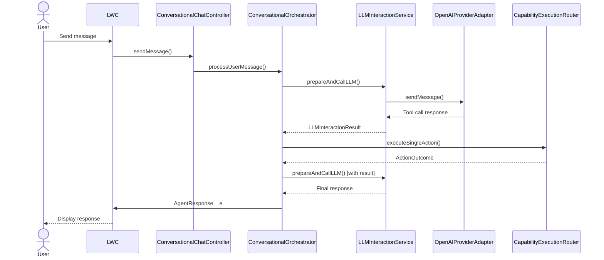
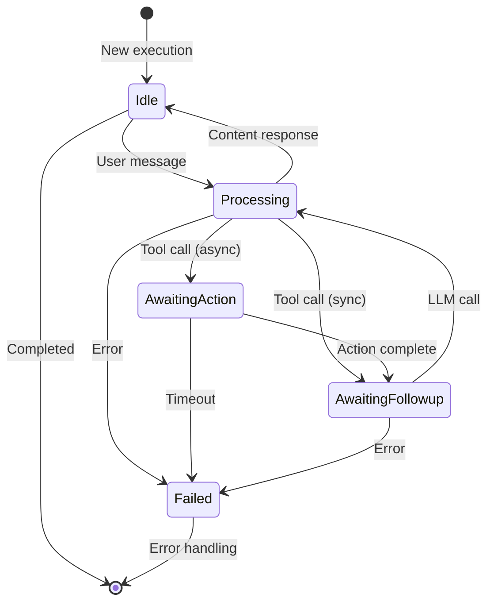

# Salesforce AI Agent Framework

> **Enterprise-Grade Agentic AI Platform for Salesforce**

A production-ready, extensible framework for building sophisticated AI agents powered by Large Language Models (LLMs) that seamlessly integrate with your Salesforce environment. Built with architectural excellence, security-first principles, and enterprise scalability.

[](https://opensource.org/licenses/MPL-2.0)
[](https://developer.salesforce.com/)

---

## 🎯 Overview

The Salesforce AI Agent Framework is a **best-in-class, production-grade platform** that enables you to build intelligent AI agents that:

- 🤖 **Understand natural language** and execute complex multi-step workflows
- 🔒 **Respect Salesforce security** with automatic CRUD/FLS enforcement
- ⚡ **Scale efficiently** with dual-mode async processing (Platform Events + Queueables)
- 🎨 **Work declaratively** through configuration, not just code
- 📊 **Provide deep observability** with comprehensive decision logging
- 🔧 **Extend infinitely** through well-designed interfaces and patterns

**Key Differentiators:**
- ✅ Unified execution model supporting conversational, batch, email, triggered, and autonomous agents
- ✅ Advanced memory management with multiple strategies (buffer window, summary buffer)
- ✅ Sophisticated error handling with LLM-friendly message sanitization
- ✅ Enterprise-ready async patterns with automatic failover
- ✅ Multi-LLM provider support through adapter pattern
- ✅ Human-in-the-loop approval workflows with native Salesforce integration

---

## 📋 Table of Contents

- [Target Audience](#-target-audience)
- [Core Features](#-core-features)
- [Architecture Overview](#-architecture-overview)
- [Data Model](#-data-model)
- [Execution Patterns](#-execution-patterns)
- [Quick Start](#-quick-start)
- [Configuration Guide](#-configuration-guide)
- [Developer Guide](#-developer-guide)
- [Security Model](#-security-model)
- [Performance & Scalability](#-performance--scalability)
- [Troubleshooting](#-troubleshooting)
- [Roadmap](#-roadmap)
- [Contributing](#-contributing)
- [License](#-license)

---

## 👥 Target Audience

### **Salesforce Administrators**
Configure AI agents declaratively using Custom Objects and metadata. No Apex required for standard workflows.

### **Salesforce Developers**
Extend the framework with custom actions (`IAgentAction`), LLM providers (`ILLMProviderAdapter`), memory strategies (`IMemoryManager`), and context providers (`IAgentContextProvider`).

### **Salesforce Architects**
Design secure, scalable, observable AI solutions that leverage Salesforce platform capabilities while maintaining enterprise-grade reliability.

---

## ✨ Core Features

### 🧠 **Intelligent Agent Orchestration**

#### **Multi-Agent Architecture**
- **Conversational Agents**: Interactive chat experiences with context-aware responses
- **Email Agents**: Process inbound emails and generate intelligent responses
- **Batch Agents**: Process large datasets with AI-driven analysis
- **Autonomous Agents**: Self-directed agents that operate independently
- **Triggered Agents**: Event-driven execution from record changes or platform events

#### **Unified Execution Model**
- Single `AgentExecution__c` object tracks all execution types
- Consistent state management across synchronous and asynchronous operations
- Turn-based conversation tracking with `ExecutionStep__c`
- Comprehensive decision logging via `AgentDecisionStep__c`

### 🔄 **Advanced Async Processing**

#### **Dual-Mode Dispatch Strategy**
```
High Concurrency Mode (Platform Events)
→ Maximum throughput for conversational agents
→ Event-driven architecture for scale

Low Concurrency Mode (Queueables)
→ Sequential processing for state-sensitive operations
→ Better error handling and debugging
```

#### **Intelligent Job Management**
- Automatic concurrency mode selection per agent
- Turn identifier validation to prevent stale job execution
- State machine design with clear transitions
- Engine pattern separating business logic from invocation context

### 💾 **Sophisticated Memory Management**

#### **Multiple Memory Strategies**
- **Buffer Window**: Maintains precise N most recent turns
- **Summary Buffer**: Automatically summarizes old conversations to preserve context
- **Custom Strategies**: Implement `IMemoryManager` for domain-specific needs

#### **Context Ledger System**
- Tracks Salesforce records mentioned across conversations
- Relevance scoring with temporal decay
- Intelligent context resolution via `ContextManagerService`
- Supports multiple context providers per agent

### 🛡️ **Enterprise-Grade Security**

#### **Salesforce Native Security**
- Automatic CRUD permission validation via `SecurityUtils`
- Field-Level Security (FLS) enforcement on all data operations
- Sharing rules respected through `inherited sharing` classes
- User context tracking (`originalUserId` vs `executionUserId`)

#### **Record-Level Access Control**
- Validates user access to related records before operations
- Prevents privilege escalation through context manipulation
- Comprehensive audit trail in `AgentDecisionStep__c`

### 🎯 **Powerful Action Framework**

#### **Standard Actions (Built-in)**
- `ActionCreateRecord`: Create any SObject with validation
- `ActionUpdateRecord`: Update records with security checks
- `ActionGetRecords`: Retrieve records with intelligent querying
- `ActionFindEntities`: Semantic search across objects
- `ActionSearchKnowledge`: Knowledge article search with relevance
- `ActionPostChatter`: Chatter feed interactions
- `ActionSendEmail`: Email composition and delivery
- `ActionFlowHandler`: Execute Salesforce Flows with parameters

#### **Custom Action Development**
- Extend `BaseAgentAction` abstract class
- Automatic parameter validation and type coercion
- Schema-driven parameter processing (JSON Schema support)
- Built-in error handling and outcome formatting
- Security validation integrated

### 🔌 **Multi-LLM Provider Support**

#### **Provider Adapter Pattern**
- Interface: `ILLMProviderAdapter`
- Built-in: `OpenAIProviderAdapter` (GPT-3.5, GPT-4, GPT-4o)
- Extensible: Add any LLM provider (Anthropic, Google, Azure)
- Configuration via `LLMConfiguration__c`

#### **Advanced LLM Features**
- Retry logic with exponential backoff (CPU-optimized)
- Token usage tracking and reporting
- Parallel tool calling support
- Reasoning mode with transient messages
- Error recovery with "Halt and Report" pattern

### 📊 **Deep Observability**

#### **Decision Step Logging**
Every agent interaction captured:
- User input with timestamps
- System prompt composition
- Available tools list
- LLM request payload
- LLM response details
- Tool execution results
- Final response generation
- Error tracking with stack traces

#### **Performance Metrics**
- Processing duration per step
- Token consumption per turn
- Action execution time
- Turn count and cycle tracking

### ✅ **Human-in-the-Loop Approvals**

#### **Native Approval Process Integration**
- `HumanApprovalRequest__c` object
- Automatic submission to Salesforce Approval Process
- Pause agent execution pending approval
- Resume with approval result
- Rejection handling with user notification

### 💬 **Rich User Experience**

#### **Real-Time UI Updates**
- `AgentResponse__e`: Final response delivery
- `TransientMessage__e`: Intermediate "thinking" display
- Status updates during async operations
- Error messages with user-friendly formatting

#### **LLM-Friendly Error Messages**
- Automatic sanitization of technical stack traces
- Emoji-enriched error presentation (🔒 🔍 💾 ⚡)
- Context-aware suggestions for recovery
- User-appropriate language transformation

---

## 🏗️ Architecture Overview

### **Design Patterns & Principles**

#### **Strategy Pattern**
- `ILLMResponseHandler` → `ContentResponseHandler` | `ToolCallResponseHandler`
- Dynamic response handling based on LLM output

#### **Factory Pattern**
- `LLMProviderFactory` → Creates provider adapters
- `MemoryManagerFactory` → Creates memory strategies
- `ActionRegistry` → Creates action handlers
- `OrchestratorFactory` → Creates execution orchestrators

#### **Template Method Pattern**
- `BaseAgentAction` → Defines action execution template
- Subclasses implement `executeAction()` only
- Framework handles validation, security, error handling

#### **Adapter Pattern**
- `ILLMProviderAdapter` → Abstracts LLM provider differences
- Consistent interface across OpenAI, Anthropic, etc.

#### **Dependency Injection**
- Constructor-based DI throughout
- Testable service layer
- Clear dependency graphs

### **Service Layer Architecture**

```
┌─────────────────────────────────────────────────────────┐
│                   Presentation Layer                     │
│  aiAssistantChat (LWC) | REST API | Platform Events     │
└───────────────────┬─────────────────────────────────────┘
                    │
┌───────────────────▼─────────────────────────────────────┐
│                  Orchestration Layer                     │
│  OrchestrationService | OrchestratorFactory             │
│  ConversationalOrchestrator | EmailOrchestrator          │
│  BatchOrchestrator | AutonomousOrchestrator             │
└───────────────────┬─────────────────────────────────────┘
                    │
┌───────────────────▼─────────────────────────────────────┐
│                    Service Layer                         │
│  LLMInteractionService | CapabilityExecutionRouter      │
│  TurnLifecycleService | ContextManagerService           │
│  SystemPromptBuilder | MemoryManagers                   │
└───────────────────┬─────────────────────────────────────┘
                    │
┌───────────────────▼─────────────────────────────────────┐
│                    Action Layer                          │
│  BaseAgentAction | ActionRegistry                       │
│  Standard Actions | Custom Actions | Flow Handler        │
└───────────────────┬─────────────────────────────────────┘
                    │
┌───────────────────▼─────────────────────────────────────┐
│                  Data Access Layer                       │
│  ExecutionContextService | ExecutionStepService         │
│  SecurityUtils | TypeCoercionService | SchemaUtils      │
└─────────────────────────────────────────────────────────┘
```

### **Async Processing Architecture**

```
User Request → OrchestrationService
                    ↓
        ┌───────────┴───────────┐
        │                       │
    [LLM Call]           [Tool Execution]
        │                       │
        ↓                       ↓
   Result ←────────────→ AgentJobEnqueuer
                              ↓
                    ┌─────────┴──────────┐
                    │                    │
          [High Concurrency]    [Low Concurrency]
            Platform Event          Queueable
                    │                    │
                    ↓                    ↓
       AsyncFrameworkRequest__e  AsyncActionQueueable
                    │                    │
                    └─────────┬──────────┘
                              ↓
                        AsyncActionEngine
                              ↓
                      Action Execution
                              ↓
                      Update Execution
                              ↓
                     Follow-up LLM Call
```

---

## 📊 Data Model

### **Core Objects**

#### **AIAgentDefinition__c**
Defines an AI agent's identity and behavior.

**Key Fields:**
- `DeveloperName__c` (String): Unique identifier
- `IdentityPrompt__c` (LongText): Agent's role and persona
- `InstructionsPrompt__c` (LongText): Behavioral instructions
- `SystemPrompt__c` (LongText): Base system instructions
- `LLMConfiguration__c` (Lookup): LLM provider to use
- `AgentType__c` (Picklist): Conversational | Email | Batch | Autonomous
- `MemoryStrategy__c` (String): BufferWindow | SummaryBuffer
- `HistoryTurnLimit__c` (Number): Max turns to include in context
- `EnableReasoningMode__c` (Checkbox): Show transient messages
- `EnableParallelToolCalling__c` (Checkbox): Allow parallel execution
- `Concurrency__c` (Picklist): High | Low (async dispatch mode)

#### **AgentExecution__c**
Tracks a single agent execution instance.

**Key Fields:**
- `ExecutionType__c` (String): Conversational | Email | Batch | API | Trigger
- `AIAgentDefinition__c` (Lookup): Agent being executed
- `ExecutionStatus__c` (String): Pending | Processing | Completed | Failed
- `ProcessingStatus__c` (String): Idle | Processing | Awaiting Action | Awaiting Followup
- `TriggerSource__c` (String): What initiated this execution
- `TriggerPayload__c` (LongText): Source data (email, record, etc.)
- `CurrentTurnIdentifier__c` (String): Active turn ID (for stale detection)
- `User__c` (Lookup): Original user
- `ServiceUser__c` (Lookup): Execution user (for elevated permissions)
- `SourceRecordId__c` (String): Primary context record
- `ConversationSummary__c` (LongText): Summary for summary buffer strategy

#### **ExecutionStep__c**
Records individual steps within an execution (messages, tool calls, results).

**Key Fields:**
- `AgentExecution__c` (Lookup): Parent execution
- `StepType__c` (String): UserInput | AgentResponse | ToolCall | ToolResult
- `StepRole__c` (String): User | Assistant | System | Tool
- `Content__c` (LongText): Step content
- `ContentType__c` (String): Text | JSON | Binary
- `TurnIdentifier__c` (String): Turn this step belongs to
- `TurnCount__c` (Number): Turn sequence number
- `ToolCallId__c` (String): LLM's tool call identifier
- `ToolName__c` (String): Capability name invoked
- `ToolArguments__c` (LongText): JSON arguments to tool
- `ToolResult__c` (LongText): JSON result from tool
- `ProcessingDuration__c` (Number): Execution time (ms)
- `IsInternal__c` (Checkbox): Hidden from user (reasoning mode)
- `IsSummarized__c` (Checkbox): Included in summary

#### **AgentDecisionStep__c**
Detailed decision logging for observability and debugging.

**Key Fields:**
- `AgentExecution__c` (Lookup): Parent execution
- `TurnIdentifier__c` (String): Turn identifier
- `StepType__c` (String): UserInput | SystemPrompt | ToolsList | LLMRequest | LLMResponse | ToolExecution | ToolResult | FinalResponse | Error
- `Title__c` (String): Step title
- `Description__c` (LongText): Step description
- `ContentJson__c` (LongText): Full step data (JSON)
- `DurationMs__c` (Number): Processing time
- `IsSuccess__c` (Checkbox): Success indicator
- `ErrorCode__c` (String): Error code if failed
- `ErrorMessage__c` (LongText): Error details
- `StepOrder__c` (Number): Sequence within turn
- `OriginalUser__c` (Lookup): User who initiated
- `ExecutionUser__c` (Lookup): User executing

#### **AgentCapability__c**
Defines actions/tools available to agents.

**Key Fields:**
- `CapabilityName__c` (String): Tool name for LLM
- `Description__c` (LongText): When/how to use this tool
- `Parameters__c` (LongText): JSON Schema for arguments
- `ImplementationType__c` (Picklist): Standard | Apex | Flow
- `StandardActionType__c` (String): CreateRecord | UpdateRecord | GetRecords | etc.
- `ImplementationDetail__c` (String): Apex class name or Flow API name
- `BackendConfiguration__c` (LongText): Server-side config (JSON)
- `RunAsynchronously__c` (Checkbox): Execute in background
- `RequiresApproval__c` (Checkbox): Submit for approval
- `HaltAndReportError__c` (Checkbox): Stop on failure vs. autonomous recovery
- `AIAgentDefinition__c` (Lookup): Parent agent

#### **LLMConfiguration__c**
Configures connection to an LLM provider.

**Key Fields:**
- `DeveloperName__c` (String): Unique identifier
- `NamedCredential__c` (String): Salesforce Named Credential
- `ProviderAdapterClass__c` (String): Apex class implementing `ILLMProviderAdapter`
- `DefaultModelIdentifier__c` (String): Model name (e.g., "gpt-4o")
- `DefaultTemperature__c` (Number): Sampling temperature
- `MaxRetryAttempts__c` (Number): Retry count
- `InitialRetryDelayMillis__c` (Number): Retry delay
- `RetryableHttpStatusCodes__c` (String): Comma-separated codes

#### **HumanApprovalRequest__c**
Tracks pending human approvals.

**Key Fields:**
- `AgentExecution__c` (Lookup): Execution requesting approval
- `OriginalAssistantStep__c` (Lookup): ExecutionStep with tool call
- `LLMToolCallId__c` (String): Tool call ID
- `LLMToolName__c` (String): Capability name
- `LLMToolArgumentsJSON__c` (LongText): Tool arguments
- `LLMConfirmationMessage__c` (LongText): Approval request message
- `ApprovalStatus__c` (String): Pending | Approved | Rejected
- `RelatedApprovalProcessInstanceId__c` (String): ProcessInstance ID

### **Platform Events**

#### **AgentResponse__e**
Published when agent execution completes.

**Fields:**
- `ChatSessionId__c` (String): AgentExecution__c ID
- `IsSuccess__c` (Checkbox): Success indicator
- `FinalAssistantMessageId__c` (String): ExecutionStep__c ID
- `FinalMessageContent__c` (LongText): Response text
- `ErrorDetails__c` (String): Error message if failed

#### **TransientMessage__e**
Published for real-time "thinking" updates (reasoning mode).

**Fields:**
- `ChatSessionId__c` (String): AgentExecution__c ID
- `MessageId__c` (String): ExecutionStep__c ID
- `MessageContent__c` (LongText): Intermediate message

#### **AsyncFrameworkRequest__e**
Internal event for high-concurrency async dispatch.

**Fields:**
- `SessionId__c` (String): AgentExecution__c ID
- `TurnIdentifier__c` (String): Turn ID
- `JobType__c` (String): ExecuteAction | FollowUpLLM | ProcessLLMMessage
- `Payload__c` (LongText): Job parameters (JSON)

---

## 🔄 Execution Patterns

### **Conversational Agent Flow**



### **Async Action Execution**



### **Turn Lifecycle**

Each "turn" represents one complete user→LLM→action→LLM→response cycle:

1. **User Input** → Create ExecutionStep (UserInput)
2. **System Prompt** → Build from agent config + context + history
3. **LLM Request** → Call provider with prompt + tools + history
4. **LLM Response** → Parse content/tool calls
5. **Tool Execution** (if requested) → Execute action(s)
6. **Follow-up LLM** (if tool executed) → Call LLM with results
7. **Final Response** → Create ExecutionStep (AgentResponse)
8. **Complete Turn** → Update execution status to Idle

---

## 🚀 Quick Start

### **Prerequisites**

- Salesforce org (Sandbox recommended for testing)
- System Administrator profile
- Named Credential setup capability
- API access to an LLM provider (e.g., OpenAI API key)

### **Installation**

1. **Deploy the Package**
   ```bash
   sfdx force:source:deploy -p force-app/main/default -u <your-org-alias>
   ```

2. **Create Named Credential**
   - Navigate to: Setup → Named Credentials
   - Click "New Named Credential"
   - **Label**: OpenAI API
   - **Name**: OpenAI_API
   - **URL**: https://api.openai.com
   - **Authentication**: Named Principal
   - **Protocol**: Password Authentication
   - **Username**: (leave blank)
   - **Password**: Your OpenAI API key
   - Save

3. **Configure Framework Settings**
   - Navigate to: Setup → Custom Settings → AIAgentFrameworkSettings
   - Click "Manage"
   - Click "New" (for Organization-level default)
   - Set values:
     - `DefaultMaxConversationTurns__c`: 5
     - `DefaultHistoryTurnLimit__c`: 20
     - `DefaultMaxRetryAttempts__c`: 1
     - `DefaultRetryableHttpStatusCodes__c`: 408,429,500,502,503,504
   - Save

4. **Create LLM Configuration**
   - App Launcher → LLM Configurations → New
   - **Developer Name**: OpenAI_GPT4
   - **Named Credential**: OpenAI_API
   - **Provider Adapter Class**: OpenAIProviderAdapter
   - **Default Model Identifier**: gpt-4o
   - **Default Temperature**: 0.7
   - **Max Retry Attempts**: 1
   - Save

5. **Create Your First Agent**
   - App Launcher → AI Agent Definitions → New
   - **Developer Name**: SalesAssistant
   - **Agent Type**: Conversational
   - **LLM Configuration**: OpenAI_GPT4
   - **Memory Strategy**: BufferWindow
   - **History Turn Limit**: 10
   - **Identity Prompt**:
     ```
     You are a helpful Salesforce assistant named SalesBot.
     You help users find information about their Salesforce records and perform common tasks.
     You are friendly, professional, and concise.
     ```
   - **Instructions Prompt**:
     ```
     - Always confirm before making changes to records
     - Provide clear explanations of what you find
     - Ask clarifying questions when needed
     - Use appropriate tools to access Salesforce data
     ```
   - **Enable Reasoning Mode**: Checked
   - **Concurrency**: Low
   - Save

6. **Create Capabilities for Your Agent**

   **Capability 1: Get Contact Information**
   - **Capability Name**: get_contact_info
   - **Description**: Retrieves detailed information about a contact by name or email. Use this when the user asks about a specific person or contact.
   - **Implementation Type**: Standard
   - **Standard Action Type**: GetRecords
   - **Backend Configuration**:
     ```json
     {
       "objectApiName": "Contact"
     }
     ```
   - **Parameters**:
     ```json
     {
       "type": "object",
       "properties": {
         "firstName": {
           "type": "string",
           "description": "First name of the contact"
         },
         "lastName": {
           "type": "string",
           "description": "Last name of the contact"
         },
         "email": {
           "type": "string",
           "format": "email",
           "description": "Email address of the contact"
         }
       },
       "required": []
     }
     ```
   - **AI Agent Definition**: SalesAssistant
   - Save

   **Capability 2: Create Contact**
   - **Capability Name**: create_contact
   - **Description**: Creates a new contact record. Use this when the user wants to add a new person to the system.
   - **Implementation Type**: Standard
   - **Standard Action Type**: CreateRecord
   - **Backend Configuration**:
     ```json
     {
       "objectApiName": "Contact"
     }
     ```
   - **Parameters**:
     ```json
     {
       "type": "object",
       "properties": {
         "firstName": {
           "type": "string",
           "description": "First name of the contact"
         },
         "lastName": {
           "type": "string",
           "description": "Last name of the contact"
         },
         "email": {
           "type": "string",
           "format": "email",
           "description": "Email address"
         },
         "phone": {
           "type": "string",
           "description": "Phone number"
         },
         "title": {
           "type": "string",
           "description": "Job title"
         }
       },
       "required": ["firstName", "lastName"]
     }
     ```
   - **AI Agent Definition**: SalesAssistant
   - **Requires Approval**: Checked (if you want approval workflow)
   - Save

7. **Add Chat Component to Lightning Page**
   - Navigate to any record page (Account, Contact, etc.)
   - Click Setup → Edit Page
   - Drag "aiAssistantChat" component to the page
   - Configure component properties:
     - **Agent Developer Name**: SalesAssistant
   - Save and Activate

8. **Test Your Agent**
   - Navigate to the page where you added the chat component
   - Type: "Find me the contact named John Smith"
   - The agent should use the `get_contact_info` tool to search
   - Try: "Create a new contact named Jane Doe with email jane@example.com"
   - The agent should use the `create_contact` tool

---

## ⚙️ Configuration Guide

### **Agent Configuration Best Practices**

#### **Writing Effective Prompts**

**Identity Prompt** (Who the agent is):
```
You are [NAME], a [ROLE] for [COMPANY/DEPARTMENT].
Your expertise includes [DOMAIN KNOWLEDGE].
Your personality is [CHARACTERISTICS].
```

**Instructions Prompt** (How the agent behaves):
```
Guidelines:
- Always [BEHAVIOR 1]
- Never [BEHAVIOR 2]
- When [SITUATION], do [ACTION]
- Prefer [APPROACH] over [ALTERNATIVE]

Tone: [Professional | Friendly | Technical | etc.]
Response Style: [Concise | Detailed | Step-by-step | etc.]
```

**Examples Prompt** (Few-shot learning):
```
Example 1:
User: "Show me open opportunities for Acme Corp"
You: "I'll search for open opportunities for Acme Corp. [searches] I found 3 open opportunities..."

Example 2:
User: "Update the close date to next Friday"
You: "I'll update the opportunity close date to [DATE]. Please confirm you'd like to proceed."
User: "Yes"
You: [updates record] "Done! The close date has been updated."
```

#### **Capability Configuration**

**Parameter Schema Design**:
- Use descriptive `description` fields - the LLM relies on these
- Mark truly required fields in `required` array
- Use `format` hints for validation (email, date, salesforce-id)
- Provide `enum` for constrained choices
- Keep parameters simple - complex nested objects are harder for LLMs

**Example: Advanced Parameter Schema**
```json
{
  "type": "object",
  "properties": {
    "accountId": {
      "type": "string",
      "format": "salesforce-id",
      "description": "The 18-character Salesforce ID of the Account record"
    },
    "opportunityStage": {
      "type": "string",
      "enum": ["Prospecting", "Qualification", "Proposal", "Negotiation", "Closed Won"],
      "description": "The sales stage for the opportunity"
    },
    "closeDate": {
      "type": "string",
      "format": "date",
      "description": "Expected close date in YYYY-MM-DD format"
    },
    "amount": {
      "type": "number",
      "description": "Opportunity amount in USD"
    },
    "contacts": {
      "type": "array",
      "items": {
        "type": "object",
        "properties": {
          "contactId": {
            "type": "string",
            "format": "salesforce-id"
          },
          "role": {
            "type": "string"
          }
        }
      },
      "description": "Array of contacts associated with this opportunity"
    }
  },
  "required": ["accountId", "opportunityStage", "closeDate"]
}
```

#### **Memory Strategy Selection**

**BufferWindow** (Default):
- Best for: Short conversations, transactional interactions
- Behavior: Keeps last N turns verbatim
- Pros: Simple, fast, predictable
- Cons: Context window fills up quickly
- Config: Set `HistoryTurnLimit__c` (e.g., 10)

**SummaryBuffer**:
- Best for: Long conversations, advisory agents
- Behavior: Summarizes old turns, keeps recent ones verbatim
- Pros: Maintains context indefinitely, controls token usage
- Cons: May lose nuance in summarization
- Config: Set `SummarizationTriggerTurnCount__c` and `SummarizationChunkTurnCount__c`

#### **Concurrency Mode Selection**

**High Concurrency** (Platform Events):
- Best for: Conversational agents with many concurrent users
- Throughput: Up to 2,000 events per transaction
- Latency: Very low
- Use when: You expect >10 concurrent conversations

**Low Concurrency** (Queueables):
- Best for: Email, batch, triggered agents
- Throughput: Sequential processing (5 at a time)
- Latency: Slightly higher
- Use when: Order matters or you need better error handling

---

## 💻 Developer Guide

### **Creating a Custom Action**

#### **Step 1: Create Apex Class**

```apex
/**
 * Custom action to get weather information
 */
public class ActionGetWeather extends BaseAgentAction {

    /**
     * This is the only method you need to implement!
     * BaseAgentAction handles all validation, security, and error handling.
     */
    public override ActionOutcome executeAction(Map<String, Object> params) {
        // Parameters are already validated and type-coerced by the framework
        String city = (String) params.get('city');
        String country = (String) params.get('country');

        // Make HTTP callout to weather API
        HttpRequest req = new HttpRequest();
        req.setEndpoint('callout:WeatherAPI/current?q=' +
                       EncodingUtil.urlEncode(city, 'UTF-8'));
        req.setMethod('GET');

        Http http = new Http();
        HttpResponse res = http.send(req);

        if (res.getStatusCode() == 200) {
            // Parse response
            Map<String, Object> weatherData =
                (Map<String, Object>) JSON.deserializeUntyped(res.getBody());

            // Return success with data
            return ActionOutcome.success(new Map<String, Object>{
                'temperature': weatherData.get('temp'),
                'conditions': weatherData.get('description'),
                'humidity': weatherData.get('humidity'),
                'message': 'Current weather in ' + city + ' retrieved successfully.'
            });
        } else {
            // Return failure with user-friendly message
            return ActionOutcome.failure(
                AIAgentConstants.ERR_CODE_CONNECT_API_ERROR,
                'Unable to retrieve weather data. Please try again.'
            );
        }
    }

    /**
     * Optional: Override to parse backend configuration
     */
    @TestVisible
    protected override void parseActionConfiguration(
        String actionConfigurationJson,
        String logPrefix
    ) {
        super.parseActionConfiguration(actionConfigurationJson, logPrefix);

        // Access configuration via this.parsedActionConfig
        // Example: this.apiKey = (String) this.parsedActionConfig.get('apiKey');
    }
}
```

#### **Step 2: Create Capability Record**

- **Capability Name**: get_weather
- **Description**: Retrieves current weather conditions for a specified city. Use this when the user asks about the weather in a location.
- **Implementation Type**: Apex
- **Implementation Detail**: ActionGetWeather
- **Backend Configuration** (optional):
  ```json
  {
    "apiKey": "your-api-key-here",
    "units": "metric"
  }
  ```
- **Parameters**:
  ```json
  {
    "type": "object",
    "properties": {
      "city": {
        "type": "string",
        "description": "The city name to get weather for"
      },
      "country": {
        "type": "string",
        "description": "Two-letter country code (e.g., US, UK, FR)"
      }
    },
    "required": ["city"]
  }
  ```

#### **Step 3: Create Named Credential**

- Setup → Named Credentials → New
- **Name**: WeatherAPI
- **URL**: https://api.weatherapi.com
- Configure authentication

### **Creating a Custom LLM Provider**

#### **Implement ILLMProviderAdapter**

```apex
public class AnthropicProviderAdapter implements ILLMProviderAdapter {

    public ProviderResult sendMessage(
        List<Map<String, Object>> messagesPayload,
        List<Map<String, Object>> toolsPayload,
        LLMConfiguration__c llmConfig,
        AIAgentDefinition__c agentConfig
    ) {
        // Build HTTP request
        HttpRequest req = buildRequest(
            messagesPayload,
            toolsPayload,
            llmConfig
        );

        // Configure retry
        HttpRetryService.RetryConfig retryConfig =
            HttpRetryService.createRetryConfig(llmConfig, '[Anthropic] ');

        // Execute with retry
        HttpRetryService.HttpRetryResult result =
            HttpRetryService.executeWithRetry(req, retryConfig);

        // Parse response
        return parseAnthropicResponse(result.response.getBody());
    }

    private HttpRequest buildRequest(
        List<Map<String, Object>> messages,
        List<Map<String, Object>> tools,
        LLMConfiguration__c config
    ) {
        HttpRequest req = new HttpRequest();
        req.setEndpoint('callout:' + config.NamedCredential__c + '/v1/messages');
        req.setMethod('POST');
        req.setHeader('Content-Type', 'application/json');
        req.setHeader('anthropic-version', '2023-06-01');

        Map<String, Object> body = new Map<String, Object>{
            'model' => config.DefaultModelIdentifier__c,
            'messages' => messages,
            'max_tokens' => 4096
        };

        if (tools != null && !tools.isEmpty()) {
            body.put('tools', convertToolsToAnthropicFormat(tools));
        }

        req.setBody(JSON.serialize(body));
        return req;
    }

    private ProviderResult parseAnthropicResponse(String jsonBody) {
        Map<String, Object> response =
            (Map<String, Object>) JSON.deserializeUntyped(jsonBody);

        // Extract content, token usage, tool calls
        // Return ProviderResult with standardized format

        return new ProviderResult(
            content,
            promptTokens,
            completionTokens,
            totalTokens,
            requestedActions,
            rawToolCallsJson,
            rawAssistantMessageJson
        );
    }

    private List<Map<String, Object>> convertToolsToAnthropicFormat(
        List<Map<String, Object>> openAITools
    ) {
        // Convert OpenAI tool format to Anthropic format
        // Both use similar JSON Schema, but structure differs slightly
        return anthropicTools;
    }
}
```

### **Creating a Custom Memory Manager**

```apex
public class SlidingWindowMemoryManager implements IMemoryManager {

    public List<Map<String, Object>> getHistoryPayload(
        Id executionId,
        AIAgentDefinition__c agentConfig,
        LLMConfiguration__c llmConfig,
        String loggingContext
    ) {
        // Query execution steps with custom logic
        Integer windowSize = 5; // last 5 exchanges

        List<ExecutionStep__c> steps = [
            SELECT StepType__c, StepRole__c, Content__c,
                   ToolCallId__c, ToolName__c, ToolArguments__c, ToolResult__c
            FROM ExecutionStep__c
            WHERE AgentExecution__c = :executionId
              AND IsInternal__c = false
            ORDER BY CreatedDate DESC
            LIMIT :windowSize * 2  // User + Assistant = 2 per exchange
        ];

        // Format for LLM consumption
        return ExecutionStepHistoryFormatter.formatStepsForApi(
            steps,
            agentConfig,
            loggingContext
        );
    }

    public void onTurnCompletion(
        Id executionId,
        AIAgentDefinition__c agentConfig,
        LLMConfiguration__c llmConfig,
        String loggingContext
    ) {
        // Optional: Perform cleanup or aggregation after turn
    }
}
```

### **Unit Testing Best Practices**

```apex
@isTest
private class ActionGetWeatherTest {

    @isTest
    static void testSuccessfulWeatherRetrieval() {
        // Setup mock HTTP response
        Test.setMock(HttpCalloutMock.class, new WeatherApiMock(200, '{"temp": 72}'));

        // Create action context
        ActionContext ctx = new ActionContext(
            null, // executionId
            UserInfo.getUserId(), // originalUserId
            UserInfo.getUserId(), // executionUserId
            null, // relatedRecordId
            null, // agentDefinitionId
            null, // capabilityId
            null, // implementationDetail
            'test_turn', // turnIdentifier
            1, // turnCount
            'Test' // executionType
        );

        // Create action instance
        ActionGetWeather action = new ActionGetWeather();

        // Execute action
        Test.startTest();
        ActionOutcome outcome = action.execute(
            null, // config
            '{"city": "San Francisco", "country": "US"}', // args
            ctx
        );
        Test.stopTest();

        // Assertions
        System.assert(outcome.isSuccess, 'Action should succeed');
        Map<String, Object> data = (Map<String, Object>) outcome.data;
        System.assertEquals(72, data.get('temperature'));
    }

    @isTest
    static void testApiFailure() {
        Test.setMock(HttpCalloutMock.class, new WeatherApiMock(500, 'Error'));

        ActionContext ctx = new ActionContext(/*...*/);
        ActionGetWeather action = new ActionGetWeather();

        Test.startTest();
        ActionOutcome outcome = action.execute(
            null,
            '{"city": "InvalidCity"}',
            ctx
        );
        Test.stopTest();

        System.assert(!outcome.isSuccess, 'Action should fail');
        System.assertEquals(
            AIAgentConstants.ERR_CODE_CONNECT_API_ERROR,
            outcome.errorCode
        );
    }

    // Mock class for HTTP callouts
    private class WeatherApiMock implements HttpCalloutMock {
        private Integer statusCode;
        private String body;

        public WeatherApiMock(Integer statusCode, String body) {
            this.statusCode = statusCode;
            this.body = body;
        }

        public HttpResponse respond(HttpRequest req) {
            HttpResponse res = new HttpResponse();
            res.setStatusCode(this.statusCode);
            res.setBody(this.body);
            return res;
        }
    }
}
```

---

## 🔒 Security Model

### **Multi-Layer Security Architecture**

#### **Layer 1: Salesforce Platform Security**
- All DML respects sharing rules via `inherited sharing` classes
- Profiles and permission sets control feature access
- Field-Level Security automatically enforced

#### **Layer 2: Framework Security Validation**
- `SecurityUtils.checkObjectPermission()` - Validates CRUD before operations
- `SecurityUtils.checkFieldPermission()` - Validates FLS before field access
- `TypeCoercionService` - Filters out non-accessible fields automatically

#### **Layer 3: Context Security**
- User context tracked: `originalUserId` vs `executionUserId`
- Record access validation before using as context
- Execution audit trail in `AgentDecisionStep__c`

#### **Layer 4: Data Sanitization**
- Debug log sanitization (PII/PHI protection)
- Error message sanitization for user display
- Input validation via JSON Schema

### **Permission Model**

#### **User Permissions Required**
- Read access to `AIAgentDefinition__c`
- Read access to `LLMConfiguration__c`
- Read/Write access to `AgentExecution__c`
- Read/Write access to `ExecutionStep__c`
- Execute permission on `ConversationalChatController` (and other controllers)

#### **System Permissions Required** (Admin/Developer)
- Full access to all configuration objects
- Manage Named Credentials
- Configure Platform Event subscribers
- Deploy Apex classes

### **Security Best Practices**

1. **Principle of Least Privilege**: Grant agents only necessary capabilities
2. **Approval for High-Risk Actions**: Use `RequiresApproval__c` for data modifications
3. **Input Validation**: Always define proper JSON Schema for parameters
4. **Audit Regularly**: Review `AgentDecisionStep__c` for anomalies
5. **Test in Sandbox**: Never test in production with real user data
6. **Monitor API Costs**: LLM API calls can accumulate quickly

---

## ⚡ Performance & Scalability

### **Governor Limit Considerations**

| Limit | Framework Impact | Mitigation |
|-------|------------------|------------|
| **100 SOQL Queries** | Moderate - Bulk queries in services | ✅ Implemented |
| **50,000 Query Rows** | Low - Paginated history retrieval | ✅ Limit clauses needed |
| **150 DML Statements** | Low - Batch processing in triggers | ⚠️ Bulkification needed |
| **10,000 DML Rows** | Very Low | ✅ Safe |
| **CPU Time (10s sync)** | **CRITICAL - Retry delays removed** | ✅ Fixed |
| **Heap Size (6MB)** | Low - JSON can be large | ⚠️ Monitor |
| **Callouts (100)** | Low - 1-2 per turn | ✅ Safe |
| **Platform Events** | Moderate - High volume possible | ⚠️ Rate limiting needed |

### **Recent Performance Fixes**

✅ **Busy-Wait CPU Consumption Removed**
- Previous: Retry delays consumed 6+ seconds of CPU time
- Fixed: Immediate retries, no in-process delays
- Impact: Eliminates CPU governor limit risk

⚠️ **Platform Event Bulkification** (Needs Implementation)
- Risk: 100 events × 3 DML each = 300 DML (exceeds limit)
- Solution: Deferred DML pattern with bulk commits
- Priority: High for production readiness

### **Scalability Limits**

| Scenario | Limit | Notes |
|----------|-------|-------|
| Concurrent Conversations | 2,000/hour | Platform Event throughput |
| Conversation Length | 50 turns | Before token limit |
| LLM Calls per Turn | 3-5 | Initial + tool + follow-up |
| Actions per Turn | 10 | Practical limit |
| Execution History | Unlimited | Archive old records periodically |

### **Performance Optimization Tips**

1. **Use Low Concurrency for Sequential Workflows**: Better error handling, easier debugging
2. **Limit History Turn Count**: Fewer tokens = faster LLM responses = lower cost
3. **Use Summary Buffer for Long Conversations**: Keeps token usage constant
4. **Optimize Tool Descriptions**: Shorter descriptions = smaller prompts = faster
5. **Cache Frequently Accessed Data**: Use Platform Cache for schema, config
6. **Monitor Token Usage**: Track via `ExecutionStep__c.ProcessingDuration__c`

---

## 🔧 Troubleshooting

### **Common Issues**

#### **Issue: "Agent stuck in 'Processing' status"**

**Symptoms**: UI shows "Processing..." indefinitely

**Causes**:
1. Async job failed silently
2. Turn identifier mismatch (stale job)
3. Platform Event not delivered
4. Queueable failed to enqueue (queue full)

**Debug Steps**:
```sql
-- Check execution status
SELECT Id, ExecutionStatus__c, ProcessingStatus__c,
       CurrentTurnIdentifier__c, LastActivityTime__c
FROM AgentExecution__c
WHERE Id = '<execution-id>'

-- Check decision steps for errors
SELECT Title__c, IsSuccess__c, ErrorCode__c, ErrorMessage__c
FROM AgentDecisionStep__c
WHERE AgentExecution__c = '<execution-id>'
ORDER BY CreatedDate DESC

-- Check async jobs
SELECT Id, Status, ExtendedStatus, NumberOfErrors
FROM AsyncApexJob
WHERE JobType = 'Queueable'
  AND CreatedDate = TODAY
ORDER BY CreatedDate DESC
```

**Solutions**:
1. Implement state timeout recovery (Scheduled Apex)
2. Check governor limit logs in Debug Logs
3. Verify Platform Event subscriber is active
4. Check flex queue depth (may be full)

#### **Issue: "LLM returns 'Tool not found' error"**

**Symptoms**: Agent says it doesn't have access to a tool

**Causes**:
1. Capability not linked to agent definition
2. `CapabilityName__c` doesn't match tool name
3. Agent prompt doesn't mention the tool
4. Tool description is unclear

**Solutions**:
1. Verify `AgentCapability__c.AIAgentDefinition__c` is set
2. Check capability name matches exactly
3. Add tool usage example to `ExamplesPrompt__c`
4. Improve `Description__c` with clear use cases

#### **Issue: "Permission denied errors"**

**Symptoms**: `SecurityUtils.ActionSecurityException` in logs

**Causes**:
1. User lacks CRUD permission on object
2. User lacks FLS on specific fields
3. Record-level access denied by sharing rules

**Debug Steps**:
```apex
// Test user permissions
User u = [SELECT Id FROM User WHERE Id = '<user-id>'];
System.runAs(u) {
    Schema.DescribeSObjectResult describeResult =
        Contact.SObjectType.getDescribe();
    System.debug('Createable: ' + describeResult.isCreateable());
    System.debug('Accessible: ' + describeResult.isAccessible());
    System.debug('Updateable: ' + describeResult.isUpdateable());
}
```

**Solutions**:
1. Grant appropriate profile/permission set permissions
2. Update sharing rules or make object public read/write
3. Use Service User context for elevated permissions

#### **Issue: "Token limit exceeded"**

**Symptoms**: LLM returns error about context length

**Causes**:
1. Too many turns in history
2. Very long tool results
3. Large context from context providers

**Solutions**:
1. Reduce `HistoryTurnLimit__c` on agent
2. Switch to Summary Buffer memory strategy
3. Limit context provider data size
4. Truncate long field values in tool results

### **Debug Logging**

**Enable detailed logging**:
```apex
// In Developer Console or VS Code
// Setup → Debug Logs → New
// User: Your test user
// Debug Level: Create new with:
//   - Apex Code: FINEST
//   - Visualforce: INFO
//   - System: DEBUG

// Look for these patterns:
// [OrchSvc Turn:xxxxx] - Orchestration flow
// [LLMIntSvc Turn:xxxxx] - LLM interactions
// [AsyncActionEngine:xxxxx] - Async processing
// [SecurityUtils] - Permission checks
```

### **Monitoring Queries**

```sql
-- Agent activity today
SELECT AIAgentDefinition__r.DeveloperName__c,
       COUNT(Id) executions,
       AVG(HOUR(StartTime__c)) avg_hour
FROM AgentExecution__c
WHERE StartTime__c = TODAY
GROUP BY AIAgentDefinition__r.DeveloperName__c

-- Failed executions
SELECT Id, AIAgentDefinition__r.DeveloperName__c,
       ExecutionStatus__c, ExecutionMetadata__c
FROM AgentExecution__c
WHERE ExecutionStatus__c = 'Failed'
  AND StartTime__c = LAST_N_DAYS:7
ORDER BY StartTime__c DESC

-- Token consumption by agent
SELECT AgentExecution__r.AIAgentDefinition__r.DeveloperName__c,
       SUM(ProcessingDuration__c) total_duration_ms,
       COUNT(Id) step_count
FROM ExecutionStep__c
WHERE StepRole__c = 'Assistant'
  AND CreatedDate = TODAY
GROUP BY AgentExecution__r.AIAgentDefinition__r.DeveloperName__c
```

---

## 🗺️ Roadmap

### **In Progress / Recently Completed**

- ✅ Unified execution model across all agent types
- ✅ Dual-mode async dispatch (Platform Events + Queueables)
- ✅ LLM-friendly error message sanitization
- ✅ CPU-optimized HTTP retry (busy-wait removed)
- ✅ Comprehensive decision logging (`AgentDecisionStep__c`)

### **Planned Enhancements**

#### **Phase 1: Production Hardening** (Q1 2025)
- [ ] Platform Event bulkification with deferred DML
- [ ] State timeout recovery (Scheduled Apex)
- [ ] Async job recovery table (`AsyncJobRecovery__c`)
- [ ] Query row limit enforcement on history retrieval
- [ ] Circuit breaker pattern for LLM failures
- [ ] JSON field size validation and compression

#### **Phase 2: Enterprise Features** (Q2 2025)
- [ ] Prompt injection detection and sanitization
- [ ] Rate limiting and quota management
- [ ] LLM response caching (Platform Cache)
- [ ] Metrics and telemetry dashboard
- [ ] Security event logging (`SecurityEvent__c`)
- [ ] Health check monitoring (Scheduled Apex)

#### **Phase 3: Advanced Capabilities** (Q3 2025)
- [ ] Multi-agent orchestration (agent-to-agent communication)
- [ ] Retrieval-Augmented Generation (RAG) with vector DB
- [ ] Streaming responses (real-time token delivery)
- [ ] Voice input/output integration
- [ ] Multi-modal support (images, documents)
- [ ] A/B testing framework for prompts

#### **Phase 4: Developer Experience** (Q4 2025)
- [ ] Visual configuration wizards (LWC)
- [ ] Observability UI (timeline view of decisions)
- [ ] Testing framework for agents
- [ ] Performance profiler for agent executions
- [ ] Prompt playground for experimentation
- [ ] Agent marketplace for pre-built agents

### **Research & Exploration**
- 🔬 Function calling optimization (reduce turns)
- 🔬 Autonomous loop prevention strategies
- 🔬 Multi-tenancy at org-level (governor limit pooling)
- 🔬 Cross-org agent federation
- 🔬 Salesforce Einstein integration
- 🔬 Heroku worker integration for long-running tasks

---

## 🤝 Contributing

We welcome contributions from the Salesforce community!

### **How to Contribute**

1. **Fork the repository**
2. **Create a feature branch**: `git checkout -b feature/my-amazing-feature`
3. **Make your changes** with clear commit messages
4. **Write tests** for new functionality
5. **Update documentation** in README or code comments
6. **Submit a Pull Request** with detailed description

### **Contribution Guidelines**

- Follow Salesforce Apex best practices and naming conventions
- Use `inherited sharing` or `with sharing` appropriately
- Add comprehensive inline documentation
- Include unit tests with >80% coverage
- Test in a scratch org or Developer Edition org
- Respect the MPL 2.0 license

### **Areas We Need Help**

- 🐛 Bug reports and fixes
- 📚 Documentation improvements
- 🧪 Test coverage expansion
- 🎨 UI/UX enhancements
- 🌐 Internationalization (i18n)
- 🔌 Additional LLM provider adapters
- 🛠️ Additional standard actions
- 📊 Analytics and reporting features

---

## ⚠️ Important Disclaimers

### **Use at Your Own Risk**

This framework is provided **"as is"** without warranties of any kind, either express or implied. In no event shall the authors be liable for any claim, damages, or other liability arising from the use of this software.

### **AI-Generated Content Warning**

⚠️ **All AI-generated responses should be independently verified before being relied upon.**

- LLMs can produce inaccurate, biased, or inappropriate content
- Hallucinations (false information) can occur
- The agent may misinterpret user intent
- Always review automated actions before they execute

### **Data & Privacy Considerations**

- User inputs are sent to external LLM providers (e.g., OpenAI)
- Conversation history is stored in Salesforce records
- Ensure compliance with your organization's data policies
- Review LLM provider data handling policies
- Consider data residency requirements (EU, APAC, etc.)

### **Testing Requirements**

⚠️ **Always test thoroughly in a Sandbox environment before deploying to production.**

- Test with realistic user scenarios
- Verify permissions are correctly configured
- Monitor governor limit consumption
- Review debug logs for unexpected behavior
- Test failure scenarios (LLM unavailable, permission denied, etc.)

### **Cost Considerations**

- LLM API calls have per-token pricing
- Long conversations = higher costs
- Monitor token consumption via `ExecutionStep__c`
- Set appropriate `HistoryTurnLimit__c` to control costs
- Consider implementing cost caps or quotas

---

## 📞 Support & Community

### **Getting Help**

- 📖 **Documentation**: This README and inline code documentation
- 🐛 **Bug Reports**: Open an issue on GitHub
- 💡 **Feature Requests**: Open an issue with `[Feature Request]` prefix
- 💬 **Questions**: Use GitHub Discussions

### **Resources**

- [Salesforce Developer Documentation](https://developer.salesforce.com/docs)
- [OpenAI API Documentation](https://platform.openai.com/docs)
- [Salesforce AI Research Papers](https://einstein.ai/research)

---

## 📄 License

Copyright © 2025 Sonal

This project is licensed under the **Mozilla Public License 2.0** (MPL-2.0).

**Key points of MPL 2.0:**
- ✅ Commercial use allowed
- ✅ Modification allowed
- ✅ Distribution allowed
- ✅ Private use allowed
- ⚠️ Must disclose source if distributing modifications
- ⚠️ Modified files must carry notices stating changes

See the [LICENSE](LICENSE) file for full details.

---

## 🙏 Acknowledgments

Built with ❤️ using:
- Salesforce Platform
- OpenAI GPT Models
- Modern Software Architecture Patterns
- Community Feedback and Contributions

Special thanks to the Salesforce Developer Community for inspiration and support.

---

<div align="center">

**[⬆ Back to Top](#salesforce-ai-agent-framework)**

Made with 🤖 and 💡 by the Salesforce AI Agent Framework Team

</div>
