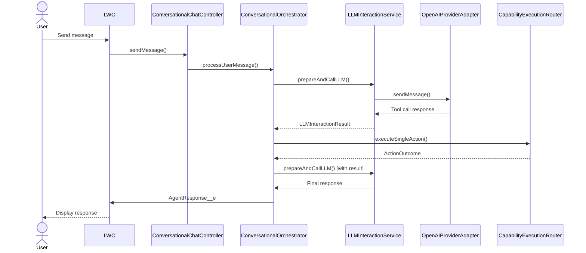
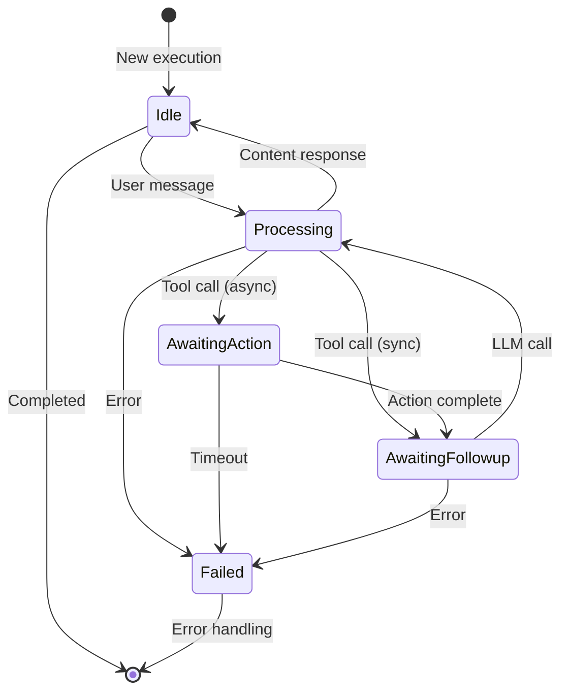

# Salesforce AI Agent Framework

> **Enterprise-Grade Agentic AI Platform for Salesforce**

A production-ready, extensible framework for building sophisticated AI agents powered by Large Language Models (LLMs) that seamlessly integrate with your Salesforce environment. Built with architectural excellence, security-first principles, and enterprise scalability.

[](https://opensource.org/licenses/MPL-2.0)
[](https://developer.salesforce.com/)

---

## 🎯 Overview

The Salesforce AI Agent Framework is a **best-in-class, production-grade platform** that enables you to build intelligent AI agents that:

- 🤖 **Understand natural language** and execute complex multi-step workflows
- 🔒 **Respect Salesforce security** with automatic CRUD/FLS enforcement
- ⚡ **Scale efficiently** with dual-mode async processing (Platform Events + Queueables)
- 🎨 **Work declaratively** through configuration, not just code
- 📊 **Provide deep observability** with comprehensive decision logging
- 🔧 **Extend infinitely** through well-designed interfaces and patterns

**Key Differentiators:**
- ✅ Unified execution model supporting conversational, batch, email, triggered, and autonomous agents
- ✅ Advanced memory management with multiple strategies (buffer window, summary buffer)
- ✅ Sophisticated error handling with LLM-friendly message sanitization
- ✅ Enterprise-ready async patterns with automatic failover
- ✅ Multi-LLM provider support through adapter pattern
- ✅ Human-in-the-loop approval workflows with native Salesforce integration

---

## 📋 Table of Contents

- [Target Audience](#-target-audience)
- [Core Features](#-core-features)
- [Architecture Overview](#-architecture-overview)
- [Execution Patterns](#-execution-patterns)
- [Quick Start](#-quick-start)
- [Security Model](#-security-model)
- [Performance & Scalability](#-performance--scalability)
- [License](#-license)

---

## 👥 Target Audience

### **Salesforce Administrators**
Configure AI agents declaratively using Custom Objects and metadata. No Apex required for standard workflows.

### **Salesforce Developers**
Extend the framework with custom actions (`IAgentAction`), LLM providers (`ILLMProviderAdapter`), memory strategies (`IMemoryManager`), and context providers (`IAgentContextProvider`).

### **Salesforce Architects**
Design secure, scalable, observable AI solutions that leverage Salesforce platform capabilities while maintaining enterprise-grade reliability.

---

## ✨ Core Features

### 🧠 **Intelligent Agent Orchestration**

#### **Multi-Agent Architecture**
- **Conversational Agents**: Interactive chat experiences with context-aware responses
- **Email Agents**: Process inbound emails and generate intelligent responses
- **Batch Agents**: Process large datasets with AI-driven analysis
- **Autonomous Agents**: Self-directed agents that operate independently
- **Triggered Agents**: Event-driven execution from record changes or platform events

#### **Unified Execution Model**
- Single `AgentExecution__c` object tracks all execution types
- Consistent state management across synchronous and asynchronous operations
- Turn-based conversation tracking with `ExecutionStep__c`
- Comprehensive decision logging via `AgentDecisionStep__c`

### 🔄 **Advanced Async Processing**

#### **Dual-Mode Dispatch Strategy**
```
High Concurrency Mode (Platform Events)
→ Maximum throughput for conversational agents
→ Event-driven architecture for scale

Low Concurrency Mode (Queueables)
→ Sequential processing for state-sensitive operations
→ Better error handling and debugging
```

#### **Intelligent Job Management**
- Automatic concurrency mode selection per agent
- Turn identifier validation to prevent stale job execution
- State machine design with clear transitions
- Engine pattern separating business logic from invocation context

### 💾 **Sophisticated Memory Management**

#### **Multiple Memory Strategies**
- **Buffer Window**: Maintains precise N most recent turns
- **Summary Buffer**: Automatically summarizes old conversations to preserve context
- **Custom Strategies**: Implement `IMemoryManager` for domain-specific needs

#### **Context Ledger System**
- Tracks Salesforce records mentioned across conversations
- Relevance scoring with temporal decay
- Intelligent context resolution via `ContextManagerService`
- Supports multiple context providers per agent

### 🛡️ **Enterprise-Grade Security**

#### **Salesforce Native Security**
- Automatic CRUD permission validation via `SecurityUtils`
- Field-Level Security (FLS) enforcement on all data operations
- Sharing rules respected through `inherited sharing` classes
- User context tracking (`originalUserId` vs `executionUserId`)

#### **Record-Level Access Control**
- Validates user access to related records before operations
- Prevents privilege escalation through context manipulation
- Comprehensive audit trail in `AgentDecisionStep__c`

### 🎯 **Powerful Action Framework**

#### **Standard Actions (Built-in)**
- `ActionCreateRecord`: Create any SObject with validation
- `ActionUpdateRecord`: Update records with security checks
- `ActionGetRecords`: Retrieve records with intelligent querying
- `ActionFindEntities`: Semantic search across objects
- `ActionSearchKnowledge`: Knowledge article search with relevance
- `ActionPostChatter`: Chatter feed interactions
- `ActionSendEmail`: Email composition and delivery
- `ActionFlowHandler`: Execute Salesforce Flows with parameters

#### **Custom Action Development**
- Extend `BaseAgentAction` abstract class
- Automatic parameter validation and type coercion
- Schema-driven parameter processing (JSON Schema support)
- Built-in error handling and outcome formatting
- Security validation integrated

### 🔌 **Multi-LLM Provider Support**

#### **Provider Adapter Pattern**
- Interface: `ILLMProviderAdapter`
- Built-in: `OpenAIProviderAdapter` (GPT-3.5, GPT-4, GPT-4o)
- Extensible: Add any LLM provider (Anthropic, Google, Azure)
- Configuration via `LLMConfiguration__c`

#### **Advanced LLM Features**
- Retry logic with exponential backoff (CPU-optimized)
- Token usage tracking and reporting
- Parallel tool calling support
- Action transparency with transient messages
- Error recovery with "Halt and Report" pattern

### 📊 **Deep Observability**

#### **Decision Step Logging**
Every agent interaction captured:
- User input with timestamps
- System prompt composition
- Available tools list
- LLM request payload
- LLM response details
- Tool execution results
- Final response generation
- Error tracking with stack traces

#### **Performance Metrics**
- Processing duration per step
- Token consumption per turn
- Action execution time
- Turn count and cycle tracking

### ✅ **Human-in-the-Loop Approvals**

#### **Native Approval Process Integration**
- `HumanApprovalRequest__c` object
- Automatic submission to Salesforce Approval Process
- Pause agent execution pending approval
- Resume with approval result
- Rejection handling with user notification

### 💬 **Rich User Experience**

#### **Real-Time UI Updates**
- `AgentResponse__e`: Final response delivery
- `TransientMessage__e`: Intermediate "thinking" display
- Status updates during async operations
- Error messages with user-friendly formatting

#### **LLM-Friendly Error Messages**
- Automatic sanitization of technical stack traces
- Emoji-enriched error presentation (🔒 🔍 💾 ⚡)
- Context-aware suggestions for recovery
- User-appropriate language transformation

---

## 🏗️ Architecture Overview

### **Design Patterns & Principles**

#### **Strategy Pattern**
- `ILLMResponseHandler` → `ContentResponseHandler` | `ToolCallResponseHandler`
- Dynamic response handling based on LLM output

#### **Factory Pattern**
- `LLMProviderFactory` → Creates provider adapters
- `MemoryManagerFactory` → Creates memory strategies
- `ActionRegistry` → Creates action handlers
- `OrchestratorFactory` → Creates execution orchestrators

#### **Template Method Pattern**
- `BaseAgentAction` → Defines action execution template
- Subclasses implement `executeAction()` only
- Framework handles validation, security, error handling

#### **Adapter Pattern**
- `ILLMProviderAdapter` → Abstracts LLM provider differences
- Consistent interface across OpenAI, Anthropic, etc.

#### **Dependency Injection**
- Constructor-based DI throughout
- Testable service layer
- Clear dependency graphs

### **Async Processing Architecture**

```
User Request → OrchestrationService
                    ↓
        ┌───────────┴───────────┐
        │                       │
    [LLM Call]           [Tool Execution]
        │                       │
        ↓                       ↓
   Result ←────────────→ AgentJobEnqueuer
                              ↓
                    ┌─────────┴──────────┐
                    │                    │
          [High Concurrency]    [Low Concurrency]
            Platform Event          Queueable
                    │                    │
                    ↓                    ↓
       AsyncFrameworkRequest__e  AsyncActionQueueable
                    │                    │
                    └─────────┬──────────┘
                              ↓
                        AsyncActionEngine
                              ↓
                      Action Execution
                              ↓
                      Update Execution
                              ↓
                     Follow-up LLM Call
```

---

## 🔄 Execution Patterns

### **Conversational Agent Flow**



### **Async Action Execution**



### **Turn Lifecycle**

Each "turn" represents one complete user→LLM→action→LLM→response cycle:

1. **User Input** → Create ExecutionStep (UserInput)
2. **System Prompt** → Build from agent config + context + history
3. **LLM Request** → Call provider with prompt + tools + history
4. **LLM Response** → Parse content/tool calls
5. **Tool Execution** (if requested) → Execute action(s)
6. **Follow-up LLM** (if tool executed) → Call LLM with results
7. **Final Response** → Create ExecutionStep (AgentResponse)
8. **Complete Turn** → Update execution status to Idle

---

## 🚀 Quick Start

### **Prerequisites**

- Salesforce org (Sandbox recommended for testing)
- System Administrator profile
- Named Credential setup capability
- API access to an LLM provider (e.g., OpenAI API key)

### **Installation**

1. **Deploy the Package**
   ```bash
   sfdx force:source:deploy -p force-app/main/default -u <your-org-alias>
   ```

2. **Create Named Credential**
   - Navigate to: Setup → Named Credentials
   - Click "New Named Credential"
   - **Label**: OpenAI API
   - **Name**: OpenAI_API
   - **URL**: https://api.openai.com
   - **Authentication**: Named Principal
   - **Protocol**: Password Authentication
   - **Username**: (leave blank)
   - **Password**: Your OpenAI API key
   - Save

3. **Configure Framework Settings**
   - Navigate to: Setup → Custom Settings → AIAgentFrameworkSettings
   - Click "Manage"
   - Click "New" (for Organization-level default)
   - Set values:
     - `DefaultMaxConversationTurns__c`: 5
     - `DefaultHistoryTurnLimit__c`: 20
     - `DefaultMaxRetryAttempts__c`: 1
     - `DefaultRetryableHttpStatusCodes__c`: 408,429,500,502,503,504
   - Save

4. **Create LLM Configuration**
   - App Launcher → LLM Configurations → New
   - **Developer Name**: OpenAI_GPT4
   - **Named Credential**: OpenAI_API
   - **Provider Adapter Class**: OpenAIProviderAdapter
   - **Default Model Identifier**: gpt-4o
   - **Default Temperature**: 0.7
   - **Max Retry Attempts**: 1
   - Save

5. **Create Your First Agent**
   - App Launcher → AI Agent Definitions → New
   - **Developer Name**: SalesAssistant
   - **Agent Type**: Conversational
   - **LLM Configuration**: OpenAI_GPT4
   - **Memory Strategy**: BufferWindow
   - **History Turn Limit**: 10
   - **Identity Prompt**:
     ```
     You are a helpful Salesforce assistant named SalesBot.
     You help users find information about their Salesforce records and perform common tasks.
     You are friendly, professional, and concise.
     ```
   - **Instructions Prompt**:
     ```
     - Always confirm before making changes to records
     - Provide clear explanations of what you find
     - Ask clarifying questions when needed
     - Use appropriate tools to access Salesforce data
     ```
   - **Enable Action Transparency**: Checked
   - **Concurrency**: Low
   - Save

6. **Create Capabilities for Your Agent**

   **Capability 1: Get Contact Information**
   - **Capability Name**: get_contact_info
   - **Description**: Retrieves detailed information about a contact by name or email. Use this when the user asks about a specific person or contact.
   - **Implementation Type**: Standard
   - **Standard Action Type**: GetRecords
   - **Backend Configuration**:
     ```json
     {
       "objectApiName": "Contact"
     }
     ```
   - **Parameters**:
     ```json
     {
       "type": "object",
       "properties": {
         "firstName": {
           "type": "string",
           "description": "First name of the contact"
         },
         "lastName": {
           "type": "string",
           "description": "Last name of the contact"
         },
         "email": {
           "type": "string",
           "format": "email",
           "description": "Email address of the contact"
         }
       },
       "required": []
     }
     ```
   - **AI Agent Definition**: SalesAssistant
   - Save

   **Capability 2: Create Contact**
   - **Capability Name**: create_contact
   - **Description**: Creates a new contact record. Use this when the user wants to add a new person to the system.
   - **Implementation Type**: Standard
   - **Standard Action Type**: CreateRecord
   - **Backend Configuration**:
     ```json
     {
       "objectApiName": "Contact"
     }
     ```
   - **Parameters**:
     ```json
     {
       "type": "object",
       "properties": {
         "firstName": {
           "type": "string",
           "description": "First name of the contact"
         },
         "lastName": {
           "type": "string",
           "description": "Last name of the contact"
         },
         "email": {
           "type": "string",
           "format": "email",
           "description": "Email address"
         },
         "phone": {
           "type": "string",
           "description": "Phone number"
         },
         "title": {
           "type": "string",
           "description": "Job title"
         }
       },
       "required": ["firstName", "lastName"]
     }
     ```
   - **AI Agent Definition**: SalesAssistant
   - **Requires Approval**: Checked (if you want approval workflow)
   - Save

7. **Add Chat Component to Lightning Page**
   - Navigate to any record page (Account, Contact, etc.)
   - Click Setup → Edit Page
   - Drag "aiAssistantChat" component to the page
   - Configure component properties:
     - **Agent Developer Name**: SalesAssistant
   - Save and Activate

8. **Test Your Agent**
   - Navigate to the page where you added the chat component
   - Type: "Find me the contact named John Smith"
   - The agent should use the `get_contact_info` tool to search
   - Try: "Create a new contact named Jane Doe with email jane@example.com"
   - The agent should use the `create_contact` tool

---

## 🔒 Security Model

### **Multi-Layer Security Architecture**

#### **Layer 1: Salesforce Platform Security**
- All DML respects sharing rules via `inherited sharing` classes
- Profiles and permission sets control feature access
- Field-Level Security automatically enforced

#### **Layer 2: Framework Security Validation**
- `SecurityUtils.checkObjectPermission()` - Validates CRUD before operations
- `SecurityUtils.checkFieldPermission()` - Validates FLS before field access
- `TypeCoercionService` - Filters out non-accessible fields automatically

#### **Layer 3: Context Security**
- User context tracked: `originalUserId` vs `executionUserId`
- Record access validation before using as context
- Execution audit trail in `AgentDecisionStep__c`

#### **Layer 4: Data Sanitization**
- Debug log sanitization (PII/PHI protection)
- Error message sanitization for user display
- Input validation via JSON Schema

### **Permission Model**

#### **User Permissions Required**
- Read access to `AIAgentDefinition__c`
- Read access to `LLMConfiguration__c`
- Read/Write access to `AgentExecution__c`
- Read/Write access to `ExecutionStep__c`
- Execute permission on `ConversationalChatController` (and other controllers)

#### **System Permissions Required** (Admin/Developer)
- Full access to all configuration objects
- Manage Named Credentials
- Configure Platform Event subscribers
- Deploy Apex classes

### **Security Best Practices**

1. **Principle of Least Privilege**: Grant agents only necessary capabilities
2. **Approval for High-Risk Actions**: Use `RequiresApproval__c` for data modifications
3. **Input Validation**: Always define proper JSON Schema for parameters
4. **Audit Regularly**: Review `AgentDecisionStep__c` for anomalies
5. **Test in Sandbox**: Never test in production with real user data
6. **Monitor API Costs**: LLM API calls can accumulate quickly

---

## ⚠️ Important Disclaimers

### **Use at Your Own Risk**

This framework is provided **"as is"** without warranties of any kind, either express or implied. In no event shall the authors be liable for any claim, damages, or other liability arising from the use of this software.

### **AI-Generated Content Warning**

⚠️ **All AI-generated responses should be independently verified before being relied upon.**

- LLMs can produce inaccurate, biased, or inappropriate content
- Hallucinations (false information) can occur
- The agent may misinterpret user intent
- Always review automated actions before they execute

### **Data & Privacy Considerations**

- User inputs are sent to external LLM providers (e.g., OpenAI)
- Conversation history is stored in Salesforce records
- Ensure compliance with your organization's data policies
- Review LLM provider data handling policies
- Consider data residency requirements (EU, APAC, etc.)

### **Testing Requirements**

⚠️ **Always test thoroughly in a Sandbox environment before deploying to production.**

- Test with realistic user scenarios
- Verify permissions are correctly configured
- Monitor governor limit consumption
- Review debug logs for unexpected behavior
- Test failure scenarios (LLM unavailable, permission denied, etc.)

### **Cost Considerations**

- LLM API calls have per-token pricing
- Long conversations = higher costs
- Monitor token consumption via `ExecutionStep__c`
- Set appropriate `HistoryTurnLimit__c` to control costs
- Consider implementing cost caps or quotas

---

## 📞 Support & Community

### **Getting Help**

- 📖 **Documentation**: This README and inline code documentation
- 🐛 **Bug Reports**: Open an issue on GitHub
- 💡 **Feature Requests**: Open an issue with `[Feature Request]` prefix
- 💬 **Questions**: Use GitHub Discussions

### **Resources**

- [Salesforce Developer Documentation](https://developer.salesforce.com/docs)
- [OpenAI API Documentation](https://platform.openai.com/docs)
- [Salesforce AI Research Papers](https://einstein.ai/research)

---

## 📄 License

Copyright © 2025 Sonal

This project is licensed under the **Mozilla Public License 2.0** (MPL-2.0).

**Key points of MPL 2.0:**
- ✅ Commercial use allowed
- ✅ Modification allowed
- ✅ Distribution allowed
- ✅ Private use allowed
- ⚠️ Must disclose source if distributing modifications
- ⚠️ Modified files must carry notices stating changes

See the [LICENSE](LICENSE) file for full details.

---

## 🙏 Acknowledgments

Built with ❤️ using:
- Salesforce Platform
- OpenAI GPT Models
- Modern Software Architecture Patterns
- Community Feedback and Contributions

Special thanks to the Salesforce Developer Community for inspiration and support.

---

<div align="center">

**[⬆ Back to Top](#salesforce-ai-agent-framework)**

Made with 🤖 and 💡 by the Salesforce AI Agent Framework Team

</div>
