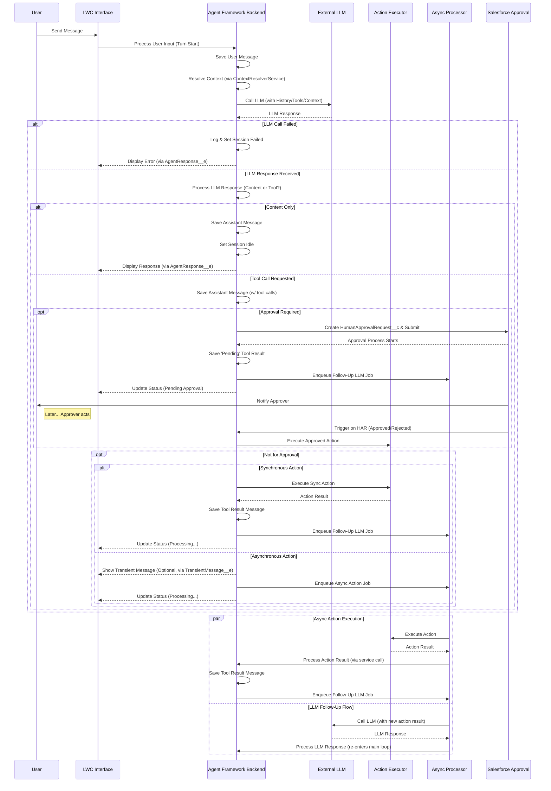

# Salesforce AI Agent Studio

## Overview

This Salesforce AI Agent Studio provides a robust, enterprise-grade, and extensible platform for integrating advanced AI Agents, powered by Large Language Models (LLMs), directly within your Salesforce environment. It enables the creation of sophisticated conversational assistants that can understand user intent, access relevant Salesforce data securely, perform complex multi-step actions, and provide intelligent, context-aware responses through a chat interface.

The framework has been re-architected to prioritize **declarative configuration**, **robust security**, **scalable asynchronous processing**, **comprehensive error handling**, and **deep observability**, allowing technical teams to build, manage, and debug powerful AI-driven workflows entirely within the Salesforce ecosystem.

---

## Core Features & Capabilities

*   **Scalable Asynchronous Architecture:** The framework's core processing logic has been decoupled from its execution mechanism. It supports two modes, configurable via a Custom Setting (`AIAgentFrameworkSettings__c`):
    *   **Queueable Jobs:** The default, reliable background processing using `Queueable` Apex.
    *   **Platform Events:** A highly scalable, event-driven mode (`AsyncFrameworkRequest__e`) that avoids Apex job queue limits, ideal for high-concurrency environments.

*   **Declarative-First Configuration:** Define agent personas, LLM connections, dynamic context retrieval rules, and agent capabilities (tools/actions) declaratively using Salesforce Custom Objects (`AIAgentDefinition__c`, `AgentCapability__c`) and Custom Metadata. The framework includes validation triggers to prevent common setup errors.

*   **Advanced Tool Chaining & Error Handling:** The `AgentCapability__c` object now supports:
    *   **Execution Prerequisites:** Define a chain of capabilities that must be successfully executed before another can run (e.g., `find_record` must succeed before `update_record`).
    *   **Prerequisite Validation Scope:** Choose whether prerequisites must be met within the current turn or across the entire session.
    *   **Halt & Report on Error:** Configure a capability to either stop and report a failure to the user or allow the agent to attempt autonomous recovery.

*   **Formal Salesforce Approval Integration:** Capabilities can be flagged to trigger a formal **Salesforce Approval Process**. The framework automatically creates a `HumanApprovalRequest__c` record, submits it for approval, and can resume the action upon approval or notify the user upon rejection.

*   **Extensible Action & Context Framework:**
    *   **LLM Agnostic (Adapter Pattern):** Integrate with various LLM providers by implementing a standard `ILLMProviderAdapter` interface. An `OpenAIProviderAdapter` with robust retry logic is included.
    *   **Custom Actions & Hooks:** Extend agent capabilities beyond the included standard actions by creating custom Apex classes implementing `IAgentAction` (via the `BaseAgentAction` template). Inject custom logic before or after any action runs using `IPreActionHook` and `IPostActionHook` interfaces.
    *   **Custom Context Provisioning:** Implement `IAgentContextProvider` to fetch and structure complex contextual data, supplementing declarative context rules.

*   **Stateful Context Management (Context Ledger):** The framework now maintains a "Context Ledger" (`ChatSession__c.EntityHistoryJson__c`) that tracks all relevant records (from the page, created by actions, etc.) throughout a session, providing a more intelligent and persistent context for the agent across multiple turns.

*   **Comprehensive Observability & Turn-Based Debugging:**
    *   Detailed logging (`OrchestrationLog__c`) captures each step of the agent's processing turn, managed centrally by `OrchestrationLogger`.
    *   A `ChatSessionVisualizer` LWC provides a step-by-step timeline of an agent's "thought process" for easy debugging.
    *   The `TurnIdentifier__c` allows for reliable correlation of all synchronous and asynchronous steps for a single user message.

*   **Security by Design:** Operates securely within Salesforce's sharing model. Enforces Object permissions and Field-Level Security (FLS) during context gathering, action argument coercion (`SObjectArgumentCoercionService`), and action execution (`SecurityUtils`, `QueryService` with `WITH USER_MODE`).

*   **Modern, Responsive UI:**
    *   The `aiAssistantChat` LWC has a modular, service-based architecture for better maintainability.
    *   It supports **transient messages** (`TransientMessage__e`), allowing the UI to display the agent's intermediate "thoughts" for a streaming-like experience before a long-running tool completes.

---

## Architecture & Key Concepts

This AI Agent framework has evolved to use several modern design patterns:

1.  **Configuration First:** Core behavior is defined in Custom Objects (`AIAgentDefinition__c`, `LLMConfiguration__c`, `AgentCapability__c`) and Custom Metadata (`StandardActionHandler__mdt`, `SObjectConfig__mdt`). This makes the framework highly adaptable.
2.  **Decoupled Asynchronous Processing:** Logic classes (`AsyncActionProcessor`, `FollowUpLLMProcessor`) are separated from their invocation mechanism (Queueable vs. Platform Event), enabling scalability. `AgentJobEnqueuer` handles the dispatching.
3.  **Strategy Pattern for Response Handling:** The `OrchestrationService` uses a `ResponseHandlerFactory` to select the correct strategy (`ToolCallResponseHandler` or `ContentResponseHandler`) based on the LLM's output.
4.  **Centralized Prompt & Context Composition:** `SystemPromptBuilder` assembles the final system prompt, while `ContextResolverService` uses the `ContextManagerService` (the "Ledger") to orchestrate the gathering of all relevant data from multiple `IAgentContextProvider` implementations in a bulk-safe way.
5.  **Template Method for Actions:** `BaseAgentAction` provides a standardized execution template (`execute`), ensuring consistent error handling, validation, and hook execution for all actions.
6.  **Event-Driven UI:** Platform Events (`AgentResponse__e`, `TransientMessage__e`) notify the LWC about final results and intermediate messages, decoupling the backend processing from the UI.

---

## Core Component Types

*   **Configuration:**
    *   **Custom Objects:** `AIAgentDefinition__c`, `LLMConfiguration__c`, `AgentCapability__c`, `AgentContextConfig__c`, `HumanApprovalRequest__c`.
    *   **Custom Metadata:** `StandardActionHandler__mdt`, `SObjectConfig__mdt`.
    *   **Custom Settings:** `AIAgentFrameworkSettings__c`.
*   **Services:** Apex classes handling specific tasks (Orchestration, LLM Interaction, Action Execution, Context Resolution & Management, State, Persistence).
*   **Interfaces:** Define contracts for extensibility (`ILLMProviderAdapter`, `IAgentAction`, `IPreActionHook`, `IPostActionHook`, `IAgentContextProvider`).
*   **Action Framework:** `BaseAgentAction`, `ActionRegistry`, and standard action implementations (e.g., `ActionGetRecords`, `ActionRunReport`).
*   **Data Model:** `ChatSession__c`, `ChatMessage__c`, `OrchestrationLog__c`.
*   **Platform Events:** `AgentResponse__e`, `TransientMessage__e`, `AsyncFrameworkRequest__e`.
*   **Utilities:** Helpers for security, schema, parameters, retries, etc.
*   **LWC UI:** Includes `aiAssistantChat` and the `chatSessionVisualizer`.

---

## Administrator / Configurator Responsibilities

*   **Clear Instructions (Prompts & Descriptions):** The quality of `AIAgentDefinition__c` prompts and `AgentCapability__c.Description__c` is paramount. These must clearly define the agent's role, limitations, and how/when to use specific tools.
*   **Accurate Tool Schemas:** The `Parameters__c` JSON Schema on `AgentCapability__c` must accurately reflect the arguments the LLM needs to provide for an action.
*   **Prerequisite Chains:** Thoughtfully configure `ExecutionPrerequisites__c` on `AgentCapability__c` to guide the agent through logical workflows.
*   **Contextual Relevance:** Configure `AgentContextConfig__c` records effectively to provide necessary, but not excessive, information to the LLM to manage token usage.
*   **Security & Permissions:** Admins are responsible for assigning appropriate permissions to users for the framework objects, Apex classes, and the underlying data the agent might access.
*   **Named Credential Setup:** Correctly configure Named Credentials for LLM provider authentication. **API keys must not be hardcoded.**

---

## Execution Flow (Conceptual)

---

## Setup

1.  **Deploy All Components:** Deploy all Custom Objects, Fields, Apex Classes, Triggers, LWCs, Custom Metadata Types, and Custom Settings from the project.
2.  **Configure Named Credential:**
    *   Create an **External Credential** for your LLM Provider.
    *   Create a **Named Credential** matching the `NamedCredential__c` value you will use in `LLMConfiguration__c`. Set its URL (e.g., `https://api.openai.com`) and link it to the External Credential.
3.  **Configure `LLMConfiguration__c`:**
    *   Create at least one record specifying a `DeveloperName__c`, the `NamedCredential__c` from step 2, the `ProviderAdapterClass__c` (e.g., `OpenAIProviderAdapter`), and the `DefaultModelIdentifier__c`.
4.  **Configure `AIAgentDefinition__c`:**
    *   Create an agent record. Assign a `DeveloperName__c`, link it to an `LLMConfiguration__c`, and write the `IdentityPrompt__c` and `InstructionsPrompt__c`.
5.  **(Optional) Configure `StandardActionHandler__mdt`:**
    *   Verify records exist for standard actions like `GetRecords`, `CreateRecord`, etc., mapping them to their respective handler classes (e.g., `ActionGetRecords`). These should be deployed with the framework.
6.  **Configure `AgentCapability__c` records:**
    *   For each `AIAgentDefinition__c`, create `AgentCapability__c` records for the tools it should use.
    *   Critically, define `CapabilityName__c` (the function name for the LLM), `Description__c`, `ImplementationType__c`, and `Parameters__c` (JSON schema).
    *   Configure advanced options like `RequiresApproval__c`, `RunAsynchronously__c`, and `ExecutionPrerequisites__c` as needed.
7.  **Configure `AgentContextConfig__c` records (Optional):**
    *   If dynamic context is needed, define context providers linking an `AIAgentDefinition__c` to `IAgentContextProvider` Apex classes.
8.  **Configure `AIAgentFrameworkSettings__c` (Custom Setting):**
    *   Go to Setup -> Custom Settings -> AI Agent Framework Settings -> Manage.
    *   Review defaults. For high-volume orgs, consider enabling `EnableScalableProcessingMode__c`. To show intermediate agent thoughts, enable `EnableTransientMessages__c`.
9.  **Assign Permissions:**
    *   Grant users access to essential Custom Objects (CRUD as appropriate: `ChatSession__c`, `ChatMessage__c` for users; more for admins).
    *   Grant users access to the controller Apex class (`AIAssistantController`).
    *   Grant admins access to configuration objects and setup/debug LWCs.
10. **(Optional) Configure Approval Process:**
    *   If using the `RequiresApproval__c` feature, create a standard Salesforce Approval Process on the `HumanApprovalRequest__c` object.
11. **Add LWC to Page (Optional):** Add `aiAssistantChat` to a Lightning Page.

---

## Known Limitations & Potential Future Enhancements

*   **State Reconciliation:** A background reconciliation job (Scheduled Apex) could be implemented to identify and fail "stuck" sessions left in a transient state by a rare, unhandled error.
*   **Advanced Context Management:** Future enhancements could include native RAG (Retrieval Augmented Generation) via vector DBs or agent-driven context selection.
*   **Dynamic LLM Routing:** Allow an agent to dynamically choose an LLM model/provider based on task complexity, cost, or specific capabilities.
*   **Observability Deep Dive:** More advanced analytics on token usage per turn/agent, action success/failure rates, and LLM tool selection accuracy could be valuable.

---

## License

Copyright (c) 2025 Sonal

This source code is licensed under the **Mozilla Public License 2.0**. See the LICENSE file for details.
