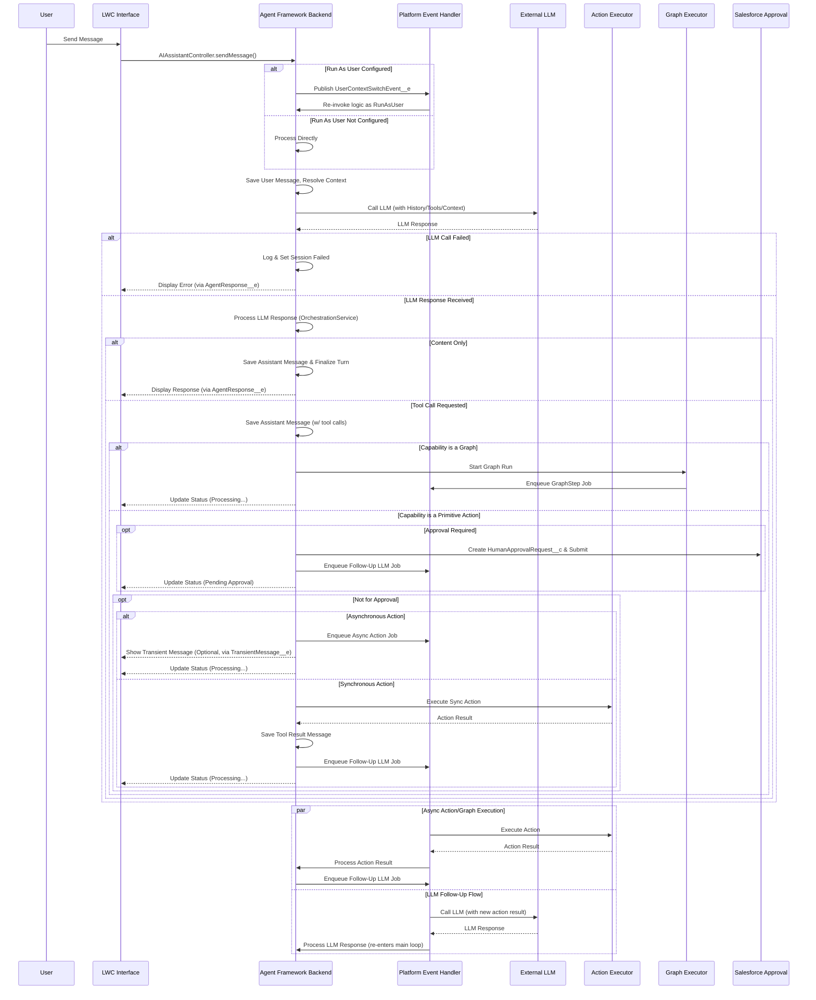

# Salesforce AI Agent Studio

## Overview

The Salesforce AI Agent Studio is a robust, enterprise-grade, and extensible platform for integrating advanced AI Agents, powered by Large Language Models (LLMs), directly within your Salesforce environment. It has evolved into a comprehensive suite for building sophisticated conversational assistants that can understand user intent, access relevant Salesforce data securely, perform complex multi-step processes, and provide intelligent, context-aware responses through a chat interface.

The framework is designed around a "clicks, not code" philosophy for orchestration, featuring a visual **Graph Builder** for defining complex, multi-step agent behaviors with conditional logic. It prioritizes robust security with features like **Run As User**, scalable asynchronous processing via Platform Events, and deep observability through a "flight recorder" style logging system. This allows technical teams to build, manage, and debug powerful AI-driven workflows entirely within the Salesforce ecosystem.

---

## Core Features & Capabilities

This framework is designed to empower teams to build, manage, and scale powerful AI assistants on the Salesforce platform. Its key features are focused on providing a balance of flexibility, control, and enterprise-grade reliability.

#### **Declarative Orchestration Engine (Graph Builder)**

*   **Visual Process Builder:** Define complex, multi-step agent workflows visually using the **Graph Builder**. Instead of rigid prerequisite chains, admins can create sophisticated flowcharts (`GraphNode__c`) with conditional branches (`ConditionalEdges__c`) to guide the agent's decision-making process, all without writing Apex code.
*   **Synchronous & Asynchronous Steps:** Seamlessly mix fast, synchronous actions with long-running, asynchronous tasks within a single graph. The framework's transaction control automatically manages state, pausing the graph to dispatch an async job and resuming it upon completion.
*   **Intelligent Error Recovery:** Configure how an agent behaves when a tool fails. The `HaltAndReportError__c` flag on a capability determines whether the agent stops and explains the problem to the user or receives the error as context to attempt an autonomous recovery with a different tool or approach.

#### **Intelligence & Actions**

*   **Intelligent Context Ledger:** The framework gives agents a persistent conversational memory (`ChatSession__c.EntityHistoryJson__c`) managed by the `ContextManagerService`. It uses relevance scoring and temporal decay to remember key records mentioned across interactions, ensuring users don't have to repeat themselves and the agent gets smarter as the conversation progresses.
*   **Built-in Managerial Approvals:** For high-stakes actions, require formal sign-off. The framework can automatically create a `HumanApprovalRequest__c` record and submit it into a standard Salesforce Approval Process, pausing the action until a manager approves or rejects it.
*   **Real-time "Thinking" Display:** Enhance the user experience with an optional streaming-like interface, powered by the `TransientMessage__e` Platform Event. Users can see the agent's intermediate thoughts in near real-time while it works on a longer task, making the interaction feel more dynamic and transparent.
*   **Advanced Search & Knowledge:** Standard actions like `FindEntities` and `SearchKnowledge` are powered by sophisticated backends featuring pattern analysis (`SearchPatternAnalyzer.cls`), intelligent scoring, and caching (`SearchResultCache.cls`) to deliver highly relevant results efficiently.

#### **Integration & Extensibility**

*   **Connect to Any AI Model:** The framework is not locked into one AI provider. Using the Adapter Pattern (`ILLMProviderAdapter` interface) and a simple `LLMConfiguration__c` record, you can connect to different Large Language Models (e.g., OpenAI, Anthropic, Google), allowing you to choose the best model for your needs.
*   **Create Any Custom Action:** Go beyond the powerful standard actions. The `BaseAgentAction` abstract class provides a simplified template for developers to build custom tools that interact with any part of Salesforce—or even external systems—by implementing a single `executeAction` method.
*   **Modular Prompt Engineering:** Structure prompts for maximum clarity and control. The `SystemPromptBuilder` composes the final system prompt from distinct, configurable parts on the `AIAgentDefinition__c` record, including `IdentityPrompt__c`, `InstructionsPrompt__c`, and `ExamplesPrompt__c`.

#### **Trust & Safety**

*   **Built on Salesforce Security:** The agent fundamentally respects your existing security model. It acts as the user, meaning it can only access data the user is permitted to see. The framework automatically enforces Sharing Rules, Profiles, and Field-Level Security (FLS) during every step.
*   **Delegated Execution with "Run As User":** Configure agents to run under a designated service account via the `RunAsUser__c` field on the `AIAgentDefinition__c`. This allows agents to perform actions with specific permissions while maintaining the security context of the original user for business logic.
*   **Scalable & Performant Processing:** The framework's architecture uses a highly scalable, event-driven model powered by the `AsyncFrameworkRequest__e` Platform Event. This ensures the agent remains responsive and avoids hitting governor limits even in high-volume organizations.

#### **Advanced Observability & Debugging**
*   **Orchestration "Flight Recorder":** A detailed `OrchestrationLogger` captures every step of an agent's decision-making process into the `OrchestrationLog__c` object. This provides deep, step-by-step visibility into prompt composition, tool selection, action execution, and graph transitions, making debugging complex interactions straightforward.
*   **Graph Execution Logs:** For graph-based capabilities, every node execution, state transition, and input/output is logged to `GraphExecutionLog__c`, providing a complete audit trail of the automated process.

---

## Architecture & Key Concepts

This AI Agent framework is built on several modern design patterns to ensure flexibility, scalability, and maintainability:

*   **Configuration First:** Core behavior is defined in Custom Objects (`AIAgentDefinition__c`, `LLMConfiguration__c`, `AgentCapability__c`, `GraphNode__c`) and Custom Metadata (`StandardActionHandler__mdt`, `SObjectConfig__mdt`). This makes the framework highly adaptable.
*   **Decoupled Asynchronous Processing:** Logic classes (`AsyncActionProcessor`, `FollowUpLLMProcessor`, `GraphExecutionService`) are separated from their invocation mechanism. The `AsyncFrameworkRequest__e` Platform Event is the primary transport, handled by `AsyncFrameworkRequestTriggerHandler`, ensuring scalability.
*   **Strategy Pattern for Response Handling:** The `OrchestrationService` uses a factory method to select the correct strategy (`ToolCallResponseHandler` or `ContentResponseHandler`) based on the LLM's output.
*   **Centralized Prompt & Context Composition:** `SystemPromptBuilder` assembles the final system prompt. `ContextResolverService` uses the `ContextManagerService` (the "Ledger") to orchestrate the gathering of all relevant data from multiple `IAgentContextProvider` implementations in a bulk-safe way.
*   **Template Method for Actions:** `BaseAgentAction` provides a simplified execution template, ensuring consistent error handling, validation, and result wrapping for all actions.
*   **Graph Execution Engine:** The `GraphExecutionService` manages the state and execution of multi-step graph-based capabilities, handling both synchronous node chains and asynchronous hand-offs.
*   **Event-Driven UI:** Platform Events (`AgentResponse__e`, `TransientMessage__e`) notify the LWC about final results and intermediate messages, decoupling the backend processing from the UI.

---

## Core Component Types

*   **Configuration:**
    *   Custom Objects: `AIAgentDefinition__c`, `LLMConfiguration__c`, `AgentCapability__c`, `AgentContextConfig__c`, `HumanApprovalRequest__c`, **`GraphNode__c`**.
    *   Custom Metadata: `StandardActionHandler__mdt`, `SObjectConfig__mdt`.
    *   Custom Settings: `AIAgentFrameworkSettings__c`.
*   **Services:** Apex classes handling specific tasks (Orchestration, LLM Interaction, Action Execution, **Graph Execution**, Context Resolution & Management, State, Persistence).
*   **Interfaces:** Define contracts for extensibility (`ILLMProviderAdapter`, `IAgentAction`, `IAgentContextProvider`).
*   **Action Framework:** `BaseAgentAction`, `ActionRegistry`, and standard action implementations (e.g., `ActionGetRecords`, `ActionRunReport`).
*   **Data Model:** `ChatSession__c`, `ChatMessage__c`, **`OrchestrationLog__c`**, **`GraphExecutionLog__c`**.
*   **Platform Events:** `AgentResponse__e`, `TransientMessage__e`, `AsyncFrameworkRequest__e`, **`UserContextSwitchEvent__e`**.
*   **Utilities:** Helpers for security, schema, parameters, retries, etc.
*   **LWC UI:** Includes `aiAssistantChat`, and the new **`graphBuilder`** suite of components.

---

## Administrator / Configurator Responsibilities
*   **Clear Instructions (Prompts & Descriptions):** The quality of `AIAgentDefinition__c` prompts (`IdentityPrompt__c`, `InstructionsPrompt__c`) and `AgentCapability__c.Description__c` is paramount. These must clearly define the agent's role, limitations, and how/when to use specific tools.
*   **Accurate Tool Schemas:** The `Parameters__c` JSON Schema on `AgentCapability__c` must accurately reflect the arguments the LLM needs to provide for an action.
*   **Graph Design:** Thoughtfully design `GraphNode__c` flows with logical conditional edges to guide the agent through robust business processes.
*   **Contextual Relevance:** Configure `AgentContextConfig__c` records effectively to provide necessary, but not excessive, information to the LLM to manage token usage.
*   **Security & Permissions:** Admins are responsible for assigning appropriate permissions to users for the framework objects, Apex classes, and the underlying data the agent might access. Configure the `RunAsUser__c` for agents requiring elevated or specific permissions.
*   **Named Credential Setup:** Correctly configure Named Credentials for LLM provider authentication. API keys must not be hardcoded.

---

## Execution Flow (Conceptual)

---

## Setup

1.  **Deploy All Components:** Deploy all metadata components in this repository. The `sfdx-project.json` is configured for standard source deployment.
2.  **Configure Named Credential:**
    *   Go to Setup -> Named Credentials -> External Credentials. Create a new one for your LLM provider.
    *   For OpenAI, set Authentication Protocol to "Custom" and add a Header with the name `Authorization` and the value `Bearer {!$Credential.OpenAI.APIKey}`.
    *   Create a Principal for your API key.
    *   Go to Setup -> Named Credentials -> Named Credentials. Create a new one. Link it to the External Credential you just created. The URL should be `https://api.openai.com`.
3.  **Configure `LLMConfiguration__c`:**
    *   Create at least one record specifying a `DeveloperName__c`, the `NamedCredential__c` from step 2, the `ProviderAdapterClass__c` (e.g., `OpenAIProviderAdapter`), and the `DefaultModelIdentifier__c`.
4.  **Configure `AIAgentDefinition__c`:**
    *   Create an agent record. Assign a `DeveloperName__c`, link it to an `LLMConfiguration__c`, and fill out the prompt fields (`IdentityPrompt__c`, `InstructionsPrompt__c`, etc.).
5.  **(Optional) Configure `StandardActionHandler__mdt`:**
    *   Verify records exist for standard actions like `GetRecords`, `CreateRecord`, etc., mapping them to their respective handler classes (e.g., `ActionGetRecords`). These should be deployed with the framework.
6.  **Configure `AgentCapability__c` records:**
    *   For each `AIAgentDefinition__c`, create `AgentCapability__c` records for the tools it should use.
    *   Critically, define `CapabilityName__c` (the function name for the LLM), `Description__c`, `ImplementationType__c` ('Standard', 'Apex', 'Flow', or **'Graph'**), and `Parameters__c` (JSON schema).
    *   Configure advanced options like `RequiresApproval__c`, `RunAsynchronously__c`, and `HaltAndReportError__c` as needed.
7.  **Configure `GraphNode__c` records (if using Graphs):**
    *   For any `AgentCapability__c` of type 'Graph', use the **Graph Builder** LWC (available on the capability's record page) to visually design the flow and create the underlying `GraphNode__c` records.
8.  **Configure `AIAgentFrameworkSettings__c` (Custom Setting):**
    *   Go to Setup -> Custom Settings -> AI Agent Framework Settings -> Manage. Configure global defaults.
9.  **Assign Permissions:**
    *   Grant users access to essential Custom Objects (CRUD as appropriate: `ChatSession__c`, `ChatMessage__c` for users; more for admins).
    *   Grant users access to the controller Apex class (`AIAssistantController`).
    *   Grant admins access to configuration objects and setup/debug LWCs.
10. **(Optional) Configure Approval Process:**
    *   If using the `RequiresApproval__c` feature, create a standard Salesforce Approval Process on the `HumanApprovalRequest__c` object.
11. **Add LWC to Page:** Add `aiAssistantChat` to a Lightning Record Page, App Page, or Utility Bar.

---

## Known Limitations & Potential Future Enhancements

*   **State Reconciliation:** A background reconciliation job (Scheduled Apex) could be implemented to identify and fail "stuck" sessions left in a transient state by a rare, unhandled error.
*   **Advanced Context Management:** Future enhancements could include native RAG (Retrieval Augmented Generation) via vector DBs or agent-driven context selection.
*   **Dynamic LLM Routing:** Allow an agent to dynamically choose an LLM model/provider based on task complexity, cost, or specific capabilities.
*   **Observability Deep Dive:** Enhance the observability UI to visualize `OrchestrationLog__c` and `GraphExecutionLog__c` records, providing a clear, interactive "flight recording" of agent turns.

---

## License

Copyright (c) 2025 Sonal

This source code is licensed under the **Mozilla Public License 2.0**. See the `LICENSE` file for details.