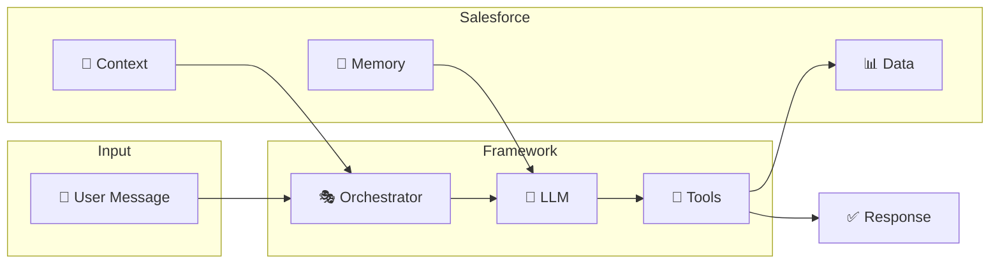

<p align="center">
  
</p>

<h1 align="center">Friday</h1>

<p align="center">
  <strong>Enterprise-Grade AI Platform for Salesforce</strong>
</p>

Build intelligent AI agents powered by Large Language Models that seamlessly integrate with your Salesforce environment. Designed for security, scalability, and ease of use.

Why Friday? Because “Unsupervised Multi-Channel Governance Runtime With Approval Routing” did not look great on the app header.

[](https://opensource.org/licenses/MPL-2.0)
[](https://developer.salesforce.com/)
[](https://iamsonal.github.io/aiAgentStudio/)
[](https://github.com/iamsonal/aiAgentStudio/stargazers)
[](https://github.com/iamsonal/aiAgentStudio/network/members)
[](https://github.com/iamsonal/aiAgentStudio/commits/main)
[](https://github.com/iamsonal/aiAgentStudio/issues)
[](https://www.linkedin.com/in/thesonal/)
[](https://github.com/sponsors/iamsonal)

---

## 🎥 Watch It In Action

**[Function Agents Demo →](https://youtu.be/-y9qDDPal0U)**

See the framework handle governed AI workflows with intelligent filtering, human-in-the-loop approvals, and error recovery on Salesforce.

---

## �  Documentation

**[View Full Documentation →](https://iamsonal.github.io/aiAgentStudio/)**

- [Getting Started Guide](https://iamsonal.github.io/aiAgentStudio/guides/getting-started/)
- [Configuration Reference](https://iamsonal.github.io/aiAgentStudio/guides/configuration/)
- [Standard Actions](https://iamsonal.github.io/aiAgentStudio/reference/actions/)
- [Developer Guide](https://iamsonal.github.io/aiAgentStudio/guides/developer-guide/) - Custom actions & context providers
- [Security Guide](https://iamsonal.github.io/aiAgentStudio/reference/security/)
- [Troubleshooting](https://iamsonal.github.io/aiAgentStudio/guides/troubleshooting/)

---

## 💖 Support This Project

Friday is **free and open-source**. If you find it useful, consider supporting ongoing development.

☕ **[GitHub Sponsors](https://github.com/sponsors/iamsonal)** | **[Buy Me a Coffee](https://buymeacoffee.com/iamsonal)**

---

## ⚠️ Repository Notice

This repository contains the **core AI Agent Framework only**. The `aiAgentStudioAddons` folder contains proprietary extensions not included in the open-source release.

The public package in `force-app` contains the core runtime, while the overall framework experience also includes broader packaged capabilities such as additional agent patterns, providers, actions, workflow composition, and UI features.

---

## 🎯 What is This?

Create AI-powered assistants that can:

- 💬 **Chat naturally** with users and remember conversation context
- ⚙️ **Run focused function-style automations** for classification, enrichment, and guided business tasks
- 📧 **Process email workflows** for triage, draft generation, and routing
- 🔍 **Search and retrieve** Salesforce data intelligently
- ✏️ **Create and update** records based on user requests
- 🔄 **Execute multi-step workflows** with approvals, sequencing, and specialist sub-agents
- 🔒 **Respect permissions** - agents only access what users can access
- 🎯 **Work with multiple AI providers** - OpenAI-compatible models, broader provider strategies, and enterprise options

---

## 💼 Use Cases

### Customer Support
Deploy AI copilots that help support agents resolve cases faster by automatically searching knowledge bases, pulling customer history, and suggesting solutions - all while respecting your existing security model.

### Sales Enablement
Give sales reps an intelligent assistant that can find accounts, surface open opportunities, create follow-up tasks, and provide real-time insights during customer conversations.

### Operations Automation
Build function-style agents, email workflows, sequential pipelines, and specialist sub-agent patterns for lead qualification, case routing, approvals, and record updates while keeping execution observable and governed inside Salesforce.

### Self-Service Portals
Embed conversational agents in Experience Cloud to let customers check order status, create support cases, or find answers from your knowledge base without waiting for human agents.

---

## 🔄 How It Works


```mermaid
flowchart LR
    subgraph Input
        A[👤 User Message]
    end

    subgraph Framework
        B[🎭 Orchestrator]
        C[🧠 LLM]
        D[🔧 Tools]
    end

    subgraph Salesforce
        E[📊 Data]
        F[📝 Context]
        G[💾 Memory]
    end

    A --> B
    B --> C
    C --> D
    D --> E
    F --> B
    G --> C
    D --> H[✅ Response]
```

1. **User sends a message** through chat, email, SMS/WhatsApp/webhook, middleware-backed normalized ingress, or API
2. **Context is gathered** from the current record, user profile, and related data
3. **LLM analyzes** the request with full conversation history
4. **Tools execute** Salesforce operations (query, create, update, post)
5. **Response is delivered** back to the user with full audit trail

Public messaging/webhook traffic can first land in a normalized ingress boundary and optional staging object before the core runtime creates `InteractionSession__c`, `InteractionMessage__c`, and `AgentExecution__c`. When staged guest ingress is used, processing is handed off through a Platform Event subscriber configured to run as an internal user instead of continuing in guest context.

All operations run asynchronously using Platform Events or Queueables, ensuring scalability for enterprise workloads.

---

## ✨ Key Features

| Feature | Description |
|:--------|:------------|
| **Multiple Runtime Patterns** | Conversational and Direct agent runtimes plus a dedicated Pipeline composition subsystem across chat, email, SMS, WhatsApp, API, and sub-agent workflows |
| **Metadata-Driven Capabilities** | Define tools, prompts, trust controls, and workflow behavior through Salesforce configuration |
| **Smart Memory** | Buffer window and summary-based conversation history |
| **Built-in Security** | Automatic CRUD, FLS, and sharing rule enforcement |
| **Standard Actions** | Create, update, query records, post to Chatter, execute Flows |
| **Extensible** | Custom actions, context providers, LLM adapters, memory managers |
| **Observability** | Full logging of LLM interactions, tool executions, and token usage |
| **Async Processing** | Platform Events (high concurrency) or Queueables (debugging) |

---

## 🏆 Why This Framework?

| Challenge | How We Solve It |
|:----------|:----------------|
| **Security concerns with AI** | Runs in user context with automatic CRUD/FLS enforcement. No privilege escalation. Full audit trail. |
| **Integration complexity** | Native Salesforce - no external servers, middleware, or data sync. Works with your existing org. |
| **Vendor lock-in** | Bring your own LLM. OpenAI-compatible APIs work out of the box, and the framework supports broader provider strategies for enterprise deployments. |
| **Scalability** | Async processing handles thousands of concurrent conversations. Choose Platform Events or Queueables. |
| **Customization needs** | Extensible architecture with interfaces for custom actions, context providers, and memory strategies. |
| **Governance & compliance** | Every interaction logged with a full execution trail. See exactly what the AI decided and why. |

---

## 🚀 Quick Start

### Prerequisites

- Salesforce org (Sandbox recommended)
- System Administrator access
- OpenAI API key

### Installation

**Option 1: Unlocked Package (Recommended for Quick Start)**

Install directly via package URL:

- **Sandbox & Scratch Orgs:**
  [https://test.salesforce.com/packaging/installPackage.apexp?p0=04tgK0000009qU1QAI](https://test.salesforce.com/packaging/installPackage.apexp?p0=04tgK0000009qU1QAI)

- **Production & Developer Edition Orgs:**
  [https://login.salesforce.com/packaging/installPackage.apexp?p0=04tgK0000009qU1QAI](https://login.salesforce.com/packaging/installPackage.apexp?p0=04tgK0000009qU1QAI)

After installation:
- Assign permission sets: `AIAgentStudioConfigurator` (for admins), `AIAgentStudioEndUser` (for users)
- Configure your LLM provider (OpenAI or any OpenAI-compatible API)
- Create your first agent

**Option 2: CumulusCI (Best for Development & Testing)**

If you have [CumulusCI](https://cumulusci.readthedocs.io/en/stable/get-started.html) set up:

```bash
cci flow run dev_org --org dev
```

This single command:
- Creates a scratch org with the framework deployed
- Deploys seed data and sample configurations
- Assigns required permission sets (`AIAgentStudioConfigurator`, `AIAgentStudioEndUser`)
- Enables Knowledge user and assigns `KnowledgeDemo` permission set
- Creates comprehensive sample data (agents, capabilities, test records)
- Sets up a External Client App for API access

**Option 3: Salesforce CLI (Source-Based)**

```bash
sf project deploy start -d force-app/main/default -o your-org-alias
```

### Optional: Load Test Data

If you need sample data to explore the framework (especially with Option 1 or 3):

1. **Deploy the test data factory** from the `seed-data` folder:
   ```bash
   sf project deploy start -d seed-data/main/default -o your-org-alias
   ```

2. **Execute in Developer Console** (or via Anonymous Apex):
   ```apex
   AgentTestDataFactory.createComprehensiveShowcase();
   ```

This creates sample agents, capabilities, accounts, contacts, and test scenarios to help you get started quickly.

### Configure OpenAI API Key

The framework includes pre-configured OpenAI named credentials. You just need to add your API key:

1. Navigate to **Setup** → **Named Credentials** → **External Credentials**
2. Find and open **OpenAIEC**
3. Under **Principals**, click **Edit** on the principal
4. In the **Authentication Parameters** section, add:
   - **Parameter**: `OpenAIKey`
   - **Value**: Your OpenAI API key (starts with `sk-`)
5. Click **Save**

The `OpenAILLM` named credential is now ready to use with the framework.

> **Tip**: The framework works well with OpenAI-compatible APIs and can be adapted to broader provider strategies for enterprise deployments. See the [Configuration Guide](https://iamsonal.github.io/aiAgentStudio/guides/configuration/).

### Setup

Once your API key is configured:

1. **Create or use existing LLM Configuration** (references the `OpenAILLM` named credential)
2. **Create AI Agent Definition** with identity/instruction prompts
3. **Add Capabilities** (tools) the agent can use
4. **Add Chat Component** to a Lightning page or use Quick Actions

👉 **[Full Getting Started Guide →](https://iamsonal.github.io/aiAgentStudio/guides/getting-started/)**

---

## 🏗️ Architecture

**Framework Capabilities:**
- Conversational strategy for multi-turn chat, email, and external messaging experiences
- Direct strategy for targeted automation and decision support
- Channel-aware routing for chat, email, SMS, WhatsApp, API, and future transports
- Provider-backed webhook/channel seams for external messaging transports such as SMS and WhatsApp
- Sequential pipelines and sub-agent workflows for multi-step orchestration
- Tool execution across data operations, flows, and custom business logic
- Human-in-the-loop approvals, observability, and trust controls
- Flexible support for multiple model-provider strategies

**Extension Areas:**
- Custom actions for business logic and integrations
- Context providers for domain-specific enrichment
- Additional model providers
- Custom memory strategies
- New execution patterns and agent behaviors

👉 **[Architecture Details →](https://iamsonal.github.io/aiAgentStudio/reference/architecture/)** | **[Developer Guide →](https://iamsonal.github.io/aiAgentStudio/guides/developer-guide/)**

---

## ⚠️ Important Notes

- **Use at your own risk** - Test thoroughly in sandbox before production
- **AI content verification** - LLMs can hallucinate; review automated actions
- **Data privacy** - User inputs are sent to external AI providers
- **Cost awareness** - Monitor token consumption; set appropriate history limits

---

## 📄 License

Copyright © 2026 Sonal

Licensed under **[Mozilla Public License 2.0](LICENSE)** (MPL-2.0)

✅ Commercial use | ✅ Modification | ✅ Distribution | ⚠️ Disclose source for modifications

---

<div align="center">

**Made with 🤖 and 💡 in 2026**

*Empowering Salesforce teams to build intelligent AI experiences*

</div>
