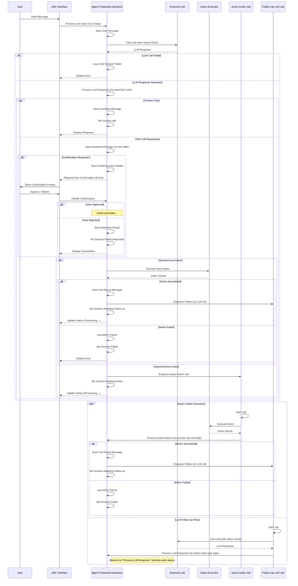

# Salesforce AI Agent Framework

## Overview

This Salesforce AI Agent Framework provides a robust and extensible platform for integrating advanced AI Agents, powered by Large Language Models (LLMs), directly within your Salesforce environment. It enables the creation of sophisticated conversational assistants that can understand user intent, access relevant Salesforce data securely, perform actions within Salesforce (like creating/updating records, posting to Chatter, running Flows), and provide intelligent responses through a chat interface.

The framework prioritizes declarative configuration, robust security, managed asynchronous processing, comprehensive error handling, and detailed observability, allowing technical teams to build, manage, and debug AI-driven workflows effectively within the Salesforce ecosystem.

---

## Core Features & Capabilities

*   **Reliable & Configurable Core:** Define agent personas, LLM connections, dynamic context retrieval rules, and agent capabilities (tools/actions) declaratively using Salesforce Custom Objects and Custom Metadata. The framework includes validation triggers on configuration objects to prevent common setup errors and reduce runtime issues.
*   **Managed Asynchronous Architecture:** LLM API callouts and designated complex actions are handled in the background using Salesforce Queueables (`FollowUpLLMQueueable`, `ExecuteSingleActionQueueable`). The framework actively manages state transitions (`ChatSession__c.ProcessingStatus__c`) and job dependencies for multi-step interactions, preventing UI timeouts and ensuring a responsive user experience. It includes logic to handle potentially stale background jobs.
*   **Extensible by Design:**
    *   **LLM Agnostic (Adapter Pattern):** Integrate with various LLM providers (OpenAI, Anthropic, etc.) by implementing a standard `ILLMProviderAdapter` interface. An `OpenAIProviderAdapter` with retry logic is included.
    *   **Custom Actions:** Extend agent capabilities beyond the included standard actions (Get/Create/Update Records, Post Chatter, Run Flow, Submit for Approval, Check Approval Status) by creating custom Apex classes implementing `IAgentAction`. A `BaseAgentAction` abstract class provides a standardized structure and error handling.
    *   **Custom Context Provisioning:** Implement custom Apex logic via `IAgentContextProvider` to fetch and structure complex or proprietary contextual data for the agent, supplementing declarative context rules.
*   **Security-First Approach:** Operates securely within Salesforce's sharing model. Enforces Object permissions (CRUD) and Field-Level Security (FLS) during context gathering (`ContextService`), action argument coercion (`ActionParamUtils`), and action execution (`SecurityUtils`, `QueryService` with `WITH USER_MODE`). Ensures agents only see and modify data the user is permitted to access.
*   **Dynamic Context Gathering & Schema Awareness:** Define rules (`AgentContextConfig__c`) to automatically pull relevant Salesforce data based on the current record context or the user. Providers fetch data, and `ContextService` formats it for the LLM, respecting FLS.
*   **Standardized Tool/Action Framework:**
    *   Configure capabilities (`AgentCapabilityBinding__c`) with clear descriptions and structured input parameters (JSON Schema) for the LLM, enabling reliable function/tool calling.
    *   The `ActionRegistry` dynamically instantiates action handlers.
    *   `ActionParamUtils` standardizes the parsing and validation of LLM-provided arguments.
    *   `BaseAgentAction` provides a template for action implementation with centralized error mapping.
*   **User Confirmation Workflow (Human-in-the-Loop):** Capabilities can be flagged (`RequiresHumanApproval__c`) to prompt the user for explicit confirmation via the chat interface before execution, mediated by Platform Events (`AgentActionConfirmationRequest__e`).
*   **Built-in Observability & Turn-Based Debugging:**
    *   Detailed logging (`OrchestrationLog__c`, managed by `OrchestrationLogger`) captures each step of the agent's processing turn.
    *   Manages the end-to-end processing of a single user message as a distinct 'turn' (tracked by `TurnIdentifier__c`), enabling reliable correlation of synchronous and asynchronous steps.
    *   Includes a `ChatSessionVisualizer` LWC to inspect orchestration logs.
*   **Turn Lifecycle Management:** `TurnLifecycleService` centralizes logic for managing chat turn state transitions, working with `ChatSessionStateService` for DML operations and platform event publishing for final responses (`AgentResponse__e`).
*   **Robust Error Handling & Retry Logic:**
    *   The framework includes retry logic for LLM callouts (in `OpenAIProviderAdapter`).
    *   Standardized error handling and mapping to `ActionResult` within `BaseAgentAction`.
    *   Queueable jobs include `try-catch` blocks and attempt to update session state to `FAILED` upon unrecoverable errors.

---

## Architecture & Key Concepts

This AI Agent framework is built on several core ideas:

1.  **Configuration First:** Define agents, LLM connections, tools (actions), and context rules using Salesforce Objects & Metadata (like `AIAgentDefinition__c`, `LLMConfiguration__c`, `ActionDefinition__c`, `AgentCapabilityBinding__c`, `AIAgentFrameworkSettings__c`). This makes the framework adaptable without changing core code.
2.  **Service-Based Design:** Different services handle specific jobs:
    *   **Orchestration:** Decides what to do after the LLM responds (reply, use a tool, ask for confirmation).
    *   **LLM Interaction:** Formats requests and handles calls to the actual language model (e.g., OpenAI).
    *   **Action/Tool Execution:** Runs the logic for specific tools (Apex, Flow, Standard Actions).
    *   **Context Management:** Gathers relevant data (e.g., from related records) to send with the LLM request.
    *   **State & Persistence:** Manages the chat session's status and saves messages.
3.  **Asynchronous Processing:** Long tasks (like waiting for LLM follow-ups or certain tool executions) run in the background using Queueables to keep the UI responsive and avoid hitting Salesforce limits.
4.  **State Management:** The `ChatSession__c` record tracks the conversation's status (e.g., Idle, Processing, Failed) using specific fields (`ProcessingStatus__c`, `CurrentTurnIdentifier__c`).
5.  **Event-Driven UI:** Platform Events (`AgentResponse__e`, `AgentActionConfirmationRequest__e`) notify the chat UI about final results or when user confirmation is needed, keeping the UI updated without direct Apex coupling.
6.  **Extensible Interfaces:** Key parts use interfaces (`ILLMProviderAdapter`, `IAgentAction`, `IAgentContextProvider`), making it easier to add support for new LLMs, tools, or context sources.

---

## Core Component Types

*   **Configuration:** Custom Objects and Metadata defining agent behavior.
*   **Services:** Apex classes handling specific tasks (Orchestration, LLM Calls, Actions, Context, State, Persistence).
*   **Interfaces:** Define contracts for extensibility (LLM Adapters, Actions, Context Providers).
*   **Action Framework:** Components for defining, discovering, and executing tools (Apex, Flow, Standard).
*   **Data Model:** Custom Objects (`ChatSession__c`, `ChatMessage__c`, `OrchestrationLog__c`) storing conversation data and debug logs.
*   **Platform Events:** Used for asynchronous UI communication.
*   **Utilities:** Helpers for security, schema interactions, parameters, etc.
*   **LWC UI:** Includes a sample chat interface (`aiAssistantChat`)

---

## Administrator / Configurator Responsibilities

The power of an AI Agent built with this framework hinges on thoughtful configuration:

*   **Clear Instructions (Prompts & Descriptions):** The quality of `AIAgentDefinition__c.SystemPrompt__c` and `AgentCapabilityBinding__c.Description__c` (for LLM tools) is paramount. These must clearly define the agent's role, limitations, and how/when to use specific capabilities. Ambiguity leads to poor LLM performance.
*   **Accurate Tool Schemas:** The `InputSchema__c` on `AgentCapabilityBinding__c` must accurately reflect the arguments the LLM needs to provide for an action, and these must be compatible with the backend action handler.
*   **Contextual Relevance:** Configure `AgentContextConfig__c` records effectively to provide necessary, but not excessive, information to the LLM.
*   **Security & Permissions:** While the framework enforces FLS/CRUD, admins are responsible for assigning appropriate permissions to users for the configuration objects, Apex classes, and underlying data the agent might access or modify.
*   **Token Awareness:** Prompts, context, history, and tool definitions all consume LLM tokens. Optimize these for conciseness and relevance to manage costs and performance.
*   **Named Credential Setup:** Correctly configure Named Credentials for LLM provider authentication. **API keys must not be hardcoded.**
*   **Iterative Refinement:** Agent configuration is an iterative process of definition, testing, and refinement based on observed behavior and performance.

---

## Execution Flow (Conceptual)

---

## Setup

1.  **Deploy All Components:** Custom Objects, Fields, Apex Classes, Triggers, LWCs, Custom Metadata Types, and Custom Settings.
2.  **Configure Named Credential:**
    *   Create an **External Credential** for your LLM Provider (e.g., for OpenAI, Custom Auth with header `Authorization` and value `Bearer YOUR_API_KEY_STORED_AS_A_SECRET_PARAMETER`).
    *   Create a **Named Credential** matching the `DeveloperName__c` you'll use in `LLMConfiguration__c`. Set its URL (e.g., `https://api.openai.com`) and link to the External Credential.
3.  **Configure `LLMConfiguration__c`:**
    *   Create at least one record specifying `DeveloperName__c`, `NamedCredential__c` (from step 2), `ProviderAdapterClass__c` (e.g., `OpenAIProviderAdapter`), and `DefaultModelIdentifier__c`.
4.  **Configure `AIAgentDefinition__c`:**
    *   Create at least one record. Assign a `DeveloperName__c`, link to an `LLMConfiguration__c`, and write a `SystemPrompt__c`.
5.  **(Optional) Standard Action Handlers (`StandardActionHandler__mdt`):**
    *   Verify records exist for standard actions like `GetRecords`, `CreateRecord`, `RunFlow`, etc., mapping them to their respective handler classes (e.g., `ActionGetRecords`, `ActionFlowHandler`). These should be deployed with the framework.
6.  **Configure `ActionDefinition__c` records:**
    *   For each reusable piece of logic (Standard, Custom Apex, Flow) your agent needs. Specify `ImplementationType__c` and details (e.g., `ImplementationName__c` for Apex/Flow, `StandardActionType__c` for Standard). Define the `InputParameterSchema__c` (JSON schema of arguments the LLM should provide).
7.  **Configure `AgentCapabilityBinding__c` records:**
    *   For each `AIAgentDefinition__c`, create bindings to the `ActionDefinition__c` records it should be able to use.
    *   Critically, define `DeveloperName__c` (the function name for the LLM), `Description__c` (how the LLM should understand and use the tool), and `InputSchema__c` (JSON schema for the LLM's arguments, tailored from the Action Definition's schema, possibly including the `confirmation_message` if `RequiresHumanApproval__c` is true).
8.  **Configure `AgentContextConfig__c` records (Optional):**
    *   If dynamic context is needed, define sources linking an `AIAgentDefinition__c` to `IAgentContextProvider` Apex classes.
9.  **Configure `AIAgentFrameworkSettings__c` (Custom Setting):**
    *   Go to Setup -> Custom Settings -> AI Agent Framework Settings -> Manage.
    *   Review defaults (e.g., `DefaultMaxConversationTurns__c`, `DefaultHistoryLimit__c`). Consider enabling `MitigateChainingLimitsViaEvent__c` for dev orgs.
10. **Assign Permissions:**
    *   Grant users access to essential Custom Objects (CRUD as appropriate: `ChatSession__c`, `ChatMessage__c` for users; more for admins).
    *   Grant users access to controller Apex classes (`AIAssistantController`).
    *   Grant admins access to configuration objects and setup/debug LWCs.
11. **Add LWC to Page (Optional):** Add `aiAssistantChat` to a Lightning Page.

---

## Known Limitations & Potential Future Enhancements

*   **State Reconciliation:** For enterprise resilience against rare cascading failures leaving sessions in transient states, a background reconciliation job (Scheduled Apex) could be implemented to identify and fail "stuck" sessions.
*   **Advanced Context Management:** Current context is primarily history + injected context. Future enhancements could include RAG (Retrieval Augmented Generation) via vector DBs, more sophisticated history summarization, or agent-driven context selection.
*   **Dynamic LLM Routing:** Allow an agent or orchestration step to dynamically choose an LLM model/provider based on task complexity, cost, or specific capabilities.
*   **Action/Schema Management UI:** A dedicated UI to more easily create, manage, and validate the alignment between `ActionDefinition__c.InputParameterSchema__c` and `AgentCapabilityBinding__c.InputSchema__c` would greatly aid configuration.
*   **Observability Deep Dive:** While `OrchestrationLog__c` is good, more advanced analytics on token usage per turn/agent, action success/failure rates, and LLM tool selection accuracy could be valuable.
*   **Rate Limiting/Throttling for LLM Calls:** For high-volume scenarios, implementing internal rate limiting for calls to the LLM provider.

---

## License

(Copyright (c) 2025 Sonal - AI Agent Framework Team)

This source code is licensed under the MIT license. See the LICENSE file for details.
