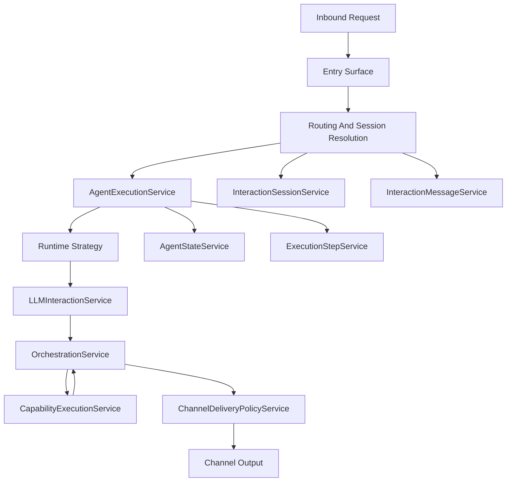

import { Aside, Badge, Card, CardGrid, LinkButton, LinkCard, Steps } from '@astrojs/starlight/components';

This page explains the framework in human terms. It is meant to give you the right mental model
before you read dozens of classes or trace a request through logs.

  <Badge text="System Walkthrough" variant="success" />
  <Badge text="Human-Oriented" variant="note" />
  <Badge text="Core Only" variant="tip" />

  <LinkButton href="../runtime-model/" variant="secondary">Review Runtime Model</LinkButton>
  <LinkButton href="../../guides/troubleshooting/" variant="minimal">See Debugging Guide</LinkButton>

<Aside type="note" title="How to read this page">
The goal here is clarity, not exhaustiveness. This page stays public-safe and core-focused. It
explains what the system is trying to model, why the boundaries matter, and how a request actually
moves through the runtime.
</Aside>

## The Short Version

Loom is a governed AI runtime for Salesforce.

It does more than send a prompt to a model and return text. It accepts requests from multiple entry
surfaces, chooses the right runtime style, manages tools and continuity, applies trust and approval
controls, and writes what happened into durable records that can be audited and operated.

That is what makes it a runtime rather than a thin wrapper around an LLM API.

## What The System Really Models

The framework works well because it separates concerns that simpler systems often blur together.

- An `AIAgentDefinition__c` record describes what an agent is.
- An `AgentExecution__c` record represents a unit of work performed by that agent.
- An `InteractionSession__c` record is the continuity anchor for a conversation or thread.
- An `InteractionMessage__c` record is the transport-level inbound or outbound message.
- An `ExecutionStep__c` record is the detailed audit trail of what happened during execution.

Those are deliberately not interchangeable. A conversation is not the same thing as a runtime work
item, and a transport message is not the same thing as an execution step. Once you keep those
boundaries clear, the rest of the framework becomes much easier to follow.

## The Mental Model

The shortest accurate summary is:

a request comes in, the system figures out the context around that request, starts or resumes
execution, lets strategy and channel shape the runtime behavior, runs the LLM and tool loop, and
then writes the resulting state back into durable records.

If you want one picture in your head, use this:

This diagram is intentionally high level. It is not a class inventory. It is the shape of the
runtime.

## Strategy, Channel, And Composition

The architecture makes the most sense when you keep three dimensions separate.

### 1. Execution strategy

This answers: what style of runtime should this request use?

- `Conversational` for ongoing interactions where continuity matters
- `Direct` for bounded work such as classification, enrichment, summarization, or controlled automation

### 2. Interaction channel

This answers: where did the request come from, and how should replies be handled?

- chat
- email
- direct API
- provider-backed messaging channels

### 3. Composition

Some work is just one normal agent execution. Some work belongs to a larger multi-agent process.
That is why pipeline-style composition lives beside the normal runtime rather than being forced into
the same conceptual box.

This separation is one of the strongest parts of the design. If runtime strategy and interaction
channel were fused together, the framework would quickly collapse into brittle variants like
“ChatAgent,” “EmailAgent,” “WhatsAppAgent,” or “TeamsAgent.” Instead, runtime style and transport
behavior stay orthogonal.

## What Happens When A Request Arrives

Every request starts somewhere:

- a UI interaction
- an API call
- an inbound message
- a Flow invocation
- a composition handoff

The first job of the system is to normalize the request and figure out enough context to make the
correct runtime decision.

For channel-based traffic, the framework uses services such as:

- `InboundInteractionPipelineService`
- `InteractionSessionService`
- `InteractionMessageService`
- `ChannelRoutingService`

Those services help answer the early questions that matter:

- what channel is this?
- which endpoint and route apply?
- is this message a duplicate?
- does it continue an existing session or begin a new one?
- how should the resulting execution be delivered?

Once that context is resolved, `AgentExecutionService.startExecution()` becomes the main execution
boundary. It loads configuration, decides whether the request belongs to a normal runtime or another
composition path, resolves strategy and channel behavior, and delegates to the correct
implementation.

That handoff is a good place to orient yourself when you are new to the codebase. It is where the
framework stops thinking about "what came in" and starts thinking about "what runtime should own
this work."

## The Two Main Runtime Styles

<CardGrid>
  <Card title="Conversational Runtime" icon="comment">
    Used when the system needs to preserve ongoing interaction continuity. Chat assistants, email
    conversations, and session-aware messaging flows fit this shape.
  </Card>
  <Card title="Direct Runtime" icon="rocket">
    Used when the request behaves more like a bounded task. These paths care more about completing
    one work unit correctly than about long-lived conversational continuity.
  </Card>
</CardGrid>

This distinction matters because it changes what the runtime cares about.

- conversational paths care about turns, sessions, and reply behavior
- direct paths care about correctness and completion of one work unit

## How The LLM And Tool Loop Works

Eventually the runtime reaches `LLMInteractionService`.

That is where prompts, tool schemas, context, memory, masking, and safety behavior come together to
form the model request.

When a result comes back, `OrchestrationService` interprets it. At that point the framework decides
whether the model:

- returned plain content
- requested tools
- needs follow-up work
- should pause, retry, or complete

If a tool needs to run, `CapabilityExecutionService` becomes the tool-execution seam. A capability
might map to:

- a packaged standard action
- a custom Apex implementation
- a Flow
- another agent capability

If the result should be visible to a user, `ChannelDeliveryPolicyService` becomes the final
governor. It asks the channel adapter how the response should be handled. Depending on the channel
and route, that may mean replying immediately, saving a draft, suppressing output, or pushing the
result through a review flow.

This is also why the framework feels production-oriented. Delivery is treated as a governed runtime
decision, not an afterthought that automatically follows every model response.

## Why Sessions, Messages, And Steps Are Different

One of the most common questions is why the framework has both session records and execution
records, or both transport message records and execution step records.

The short answer is that they represent different layers of truth.

- `InteractionSession__c` answers: what conversation or thread does this belong to over time?
- `AgentExecution__c` answers: what runtime work item are we doing right now?
- `InteractionMessage__c` answers: what came in or went out over the channel?
- `ExecutionStep__c` answers: what did the runtime do while handling this execution?

If those concepts were collapsed into one record type, the system might be easier to start but much
harder to extend, audit, and debug.

## How External Messaging Fits

Provider-backed channels such as WhatsApp, Slack, and Teams are a good example of how the framework
handles transport-specific concerns without polluting the generic agent API.

Webhook verification, signature checks, and payload parsing happen outside the generic agent runtime
boundary. The provider transport is resolved through endpoint metadata, and the normalized inbound
request then enters the same broader execution model the rest of the framework uses.

The design goal is stability of the runtime model. Adding another provider-backed channel should not
require inventing a new architecture. It should mostly require:

- a provider implementation
- a channel adapter
- endpoint and route metadata
- tests

## Metadata Matters More Than It First Appears

The framework is heavily metadata-driven, and that is one of the main reasons it can grow without
constant code changes.

<CardGrid>
  <Card title="Agent Metadata" icon="information">
    `AIAgentDefinition__c`, `AgentCapability__c`, and `LLMConfiguration__c` define agent behavior,
    capability exposure, and provider/model configuration.
  </Card>
  <Card title="Routing Metadata" icon="random">
    `AgentChannelRoute__mdt`, `ChannelEndpoint__mdt`, and `InteractionChannelType__mdt` define how
    traffic is interpreted and which agent owns it.
  </Card>
  <Card title="Action Metadata" icon="puzzle">
    `ActionHandlerRegistry__mdt` maps packaged action types to concrete handlers.
  </Card>
</CardGrid>

In practical terms:

- endpoint metadata answers where the traffic came from
- route metadata answers which agent should handle it
- runtime metadata answers how that work should behave once it starts

## Why Async Execution Is So Important

The asynchronous model is not optional complexity added for style. It exists because Salesforce
transactions have real constraints around callouts, DML sequencing, retries, and concurrency.

That is why queueables and platform events appear so often in the architecture. If a request can be
completed inline and the transaction is still safe, part of the runtime may proceed synchronously.
If not, the framework persists the required state and continues asynchronously.

`TransactionContext` exists for the same reason. It helps the runtime remember what is still safe
in the current transaction:

- whether more LLM calls are allowed
- whether deferred DML mode is active
- whether DML or callouts have already happened
- whether the current path should continue inline or pivot to async work

## The Most Important Services In Human Terms

| Service | Human description |
| :-- | :-- |
| `AgentExecutionService` | Main traffic controller and public entrypoint for runtime work |
| `RuntimeRegistryService` | Resolves strategy, channel, and runtime traits |
| `InteractionChannelRegistryService` | Lookup layer for channel behavior |
| `LLMInteractionService` | Builds and sends the model request |
| `OrchestrationService` | Interprets model output and decides what happens next |
| `CapabilityExecutionService` | Runs tools and capability implementations |
| `AgentStateService` | Manages execution lifecycle state |
| `ExecutionStepService` | Records detailed execution history |
| `InteractionSessionService` | Manages continuity across conversations or threads |
| `InteractionMessageService` | Manages transport-level message history |
| `ChannelDeliveryPolicyService` | Governs final response delivery |

You do not need to memorize every service at once. These are the ones that define the framework's
shape.

## Where To Start Reading The Code

If you want to translate this architecture into source code, a productive reading order is:

1. `AgentExecutionService`
2. `RuntimeRegistryService`
3. one conversational runtime and one direct runtime path
4. `LLMInteractionService`
5. `OrchestrationService`
6. `CapabilityExecutionService`
7. `AgentStateService`, `ExecutionStepService`, and the session/message services

## How To Debug A Request

When debugging, it helps to walk the request in the same order the framework does.

<Steps>
1. Identify the entrypoint.
2. Identify the target agent.
3. Identify the runtime strategy and interaction channel.
4. Check whether a session already existed and whether it was reused or rolled over.
5. Inspect `AgentExecution__c` for lifecycle state, turn identifier, trigger payload, and execution type.
6. Inspect `ExecutionStep__c` to see what the runtime actually did.
7. Verify whether delivery was attempted and whether `InteractionMessage__c` captured the transport event correctly.
</Steps>

That order is usually more useful than jumping into one class at random.

## Final Takeaway

The framework is best understood as a governed AI runtime for Salesforce.

It supports multiple execution styles, multiple interaction channels, durable continuity,
metadata-driven routing, detailed auditability, and explicit separation between transport,
execution, and trace records.

If you keep one model in your head, keep this one:

a request enters through an entry surface, routing and context services normalize the inbound
situation, `AgentExecutionService` starts or resumes work, strategy and channel determine how that
work behaves, the LLM and tool loop does the reasoning, and the resulting state is written back
into executions, sessions, messages, and steps.

## Continue

<CardGrid>
  <LinkCard title="Security" href="../security/">
    Continue into how permissions, trust layers, approvals, and auditability protect this runtime.
  </LinkCard>
  <LinkCard title="API Reference" href="../api-reference/">
    See how the execution and ingress REST surfaces connect to the runtime model described here.
  </LinkCard>
  <LinkCard title="Troubleshooting" href="../../guides/troubleshooting/">
    Use the operational debugging guide when you need to inspect real runtime failures.
  </LinkCard>
</CardGrid>
