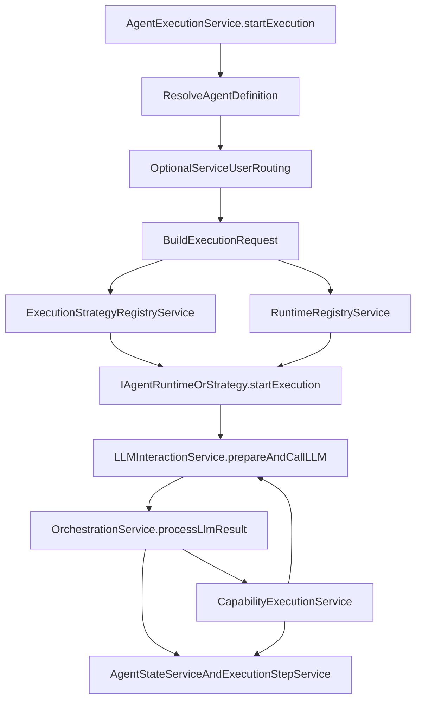
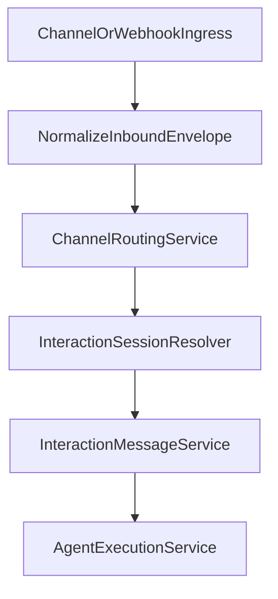

import { Aside, Card, CardGrid, Steps } from '@astrojs/starlight/components';

# Architecture Overview

This page shows how the core runtime is wired together at the service level. For the conceptual
model of strategies, channels, sessions, and executions, start with the Runtime Model page.

<Aside type="note" title="Scope">
This page covers the public core architecture in `force-app`. It intentionally avoids addon-only
implementation details and private orchestration mechanics.
</Aside>

## Main Execution Path

## Core Services

<CardGrid>
  <Card title="AgentExecutionService" icon="seti:play">
    Unified public entry point. Resolves the target, performs service-user routing when needed,
    validates payload shape, and delegates to the correct runtime boundary.
  </Card>
  <Card title="RuntimeRegistryService" icon="seti:settings">
    Resolves strategy, channel, and runtime traits while keeping execution strategy separate from
    interaction channel.
  </Card>
  <Card title="LLMInteractionService" icon="seti:cloud">
    Builds prompt payloads, includes history and tool definitions, invokes the provider adapter, and
    returns parsed provider results.
  </Card>
  <Card title="OrchestrationService" icon="seti:graph-line">
    Interprets LLM output, selects response handlers, continues follow-up turns, and routes tool
    results back into the runtime loop.
  </Card>
  <Card title="CapabilityExecutionService" icon="seti:tools">
    Executes capabilities across standard actions, custom Apex actions, and Flow-backed
    implementations.
  </Card>
  <Card title="AgentStateService and ExecutionStepService" icon="seti:list-unordered">
    Own execution lifecycle updates and durable trace records so every run can be inspected and
    debugged.
  </Card>
</CardGrid>

## Inbound Channel Architecture

Channel-driven traffic shares a normalized inbound pipeline instead of duplicating logic in each
entrypoint.

That pattern allows the framework to:

- keep channel adapters thin
- preserve durable session continuity
- support route and endpoint metadata independently from prompts
- apply the same execution engine after the transport boundary is normalized

## Continuity and Observability

<CardGrid>
  <Card title="InteractionSessionService" icon="seti:history">
    Resolves or creates durable session anchors so the framework can preserve continuity across
    turns and executions.
  </Card>
  <Card title="InteractionMessageService" icon="seti:mail">
    Stores inbound and outbound message records at the transport layer, separate from agent
    reasoning and tool traces.
  </Card>
  <Card title="ExecutionStepService" icon="seti:timeline">
    Persists user turns, assistant content, tool calls, tool results, and failures for operational
    review.
  </Card>
  <Card title="TransactionContext" icon="seti:database">
    Tracks deferred DML and unsafe operations so the runtime can decide whether follow-up LLM turns
    are still legal in the current transaction.
  </Card>
</CardGrid>

## Trust and Control Services

<CardGrid>
  <Card title="PIIMaskingService" icon="seti:shield">
    Masks sensitive values before provider calls using framework-controlled masking rules.
  </Card>
  <Card title="HITLGatewayService" icon="approve-check">
    Applies confirmation and approval behavior for capabilities that require human review.
  </Card>
  <Card title="ToolFlowGraphService" icon="seti:git-branch">
    Filters tool eligibility at runtime so the model only sees tools that are currently legal to
    use.
  </Card>
  <Card title="ChannelDeliveryPolicyService" icon="seti:mail">
    Applies channel-specific reply and delivery policy after the runtime decides what to send.
  </Card>
</CardGrid>

## Architectural Constraints That Matter

<Steps>
1. **Callout legality shapes the runtime**

   The framework is explicitly designed around Salesforce's no-callout-after-uncommitted-work rule.
   Service-user routing, async dispatch, and deferred DML all exist in part to preserve legal
   execution paths.

2. **Durable state beats transient state**

   Sessions, messages, executions, and execution steps are persisted so work can resume safely,
   concurrency can be guarded, and operators can inspect what actually happened.

3. **Trust controls are runtime concerns**

   Masking, safety checks, approval gates, and tool-flow constraints are part of the execution path,
   not just admin documentation.
</Steps>
