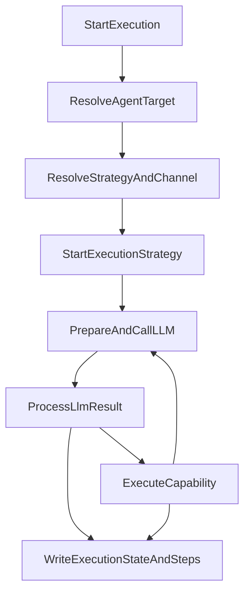
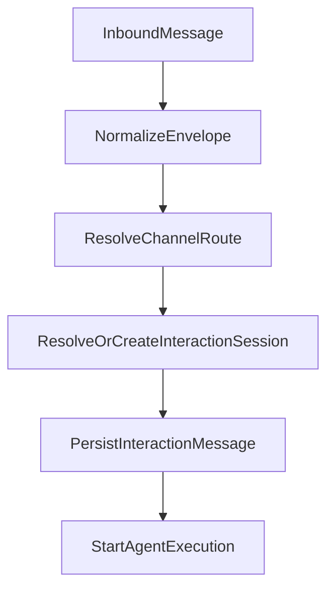

import { Aside, Badge, Card, CardGrid, LinkButton, LinkCard, Steps } from '@astrojs/starlight/components';

# Runtime Model

This page explains the current core runtime model in `force-app`. Use it as the conceptual map for
the rest of the docs before diving into service-level architecture.

  <Badge text="Core Vocabulary" variant="success" />
  <Badge text="Concept Model" variant="note" />
  <Badge text="Read Early" variant="tip" />

  <LinkButton href="../architecture/" variant="secondary">Read Architecture Next</LinkButton>
  <LinkButton href="../../guides/configuration/" variant="minimal">Map Concepts To Config</LinkButton>

<Aside type="note" title="Public scope">
This page stays focused on the core runtime model. Addon packages can extend the framework, but
their internal orchestration mechanics are intentionally out of scope here.
</Aside>

## The Core Idea

AI Agent Studio separates **how work is executed** from **where the interaction came from**.

- Runtime strategy answers: is this a conversational or direct execution?
- Interaction channel answers: is this work happening through chat, email, API, or another transport?
- Session and message records preserve continuity independently from the runtime strategy.

That separation is one of the most important ideas in the framework. It prevents the runtime from
turning into a pile of special-case agent variants for every channel and workflow combination.

## Runtime Strategy vs Interaction Channel

| Concern | What it controls | Core examples |
| :-- | :-- | :-- |
| runtime strategy | how the work behaves | conversational, direct |
| interaction channel | where the work shows up | chat, email, API, provider-backed messaging |
| session | continuity over time | conversation or thread context |
| message | transport history | inbound and outbound channel events |

<Aside type="tip" title="What to remember">
Do not infer the interaction channel from the runtime strategy. Strategy and channel are related at
runtime, but they are not the same thing.
</Aside>

## Execution Units

<CardGrid>
  <Card title="Agent Definition" icon="information">
    The agent definition stores the agent's identity, instructions, model settings, memory choices,
    and trust controls.
  </Card>
  <Card title="Capability" icon="puzzle">
    A capability defines what the agent is allowed to do and under what rules.
  </Card>
  <Card title="Execution" icon="rocket">
    An execution is one durable unit of runtime work, including status, channel, and turn state.
  </Card>
  <Card title="Execution Steps" icon="list-format">
    Execution steps form the detailed trace of user input, model output, tool calls, results, and
    failures.
  </Card>
</CardGrid>

## Why These Record Boundaries Matter

These records may sound similar at first, but they answer different operational questions:

- what behavior is this agent configured to have?
- what unit of work is running or has already run?
- what longer-lived conversation or thread does this belong to?
- what actually came in or went out over the transport?
- what did the runtime do internally while handling the work?

Once you keep those layers distinct, debugging becomes much easier because you know which record
type should contain which kind of truth.

## Main Runtime Flow

## Inbound and Session Continuity

For channel-driven traffic, the framework uses one shared inbound path:

That model gives the framework a few important properties:

- channel entrypoints can stay thin
- session continuity is durable
- the same execution engine can be reused across multiple delivery surfaces

## Trust Layers in the Runtime

<CardGrid>
  <Card title="PII Masking" icon="approve-check-circle">
    Sensitive values can be masked before provider calls so prompts and tool payloads are safer to
    send outside Salesforce.
  </Card>
  <Card title="Prompt Safety" icon="warning">
    Provider adapters can run native safety checks before or during model interaction.
  </Card>
  <Card title="Tool Flow Graph" icon="random">
    Tool eligibility can be constrained at runtime so only currently valid tools are exposed to the
    model.
  </Card>
  <Card title="Human-in-the-Loop" icon="approve-check">
    Capabilities can require confirmation or approval before executing sensitive actions.
  </Card>
</CardGrid>

## Common Modeling Mistakes

- treating runtime strategy and interaction channel as the same setting
- assuming every execution should have conversational continuity
- reading only `AgentExecution__c` and skipping `ExecutionStep__c` when diagnosing behavior
- using one agent definition for unrelated jobs that should be separate runtimes
- thinking of sessions as just chat UX state rather than durable continuity records

## Extension Points

The core framework is intentionally extensible at a few clear seams:

- new tools
- new context providers
- new model providers
- new memory strategies
- future runtime and channel evolution

## Recommended Reading Order

<Steps>
1. Read this page to understand the runtime vocabulary.
2. Continue to the Architecture page for the service-level execution path.
3. Use the Configuration guide to map those concepts to admin settings.
</Steps>

## Continue

<CardGrid>
  <LinkCard title="Architecture" href="../architecture/">
    Continue into the human-oriented system walkthrough once the runtime vocabulary is clear.
  </LinkCard>
  <LinkCard title="Configuration" href="../../guides/configuration/">
    See how strategy, channels, capabilities, and controls map into metadata and settings.
  </LinkCard>
  <LinkCard title="Security" href="../security/">
    Learn how trust layers, approvals, and auditability fit into the runtime model.
  </LinkCard>
</CardGrid>
