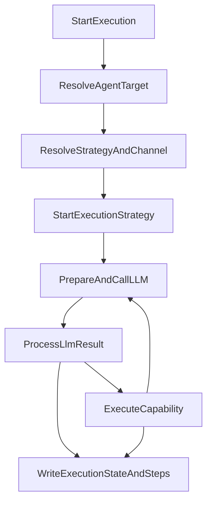
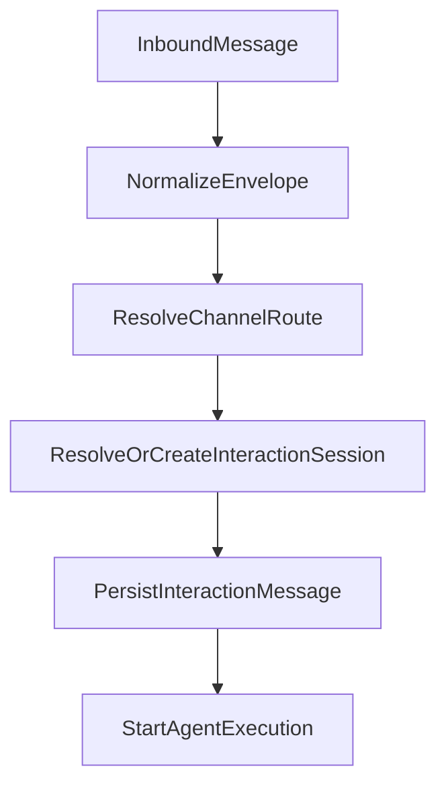

import { Aside, Card, CardGrid, Steps } from '@astrojs/starlight/components';

# Runtime Model

This page explains the current core runtime model in `force-app`. Use it as the conceptual map for
the rest of the docs before diving into service-level architecture.

<Aside type="note" title="Public scope">
This page stays focused on the core runtime model. Addon packages can extend the framework, but
their internal orchestration mechanics are intentionally out of scope here.
</Aside>

## The Core Idea

AI Agent Studio separates **how work is executed** from **where the interaction came from**.

- Runtime strategy answers: is this a conversational or direct execution?
- Interaction channel answers: is this work happening through chat, email, API, or another transport?
- Session and message records preserve continuity independently from the runtime strategy.

## Runtime Strategy vs Interaction Channel

| Concern | What it controls | Core examples |
| :-- | :-- | :-- |
| `RuntimeStrategy__c` on `AIAgentDefinition__c` | Execution behavior and orchestration style | `Conversational`, `Direct` |
| `InteractionChannel__c` on `AgentExecution__c` | The delivery or transport surface for a work unit | `Chat`, `Email`, `Direct`, provider-backed channels |
| `InteractionSession__c` | Durable continuity across messages and executions | Preserves thread or conversation context |
| `InteractionMessage__c` | Transport-level message records | Inbound and outbound channel messages |

<Aside type="tip" title="What to remember">
Do not infer the interaction channel from the runtime strategy. Strategy and channel are related at
runtime, but they are not the same thing.
</Aside>

## Execution Units

<CardGrid>
  <Card title="Agent Definition" icon="seti:settings">
    `AIAgentDefinition__c` stores the agent's prompts, provider binding, runtime strategy, memory,
    trust controls, and execution preferences.
  </Card>
  <Card title="Capability" icon="seti:tools">
    `AgentCapability__c` defines what the agent can do, including implementation type, JSON schema,
    HITL mode, and exposure level.
  </Card>
  <Card title="Execution" icon="seti:graph-line">
    `AgentExecution__c` is the durable work unit. It captures lifecycle state, resolved strategy,
    interaction channel, and turn coordination data.
  </Card>
  <Card title="Execution Steps" icon="seti:list-unordered">
    `ExecutionStep__c` stores the execution trace across user turns, assistant responses, tool
    calls, tool results, and failures.
  </Card>
</CardGrid>

## Main Runtime Flow

## Inbound and Session Continuity

For channel-driven traffic, the framework uses a shared inbound pipeline:

That model gives the framework a few important properties:

- channel entrypoints can stay thin
- session continuity is durable
- the same execution engine can be reused across multiple delivery surfaces

## Trust Layers in the Runtime

<CardGrid>
  <Card title="PII Masking" icon="seti:shield">
    Sensitive values can be masked before provider calls so prompts and tool payloads are safer to
    send outside Salesforce.
  </Card>
  <Card title="Prompt Safety" icon="seti:warning">
    Provider adapters can run native safety checks before or during model interaction.
  </Card>
  <Card title="Tool Flow Graph" icon="seti:git-branch">
    Tool eligibility can be constrained at runtime so only currently valid tools are exposed to the
    model.
  </Card>
  <Card title="Human-in-the-Loop" icon="approve-check">
    Capabilities can require confirmation or approval before executing sensitive actions.
  </Card>
</CardGrid>

## Extension Points

The core framework is intentionally extensible at clear seams:

- `IAgentAction` and `BaseAgentAction` for new tool implementations
- `IAgentContextProvider` for dynamic business context
- `ILLMProviderAdapter` and `BaseProviderAdapter` for new model providers
- `IMemoryManager` for alternative memory strategies
- strategy and channel registries for runtime evolution

## Recommended Reading Order

<Steps>
1. Read this page to understand the runtime vocabulary.
2. Continue to the Architecture page for the service-level execution path.
3. Use the Configuration guide to map those concepts to admin settings.
</Steps>
