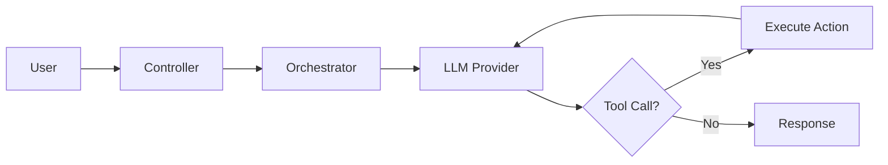
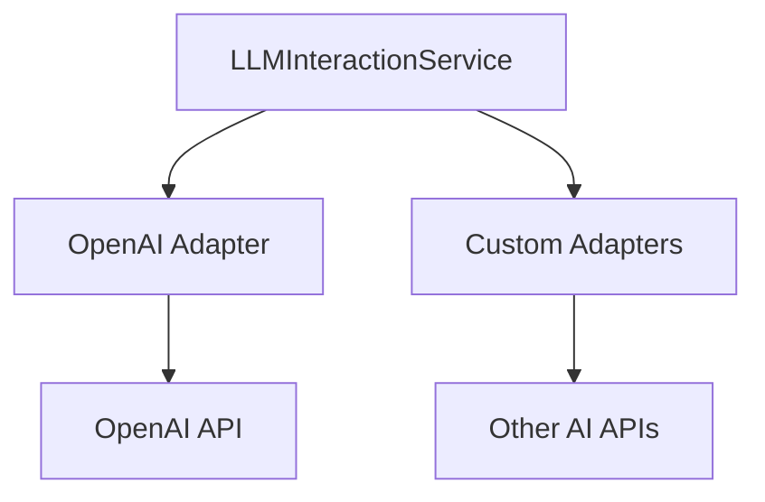

# Architecture Overview
{: .no_toc }

Understanding how the framework processes requests and executes actions.
{: .fs-6 .fw-300 }

## Table of contents
{: .no_toc .text-delta }

1. TOC
{:toc}

---

## Request Flow



---

## Core Components

### Entry Points

| Component | Purpose | Use Case |
|:----------|:--------|:---------|
| `AgentExecutionService` | Main programmatic entry | Apex integrations |
| `ConversationalChatController` | LWC controller | Chat UI |
| `AIAgentRestService` | REST API | External integrations |

### Orchestrators

Orchestrators manage the execution flow for different agent types.

| Orchestrator | Agent Type | Behavior |
|:-------------|:-----------|:---------|
| `ConversationalOrchestrator` | Conversational | Multi-turn with memory |
| `FunctionOrchestrator` | Function | Single-task factory routing to sync/async patterns |
| `WorkflowOrchestrator` | Workflow | Multi-agent state machine |
| `EmailOrchestrator` | Email | Threaded email processing |

### Core Services

| Service | Responsibility |
|:--------|:---------------|
| `LLMInteractionService` | Communicates with AI providers |
| `OrchestrationService` | Coordinates LLM and tool execution |
| `CapabilityExecutionService` | Executes agent actions |
| `AgentStateService` | Manages execution lifecycle |
| `ContextManagerService` | Handles memory and context |
| `ExecutionStepService` | Execution step logging & retrieval |
| `AgentExecutionDispatcher` | DLQ dispatch for multi-record execution |
| `AgentExecutionWorker` | DLQ worker with self-pull pattern |
| `TransactionContext` | Deferred DML / multi-LLM optimization |

---

## AI Provider Integration

### Adapter Pattern

The framework uses adapters to support multiple AI providers with a consistent interface.



### Available Adapters

| Adapter | Provider | Models |
|:--------|:---------|:-------|
| `OpenAIProviderAdapter` | OpenAI | GPT-4o, GPT-4o-mini |
| `ClaudeProviderAdapter` | Anthropic | Claude models |
| `GeminiProviderAdapter` | Google | Gemini models |

You can add your own provider by extending `BaseProviderAdapter`.

---

## Memory Management

### Buffer Window Strategy

Keeps the last N conversation turns verbatim.

```
Turn 1: User asks about accounts     ─┐
Turn 2: Agent responds               │
Turn 3: User asks follow-up          │ Kept in context
Turn 4: Agent responds               │
Turn 5: User asks another question   ─┘
Turn 6: (Turn 1 dropped when limit reached)
```

**Best for**: Short conversations, precise context needed

### Summary Buffer Strategy

Summarizes older turns to preserve context while reducing tokens.

```
[Summary of turns 1-5]              ─┐
Turn 6: Recent user message          │ Sent to LLM
Turn 7: Recent agent response        │
Turn 8: Current user message        ─┘
```

**Best for**: Long conversations, cost optimization

---

## Tool Execution

### Execution Flow

1. **LLM decides** to use a tool based on user request
2. **Framework validates** permissions and parameters
3. **Action executes** the Salesforce operation
4. **Results returned** to LLM for formatting
5. **LLM generates** user-friendly response

### Action Types

| Type | Implementation | Use Case |
|:-----|:---------------|:---------|
| Standard | Built-in classes | Common operations |
| Apex | Custom `IAgentAction` | Complex logic |
| Flow | Salesforce Flow | No-code automation |

---

## Observability

### Decision Steps

Every interaction is logged to `AgentDecisionStep__c`:

| Field | Content |
|:------|:--------|
| `StepType__c` | Type of step (LLMCall, ToolCall, ToolResult, Error) |
| `ContentJson__c` | Full payload/content for the step |
| `Title__c` | Brief description of the step |
| `TotalTokens__c` | Token consumption |
| `DurationMs__c` | Processing duration |
| `IsSuccess__c` | Whether the step succeeded |

### Querying Decision Steps

```sql
SELECT Id, StepType__c, Title__c, TotalTokens__c
FROM AgentDecisionStep__c
WHERE AgentExecution__c = :executionId
ORDER BY CreatedDate ASC
```

---

## Extension Points

### Adding New Agent Types

Implement `IAgentOrchestrator`:

```apex
public interface IAgentOrchestrator {
    void configure(AIAgentDefinition__c agentDefinition);
    AgentExecutionService.ExecutionResult start(String agentDeveloperName, AgentExecutionService.ExecutionPayload payload);
    AgentExecutionService.ExecutionResult resume(Id executionId, BaseAgentOrchestrator.ResumeOptions options);
    void runAsync(Map<String, Object> payload, String logPrefix);
    void onChildComplete(Id executionId, Map<String, Object> asyncPayload);
    Boolean canResume(Id executionId);
    String buildSystemPromptAdditions(OrchestrationContext context);
    String evaluateToolOutcome(OrchestrationContext context, List<ToolCallResponseHandler.ToolExecutionResult> toolResults, String scenario);
    AIAgentDefinition__c getAgentDefinition();
}
```

### Adding New AI Providers

Extend `BaseProviderAdapter`:

```apex
public class MyProviderAdapter extends BaseProviderAdapter {
    protected override HttpRequest buildProviderRequest(
        LLMConfiguration__c llmConfig,
        List<Map<String, Object>> messagesPayload,
        List<Map<String, Object>> toolsPayload,
        AIAgentDefinition__c agentConfig
    ) {
        // Build provider-specific HTTP request
    }

    protected override ProviderResult parseProviderResponse(
        HttpResponse response,
        String logPrefix
    ) {
        // Parse provider-specific response format
    }
}
```

### Adding Custom Actions

Extend `BaseAgentAction` (which implements `IAgentAction`):

```apex
public class MyCustomAction extends BaseAgentAction {
    public override ActionOutcome executeAction(Map<String, Object> params) {
        // Your action logic here
        return ActionOutcome.success(resultData);
    }
}
```

The `IAgentAction` interface defines:

```apex
public interface IAgentAction {
    ActionOutcome execute(String actionConfigurationJson, String argumentsJson, ActionContext context);
}
```

### Adding Memory Strategies

Implement `IMemoryManager`:

```apex
public interface IMemoryManager {
    List<Map<String, Object>> getHistoryPayload(Id executionId, AIAgentDefinition__c agentConfig, LLMConfiguration__c llmConfig, String loggingContext);
    void onTurnCompletion(Id executionId, AIAgentDefinition__c agentConfig, LLMConfiguration__c llmConfig, String loggingContext);
}
```

---

## Performance Considerations

### Token Optimization

- Use appropriate `HistoryTurnLimit__c`
- Choose `SummaryBuffer` for long conversations
- Keep capability descriptions concise but clear
- Limit fields in `BackendConfiguration__c`

### Concurrency

| Mode | Limit | Best For |
|:-----|:------|:---------|
| Platform Events | High | Production, many users |
| Queueables | ~50 concurrent | Development, debugging |

### Multi-LLM Optimization (Deferred DML)

Conversational, Email, and async Function agents can chain multiple LLM calls within one transaction when:
1. Deferred DML mode is enabled,
2. The execution record already exists,
3. No tool in the turn performed DML or callouts, and
4. The max LLM call limit is not exceeded.

This reduces queueable churn and improves latency while preserving transaction safety.

### Caching

The framework caches:
- Agent definitions
- LLM configurations
- Capability metadata

Cache is invalidated on configuration changes.
