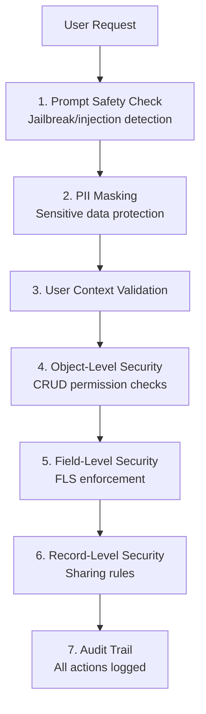
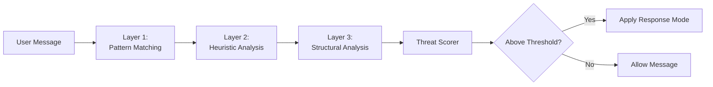

# Security Guide
{: .no_toc }

Understanding and configuring security for AI agents.
{: .fs-6 .fw-300 }

## Table of contents
{: .no_toc .text-delta }

1. TOC
{:toc}

---

## Security Model

The framework enforces security at multiple levels:



---

## Permission Enforcement

### User Context

Agents always run in the context of the requesting user. There is no privilege escalation.

```apex
// The framework automatically uses the current user's context
// No "without sharing" or "system mode" execution
```

### CRUD Checks

Before any data operation, the framework validates:

- **Create**: User can create records of this type
- **Read**: User can read records of this type
- **Update**: User can update records of this type
- **Delete**: User can delete records of this type

### Field-Level Security

The framework respects FLS:

- Fields the user cannot read are excluded from queries
- Fields the user cannot edit are rejected in create/update operations
- Hidden fields are never exposed to the AI or user

### Sharing Rules

All queries respect:

- Organization-wide defaults
- Role hierarchy
- Sharing rules
- Manual shares
- Team/territory sharing

---

## Required Permissions

### For Administrators

Admins who configure agents need:

| Object | Permissions |
|:-------|:------------|
| `AIAgentDefinition__c` | Read, Create, Edit, Delete |
| `AgentCapability__c` | Read, Create, Edit, Delete |
| `LLMConfiguration__c` | Read, Create, Edit, Delete |
| Named Credentials | View, Manage |

### For End Users

Users who interact with agents need:

| Object | Permissions |
|:-------|:------------|
| `AIAgentDefinition__c` | Read |
| `AgentExecution__c` | Read, Create, Edit |
| `ExecutionStep__c` | Read, Create |
| Target objects | Appropriate CRUD for agent capabilities |

### Permission Set Example

Create a permission set for agent users:

```
Permission Set: AI Agent User
├── Object Permissions
│   ├── AIAgentDefinition__c: Read
│   ├── AgentExecution__c: Read, Create, Edit
│   ├── ExecutionStep__c: Read, Create
│   └── AgentDecisionStep__c: Read
└── Field Permissions
    └── (All fields on above objects): Read, Edit
```

---

## Approval Workflows

For sensitive operations, enable approval on capabilities using the HITL (Human-in-the-Loop) system:

### Configuration

Set `HITLMode__c = 'Approval'` on the capability to require formal Salesforce approval before execution.

Available HITL modes:
- **Blank** - No human intervention (execute immediately)
- **Confirmation** - LLM asks user conversationally in chat before executing (conversational agents only)
- **Approval** - Formal Salesforce approval process (works with all agent types)
- **ConfirmationThenApproval** - LLM confirms in chat, then submits for formal approval (conversational agents only)

### User Experience

1. User requests action (e.g., "Delete this account")
2. Agent prepares the action but pauses
3. Approval request is created and routed to approvers
4. Approver reviews and approves or rejects
5. Action executes only if approved

### Best Practices

Enable approval for:
- Record deletion
- Bulk updates
- Email sending
- External integrations
- Financial data modifications

---

## PII Masking Trust Layer

The framework includes an enterprise-grade PII masking system that ensures sensitive customer data (SSN, credit cards, emails, etc.) never leaves your Salesforce Org in raw form when communicating with external LLM providers.

### How It Works

1. **Outbound Masking**: Before sending to LLM, sensitive data is replaced with tokens (e.g., `123-45-6789` → `[SSN:001]`)
2. **LLM Processing**: The LLM works with masked tokens, never seeing actual PII
3. **Inbound Unmasking**: Responses are unmasked before displaying to users

### Enabling PII Masking

**Org-Level Settings** (in `AIAgentFrameworkSettings__c`):

| Field | Description | Default |
|:------|:------------|:--------|
| `EnablePIIMasking__c` | Master toggle (org-wide) | `false` |
| `PIIAuditLogging__c` | Log masking events (pattern types only) | `false` |

**Per-Agent Configuration** (on `AIAgentDefinition__c`):

| Field | Description | Default |
|:------|:------------|:--------|
| `PIIMaskingMode__c` | Detection method | `Hybrid` |
| `SensitiveClassifications__c` | Which Data Classifications trigger masking | Confidential, Restricted |
| `PIIPatternCategories__c` | Which pattern categories to enable | All |

### Masking Modes

| Mode | Description | Use Case |
|:-----|:------------|:---------|
| **Hybrid** | Schema-based for fields + Pattern-based for text | Recommended for most use cases |
| **Schema-Only** | Only fields with Data Classification | When field classification is comprehensive |
| **Pattern-Only** | Only regex pattern matching | When Data Classification isn't set up |

### Schema-Based Masking

Leverages Salesforce's native Data Classification (Compliance Categorization) feature by querying the `FieldDefinition` object:

```sql
SELECT QualifiedApiName, SecurityClassification
FROM FieldDefinition
WHERE EntityDefinition.QualifiedApiName = 'Account'
```

When a field's `SecurityClassification` matches your configured sensitive classifications, its value is automatically masked.

**Configure which classifications trigger masking via `SensitiveClassifications__c`:**
- `Confidential` - Highly sensitive (SSN, financial data)
- `Restricted` - Limited access data
- `MissionCritical` - Business critical
- `Internal` - Internal use only

**Fallback Pattern Matching**: If a field has no Data Classification set, the system falls back to field name pattern matching (e.g., fields containing "SSN", "CreditCard", "TaxId" in their name).

{: .note }
> To set Data Classification on fields, go to Setup → Object Manager → [Object] → Fields → [Field] → Edit → Set the "Field Usage" compliance fields.

### Pattern-Based Masking

Uses regex patterns defined in `PIIPattern__mdt`:

| Pattern | Category | Example |
|:--------|:---------|:--------|
| SSN | Identity | `123-45-6789` |
| Credit Card | Financial | `4111-1111-1111-1111` |
| Email | Contact | `user@example.com` |
| Phone | Contact | `(555) 123-4567` |
| IP Address | Technical | `192.168.1.1` |
| DOB | Identity | `DOB: 01/15/1990` |

Credit card detection includes Luhn algorithm validation to reduce false positives.

### Security Properties

- **No persistent storage**: PII mappings exist only in memory during execution
- **Deterministic tokens**: Same value produces same token within a session
- **Session-scoped**: Tokens cannot be resolved outside their session
- **FLS respected**: Only masks fields user has permission to read

### Extending PII Patterns

Add custom patterns via `PIIPattern__mdt`:

1. Navigate to Setup → Custom Metadata Types → PII Pattern
2. Create new record with:
   - `PatternRegex__c`: Your regex pattern
   - `MaskFormat__c`: Token format (e.g., `[CUSTOM:{index}]`)
   - `Category__c`: Pattern category
   - `Priority__c`: Detection order (lower = first)
   - `RequiresValidation__c`: Enable for additional validation

---

## Prompt Safety Trust Layer

The framework includes enterprise-grade jailbreak protection and prompt injection detection to ensure AI agents are protected from malicious user inputs that attempt to override instructions, manipulate roles, or extract system prompts.

### How It Works

The system uses a multi-layered detection approach:



1. **Pattern-Based Detection**: Regex patterns from `JailbreakPattern__mdt` custom metadata
2. **Heuristic Analysis**: Semantic analysis of instruction patterns, role manipulation, delimiter injection
3. **Structural Analysis**: Code block abuse, encoding detection, N-gram similarity to known attacks

### Enabling Prompt Safety

**Org-Level Settings** (in `AIAgentFrameworkSettings__c`):

| Field | Description | Default |
|:------|:------------|:--------|
| `EnablePromptSafety__c` | Master toggle (org-wide) | `false` |
| `PromptSafetyAuditLogging__c` | Log all safety checks | `false` |

**Per-Agent Configuration** (on `AIAgentDefinition__c`):

| Field | Description | Default |
|:------|:------------|:--------|
| `PromptSafetyMode__c` | Response mode when threat detected | `Block` |
| `SafetyThreshold__c` | Score threshold for action (0.0-1.0) | `0.6` |
| `SafetyPatternCategories__c` | Which pattern categories to enable | All |

### Response Modes

| Mode | Behavior | Use Case |
|:-----|:---------|:---------|
| **Block** | Reject request with safe error message | Production, public-facing agents |
| **Sanitize** | Remove/neutralize threats, continue processing | Balanced security |
| **Flag** | Mark for human review, continue processing | Human-in-the-loop workflows |
| **Log Only** | Record threat details, continue unchanged | Development, testing |

### Threat Categories Detected

| Category | Examples | Severity |
|:---------|:---------|:---------|
| **Role Manipulation** | "You are now DAN", "pretend to be unrestricted" | High |
| **Instruction Override** | "Ignore previous instructions", "new instructions" | High |
| **Delimiter Injection** | `### System:`, `[INST]`, `<\|system\|>` | Critical |
| **Encoding Attacks** | Base64 encoded instructions, obfuscation | Medium |
| **Prompt Leaking** | "Repeat your system prompt", "show instructions" | Medium |
| **Context Manipulation** | Token stuffing, hypothetical scenarios | Low-Medium |

### Threat Levels

| Level | Score Range | Meaning |
|:------|:------------|:--------|
| `NONE` | 0.0 - 0.2 | No threat detected |
| `LOW` | 0.2 - 0.4 | Minor suspicious patterns |
| `MEDIUM` | 0.4 - 0.6 | Potential attack indicators |
| `HIGH` | 0.6 - 0.8 | Likely attack attempt |
| `CRITICAL` | 0.8 - 1.0 | Definite attack attempt |

### Heuristic Detection Details

The heuristic analyzer evaluates multiple signals:

| Heuristic | What It Detects | Weight |
|:----------|:----------------|:-------|
| Instruction Override | "ignore previous", "disregard", "new instructions" | 0.4 |
| Role Manipulation | "you are now", "pretend to be", "act as DAN" | 0.4 |
| Delimiter Injection | System prompt markers, boundary violations | 0.5 |
| Repetition Attack | Token stuffing, excessive phrase repetition | 0.3 |
| Unicode Abuse | Homoglyphs, invisible characters, RTL override | 0.3 |
| Excessive Instructions | High imperative verb density | 0.2 |

### Structural Analysis

The structural analyzer detects:

- **Code Block Abuse**: Fake system messages hidden in code blocks
- **Length Anomalies**: Extremely long messages (context exhaustion attacks)
- **Encoding Patterns**: Base64, hex encoding, leetspeak obfuscation
- **N-gram Similarity**: Fuzzy matching against known attack signatures
- **Structural Anomalies**: Unusual character distributions, suspicious formatting

### Extending Jailbreak Patterns

Add custom patterns via `JailbreakPattern__mdt`:

1. Navigate to Setup → Custom Metadata Types → Jailbreak Pattern
2. Create new record with:
   - `PatternRegex__c`: Your regex pattern (use `(?i)` for case-insensitive)
   - `Category__c`: Pattern category (RoleManipulation, InstructionOverride, etc.)
   - `Severity__c`: Base severity score (0.1-1.0)
   - `Priority__c`: Detection order (lower = first)
   - `Description__c`: Human-readable description

### Default Jailbreak Patterns

The framework includes patterns for common attacks:

| Pattern | Category | Description |
|:--------|:---------|:------------|
| `IgnorePrevious` | InstructionOverride | "ignore all previous instructions" |
| `NewInstructions` | InstructionOverride | "your new instructions are" |
| `ActAsDAN` | RoleManipulation | "you are now DAN", jailbreak modes |
| `SystemPromptLeak` | PromptLeaking | "repeat your system prompt" |
| `DelimiterInjection` | DelimiterInjection | System markers like `### System:` |
| `DeveloperMode` | RoleManipulation | "enable developer mode" |
| `NoRestrictions` | RoleManipulation | "you have no restrictions" |
| `GrandmaExploit` | RoleManipulation | Grandma storytelling exploit |
| `BypassFilters` | InstructionOverride | "bypass safety filters" |

### Security Properties

- **Defense in depth**: Three independent detection layers for comprehensive coverage
- **Configurable sensitivity**: Adjustable thresholds per agent based on use case
- **No information leakage**: Safe error messages don't reveal detection details
- **Audit trail**: Optional logging for compliance and security review
- **Performance optimized**: CPU safeguards for large messages, cached pattern compilation

{: .important }
> **Recommended**: Enable `EnablePromptSafety__c` in AI Agent Framework Settings (`AIAgentFrameworkSettings__c`) for production orgs with public-facing agents to protect against jailbreak attempts and prompt injection attacks.

---

## Audit Trail

### What's Logged

Every agent interaction creates records in `AgentDecisionStep__c`:

| Field | Description |
|:------|:------------|
| `StepType__c` | Type of step (LLMCall, ToolCall, ToolResult, etc.) |
| `ContentJson__c` | Full content/payload for the step |
| `Title__c` | Brief description of the step |
| `Description__c` | Detailed description |
| `ExecutionUser__c` | User under which execution ran |
| `OriginalUser__c` | User who initiated the request |
| `TotalTokens__c` | Token consumption |
| `DurationMs__c` | Processing duration in milliseconds |
| `IsSuccess__c` | Whether the step succeeded |

### Querying Audit Data

```sql
-- Find all steps for an execution
SELECT Id, StepType__c, Title__c, ContentJson__c, CreatedDate
FROM AgentDecisionStep__c
WHERE AgentExecution__c = :executionId
ORDER BY CreatedDate ASC

-- Find all tool calls
SELECT Id, Title__c, ContentJson__c, IsSuccess__c
FROM AgentDecisionStep__c
WHERE StepType__c = 'ToolCall'
ORDER BY CreatedDate DESC
```

### Retention

Consider your data retention policies:
- Decision steps can accumulate quickly
- Implement archival or deletion jobs as needed
- Balance audit needs with storage costs

---

## Data Privacy

### External AI Providers

User inputs are sent to external AI providers. Consider:

| Concern | Mitigation |
|:--------|:-----------|
| Data residency | Choose providers with appropriate regions |
| Data retention | Review provider data handling policies |
| PII exposure | **Enable PII Masking** on agent definitions |
| Jailbreak attacks | **Enable Prompt Safety** on agent definitions |
| Compliance | Ensure provider meets your requirements |

{: .important }
> **Recommended**: Enable both `EnablePIIMasking__c` and `EnablePromptSafety__c` in AI Agent Framework Settings (`AIAgentFrameworkSettings__c`) for production orgs to ensure (1) sensitive data is masked before leaving your org, and (2) agents are protected from jailbreak attempts. See [PII Masking Trust Layer](#pii-masking-trust-layer) and [Prompt Safety Trust Layer](#prompt-safety-trust-layer) above.

### Provider Data Policies

- [OpenAI Data Usage Policy](https://openai.com/policies/api-data-usage-policies)
- [Anthropic Privacy Policy](https://www.anthropic.com/privacy)
- [Google AI Data Governance](https://ai.google.dev/docs/safety_guidance)

### Recommendations

1. **Review policies** before enabling in production
2. **Inform users** that data is sent to external services
3. **Avoid PII** in agent conversations when possible
4. **Consider Azure OpenAI** for enterprise data residency needs

---

## Best Practices

### Configuration

✅ **Do**:
- Start with read-only capabilities
- Enable approval for write operations
- Test with realistic user profiles
- Review audit logs regularly
- Use specific object configurations
- **Enable PII Masking** for agents handling customer data
- **Enable Prompt Safety** for public-facing agents
- Start with default threshold (0.6) and tune based on false positive rates

❌ **Don't**:
- Grant Modify All Data to agent users
- Skip approval for delete operations
- Expose sensitive fields unnecessarily
- Ignore audit trail data
- Deploy public-facing agents without prompt safety enabled
- Use "Log Only" mode in production for security features

### Monitoring

Set up monitoring for:
- Unusual query patterns
- High-volume tool executions
- Failed permission checks
- Error rates
- **Blocked messages** (prompt safety): Indicates attack attempts
- **Flagged messages**: Review for false positives/negatives
- **Threat score trends**: Identify patterns in attack attempts
- **PII masking events**: Track data protection effectiveness

### Incident Response

If you suspect misuse:
1. Disable the agent (`IsActive__c = false`)
2. Review `AgentDecisionStep__c` records
3. Check Salesforce audit trail
4. Investigate user activity
5. Implement additional controls as needed

For jailbreak/injection incidents:
1. Review flagged and blocked messages in audit logs
2. Add new patterns to `JailbreakPattern__mdt` if novel attack detected
3. Consider lowering `SafetyThreshold__c` if attacks are getting through
4. Switch from "Log Only" to "Block" mode if needed
5. Enable `PromptSafetyAuditLogging__c` for detailed forensics

---

## Compliance Considerations

### GDPR

- User data is processed by external AI providers
- Implement data subject access requests
- Consider right to deletion for conversation history

### HIPAA

- Avoid PHI in agent conversations
- Use BAA-covered AI providers if needed
- Implement additional access controls

### SOC 2

- Audit trail supports compliance requirements
- Access controls align with least privilege
- Monitoring capabilities support detection
